# UmaAgent 前端设计实施规格

通用Agent对话、执行计划、后台任务和管理员渠道工作台的独立前端实施合同。

> 文档修订日期：2026-09-17。本文是目标设计合同，不代表当前代码已实现全部目标行为。设计图为可编辑 SVG 结构稿，不是产品运行截图，也不是 ImageGen 输出。

[图文阅读版与界面索引](frontend-design/index.html) · [结构化界面规格](frontend-design/spec.json) · [审查与验收记录](release-acceptance.md)

## 1. 权威顺序与实施范围

电脑端为Windows浏览器/Web/PWA，当前没有Electron或原生Windows客户端，禁止凭空增加托盘进程。Android为Compose，手机/平板同一业务合同。普通用户与管理员入口按服务端角色决定；管理员可在同一身份下进入普通Agent工作台，切换普通账号是另一项操作。CLI不作为图形前端。

同一交付中：交互表和字段规则 > 几何规范 > SVG 示例值。示例值是合成测试数据，不是默认业务数据。业务状态只取服务端或本地桥接回执；画面不允许推断业务成功。若未来协议改变，必须升级本文件与 spec.json；不得让开发者自行猜测一个静默替代行为。

## 2. 现状证据与设计差额

Android为独立验收重点，页面与操作详见 docs/android-design.zh-CN.md；当前实现和验收结果以发布验收文档为准。

### 本轮实施基线

|范围|实施规则|
|---|---|
|protocol|Protocol v16 / HTTP /api/v16 / SQLite schema 25|
|serverChanges|账号级免审批默认开启；统一执行策略、增量同步与 trace，详见后端设计。|
|web.styleEntry|styles.css then design-system.css|
|web.shell|220px navigation + main workspace|
|web.contentWidth|960px|
|web.avatar|desktop: 48px、mobile: 38px|
|web.bodyTypography|16/24|
|web.detailTypography|12/18|
|web.navigation|工作区设置包含账号执行权限、外观、账号 Profile、应用和账号操作；会话设置只编辑当前会话。|
|web.pendingWrites|创建回执前禁用输入与发送；消息提交期间禁止重复提交；最新消息按钮锚定输入区上沿。|
|web.composer|输入区使用有名称的原生按钮和文本框；上传按钮可通过Tab与Enter操作；正文上限20000字符，Enter发送、Shift+Enter换行，中文输入法组合期间不发送。|
|web.mobileNavigation|手机壳使用内容minmax(0,1fr)+导航auto两行；底部导航以实际高度占位，支持200%字体和安全区，禁止用固定64px留白补偿覆盖导航。输入区与底部导航必须无交叠。|
|web.formProtection|任务、调度、资源、Profile与会话身份登记未保存状态；导航离开确认，局部编辑取消只丢弃当前表单。聊天草稿独立保存。完整组合验收见release-acceptance。 会话身份同步仅替换未修改字段；保存中禁用编辑，失败保留草稿。 知识目录与技能目录独立登记，局部取消不清其他表单；任务、调度和资源在写入期间锁定字段。|
|web.qualityLoading|质量按当前标签查询和刷新；运行诊断支持24小时/7天/30天，区间以同一个结束时刻生成，报告显示实际起止时间。|
|web.registration|注册令牌复制成功或勾选手动保存后才允许继续；复制失败保留文本。|
|web.commands|命令只调用Core executeShortcut，不预读管理页面数据；无搜索结果不能执行旧选中项，提交锁阻止双击重复请求；原生dialog处理焦点限制、Escape和返回焦点。 Ctrl+K/Meta+K仅在UmaAgent焦点范围内生效；方向键切换可见命令，Enter执行，输入法组合不触发选择。|
|web.actionMenus|辅助操作使用一层原生disclosure，Tab发现；上下方向键循环跳过禁用项，Home/End到首尾，Escape关闭并还原入口焦点。顶栏及操作容器允许菜单溢出，裁切只作用于标题；手机更多入口靠右，避免弹层越过左边界。独立和嵌入发布入口均验证320/390/1280px下全部菜单项的视口命中、实际点击、外部关闭及键盘操作。|
|android.shell|UmaShell|
|android.singlePaneBelowDp|600|
|android.railFromDp|600|
|android.dualPaneFromDp|840|
|android.imeInsetsOwner|聊天根节点消费聊天键盘Insets；二级表单由Shell消费；同一路径只消费一次|
|android.navigation|UmaShell 使用 Compose Navigation 管理页面栈；对话、会话、任务为一级页面，更多菜单进入调度、资源、记忆、质量、设置和管理员渠道页。二级页面显示返回并隐藏一级导航；Profile 返回设置。顶栏单行显示页面名称与连接摘要；会话标题归聊天头部。|
|android.composer|附件与发送为48dp图标按钮，消息输入独占剩余宽度；键盘打开隐藏底栏，聊天由ChatScreen消费IME，二级表单由Shell消费；成功回执后清空草稿，失败保留。 提交期间禁用文本编辑，避免成功回执清空在途期间新输入的草稿。|
|android.conversationScroll|首次打开定位到末尾；仅在用户保持末尾时跟随流式内容，上翻历史后不抢滚动；显示“最新消息”按钮恢复跟随，切换会话重置跟随状态。|
|android.bodyTypography|16sp / 24sp|
|android.actions|复制与更多常显；编辑、重试、审查、改进、队列排序进入一级菜单；设置提供账号级免审批。|
|android.rendering|离线共享 marked/DOMPurify/KaTeX 正文；增量按4ms窗口合并（预算上限50ms），终态立即校准；使用解析后的投影，不逐事件拉快照。 正文比较保留上次渲染结构，复制反馈与图片错误状态不会导致未变块重复替换。|
|android.formProtection|会话设置按字段保存远端基线，Profile恢复后重读保留脏草稿；导航与系统返回保护未提交表单，包括双栏首页。管理写入归账号ViewModel所有，返回只停止当前页面等待，账号切换取消旧任务。 知识上传与知识源登记同属账号ViewModel任务，离页不中断；未知结果不自动重试。 账号切换检查所有会话未发送正文、附件及未确认发送；未提交命令修改关闭先确认。 资源目录/技能表单打开后停用重复入口，提交锁定字段；创建回执后先清理表单再刷新列表，读取失败不诱导重复创建。|
|android.settingsLayout|字号≥1.5或可用宽度<300dp时，设置行采用标题、说明、操作纵向布局，避免尾部控件把说明挤成逐字竖排。|
|android.diagnostics|运行诊断提供24小时/7天/30天时间窗，切换与刷新均发送明确epoch区间。 首屏直接显示运行、模型、工具和Trace摘要，服务与失败明细按需展开，去除重复时间区间。 多标签页不重复大标题，耗时一位小数；Run Trace按已加载父子关系缩进最多四层，ID可选且复制反馈真实结果。|
|android.registration|注册令牌复制成功或勾选手动保存后才允许继续；复制失败保留文本。|
|android.imageDecoding|会话头像后台采样至最长边512像素，由所有消息共享Bitmap；附件预览后台解码，加载、失败与成功分别呈现。上传与恢复默认立即更新头像。|
|android.lifecycle|UI采用AndroidX生命周期感知状态收集；后台仍接收、投影及保存运行结果，停止驱动不可见页面重组，恢复前台读取最新状态。|
|android.sessionIdentity|会话快照及缺口补拉同步会话名称、模型与头像标识，不在逐token发布时解析身份；当前头像后台读取并校验账号、会话和附件ID，非当前会话只更新列表。|
|android.queueReceipts|队列及会话写入回执校验账号和会话；切换后不覆盖新会话队列、加载、取消状态或编辑弹窗，不跳回旧会话；写入先同步锁定入口。名称及头像更新列表，删除清理对应草稿与缓存。 模型切换成功/失败回执也核对发起会话；删除当前会话清理发送、取消、附件及未确认状态。|
|android.runStatus|准备、执行和校验阶段保留停止入口，使用v16 Run状态文案；业务澄清继续由用户输入。|
|compatibility|服务仅接受当前协议；schema24→25仅通过显式离线工具一次性升级，不保留运行时兼容层。|

## 3. 视觉、布局与组件规范

所有数字为目标值；Windows/Web 使用 CSS px，Android 使用 dp，字体使用 sp。SVG 画布代表逻辑视口，不含外部显示器边框。默认缩放 100%。

|尺寸/组件|规范|
|---|---|
|Web/Windows 基准|1440×900；桌面壳使用220导航+主工作区；会话、设置、队列与输入区共用960最大内容宽度，正文与头像间距至少12|
|中等宽度|840–1199：导航220；正文左右24；右侧检查器一律覆盖，不压缩聊天|
|紧凑宽度|320–839：单栏；导航折叠为覆盖层，内容边距16；手机基准390×844|
|Android 断点|<600 单栏、600–839 使用80宽 Navigation Rail+单内容、≥840 Rail+320宽列表+剩余详情；只有≥840才双栏，防止600dp塞入三列|
|系统栏|Android 图示状态栏24/手势16仅为基准；实际读取系统 Insets；Windows 原生标题栏由系统控制，图示32仅标位置；不得自绘红黄绿圆点|
|导航与顶栏|应用顶栏64；手机底部导航56+系统底栏Inset；图中表单内容可独立纵向滚动；未显示字段在同一滚动容器中|
|正文层级|页标题24/32、分区20/28、会话正文16/24、控件14/20、折叠详情与辅助12/18；字体Segoe UI/微软雅黑，Android系统字体；字号不小于12|
|间距|4、8、12、16、24、32、48；表单字段组间10，分区间24；屏幕图按字段类型使用78或126高的组；字段label到输入顶26|
|控件|输入框48高；多行输入最小96/最大240后内部滚动；按钮44高，Android点击区域扩为48；按钮左右16；图标20；焦点2px描边+2px间隔|
|外观|卡片圆角12、输入与按钮8、手机Sheet顶部20；边框1；图标取本项目现有线性图标体系，线宽1.75；禁止Emoji代替常规导航图标|
|弹层|桌面对话框宽480，复杂审批640；最大高度视口-64，内容滚动、操作栏固定；手机为全宽Sheet或全屏详情，最大高度可用视口-24|
|层叠|正文0、悬浮工具10、遮罩40、Sheet/Dialog50、Toast60；业务详情最多一个模态层，子详情在层内切换；仅允许一次阻止丢失修改的原生确认覆盖编辑表单，底层不可操作，取消后还原编辑焦点，禁止继续叠加业务详情|
|操作优先级|交互表第一项为主操作，第二项为次操作；其余放右上“更多操作”菜单；菜单顺序与表一致；危险项置底并用危险文字色|
|长内容|列表标题2行省略，详情允许换行；逻辑路径/标识可中部省略，详情可复制全值；代码、表格内部横滚，不使页面横滚；所有图都是首屏示例|
|动效|按钮反馈即时；展开160ms ease-out、Sheet200ms、Toast4秒；减少动态效果开启时动画0ms；骨架不闪烁、不模拟百分比|

深色主题明确映射：bg=#111820，surface=#1B2632，text=#F1F5F9，muted=#BCC8D5，border=#65768A，selected=#293E54；主色文字在深色下用#A8D0FF，实心按钮背景固定为#365F45、文字#FFFFFF（与浅色主题的primary token一致）；#A8D0FF仅用于深色主题链接和文字，不作为白字按钮底色。Android固定使用本项目品牌色：浅色primary=#365F45、onPrimary=#FFFFFF；深色primary=#A5D6B0、onPrimary=#153C23、primaryContainer=#263D30、onPrimaryContainer=#D6EFDE，原生Material控件使用此语义映射。其余上述蓝色链接和白字实心按钮规则用于Web。本版不提供动态色开关。按钮hover叠加5%黑色，pressed叠加10%黑色（sRGB通道分别乘0.95/0.90并四舍五入），键盘focus使用2px #A8D0FF外圈，disabled使用surface背景和muted文字，并由真实disabled属性阻止提交。危险按钮浅色#B42318/白字，成功#067647，警告#8A4B08。

会话正文16px/24px，折叠步骤12px/18px。Web头像48px，840px以下38px；消息列间距桌面14px、移动10px；回复卡片四周16px内边距。正文、队列和输入区最大960px，队列摘要位于输入区正常布局内，详情向上展开。状态摘要使用16px内边距和可收缩的两列，长路径可换行。Android正文bodyMedium，详细步骤bodySmall；回复头像24dp、聊天头部不显示装饰头像。

|Token|浅色值|用途|
|---|---|---|
|bg|`#F5F3ED`|bg|
|surface|`#FFFFFF`|surface|
|text|`#17212B`|text|
|muted|`#52616E`|muted|
|border|`#7B8A98`|border|
|primary|`#365F45`|primary|
|selected|`#E6EFE7`|selected|

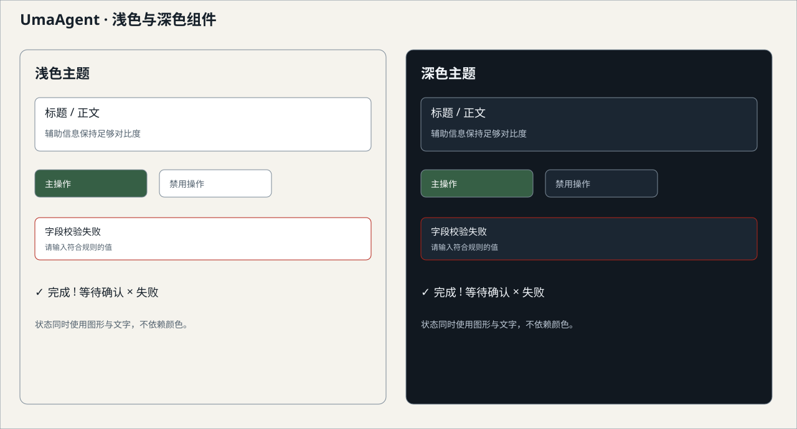

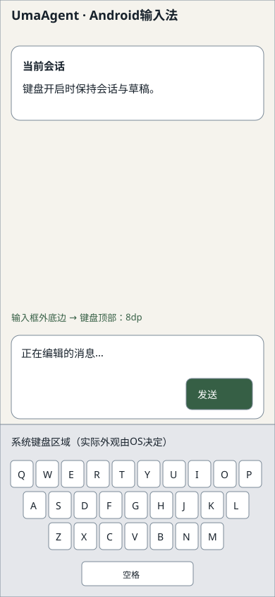

### 统一交互规则（适用于下文每个界面和动作）

G01：进入页面先读缓存（若存在且属于当前账号），标记“上次同步”；同时发起只读刷新。首次无缓存显示骨架；成功空数组才显示“暂无…”。失败不删除已有数据。未知数值显示“未提供”，绝不能显示0冒充测量值。

G02：点击任一写操作立即禁用该动作和冲突操作，按钮文字“处理中…”，输入保持；远端业务写入只在服务端明确成功后显示成功并清空对应草稿；纯本地动作与系统桥接按G13的本地完成条件判断。失去连接或超时显示“结果尚未确认”，先查询资源状态再允许重发；非幂等操作不得静默自动重试。只读请求可手动重试。

G03：关闭表单/切换账户前如有未保存修改，弹“放弃未保存内容？”；默认焦点“继续编辑”，另有“放弃并离开”。普通页返回不弹确认。关闭模态层先返回其父层，焦点恢复到触发控件；正在提交时可离开但不假称操作被取消，后台结果按资源ID归并。跨账号迟到响应一律丢弃。

G04：表单字段规范是UI约束，不能放宽协议上限。字符串按Unicode字符校验；仅在提交时去除首尾空白，正文保留换行与内部空白。字段失焦校验；提交先定位第一处错误；服务端422/400映射到字段，未能映射的显示表单顶部。未在字段表中列出的字段不允许由设计实现者自行新增。

G05：Web/Windows Enter发送、Shift+Enter换行，输入法正在组合（isComposing）时Enter只确认候选；Android多行IME默认换行，使用显式发送按钮。正文与附件均为空时禁发；仅附件发送使用默认提示词。离线保留草稿但禁发；恢复连接后不自动发送。消息发送与文件上传分开反馈。

G06：用户距底部≤80px时新增消息跟随；向上滚动超过80px暂停跟随，显示“查看新消息”；加载历史保留首个可见消息ID与偏移。打开/关闭检查器不重置会话。草稿按账号和会话隔离。Android 原子保存草稿及未确认发送ID，支持进程恢复；退出账号清除本机草稿。Web 草稿仅当前页面生命周期。重命名/主题/导航展开状态允许本机偏好保存，不保存Token或正文到普通偏好存储。

G07：401先结束当前订阅，显示重新登录；403解释权限不足且不可通过按钮重试升级权限；404显示资源已不存在并返回列表；409重新获取最新状态并展示差异；429依据Retry-After倒计时；5xx允许手动重试读取。错误Toast不替代持久错误区。认证失败不循环重连。UI 15秒未确认提示“仍在等待”；60秒转“结果尚未确认”并允许查询，不能当作服务端已失败。

G08：时间以协议值存储（ISO UTC或epoch毫秒依本项目），显示到本地时区；列表用相对时间，详情显示YYYY-MM-DD HH:mm:ss UTC±hh:mm。日期边界采用用户选择时区，不固定+8。所有示例名/时间/文件为合成数据。

G09：所有控件用原生按钮/输入语义；Tab按视觉顺序、Esc关闭最上层弹窗；焦点圈全程可见；读屏按标题、状态、正文、操作顺序；错误用role=alert，流式按段以polite播报。触控最小48dp，不依赖hover/滑动唯一操作。字体200%时允许重排，禁止裁掉按钮文字。

G10：手机IME与系统底栏不叠加：内容底部留白=max(IME.bottom,systemBars.bottom)，只有最外层消费系统Inset；键盘打开隐藏底部导航，输入框外底边距键盘顶部8dp，容差±2dp。Web嵌入容器使用可用动态视口高度，父壳与子页面不得同时增加bottom padding。系统返回优先收键盘、再收Sheet、再退页面。

G11：界面图绑定的事件ID是验收ID。每条动作至少执行正常完成、不可执行/失败、双击和返回四类测试；local/system使用本地或系统完成条件，read/write使用远端回执；图片里的成功/失败是从处理中分支，绝不能按图横向顺序理解为成功后自动失败。任何与UI无关的trace/requestId只在“诊断详情”折叠区提供，不挤占普通工作流。

G12：同组菜单项约定：启用只发送enabled=true、停用只发送false；启动只调start、停止只调stop、暂停只调pause、恢复只调resume；取消只调cancel、继续只调resume；保存已有对象调用update、新建调用create；刷新只读取或refresh，安装只调install；查/下载/打开是不同阶段，只在前一阶段成功后显示下一动作。交互表用“/”列出的互斥动作按这里绑定，不能一次点击同时调用所有API。

### 固定导航映射

|导航项|目标页面|
|---|---|
|会话|UM-03|
|后台任务|UM-13|
|调度|UM-14|
|资源|UM-17；页内标签切换知识UM-17、添加UM-18、Skill/MCP UM-19|
|记忆|UM-20|
|质量|UM-21|
|设置|UM-22；账户/关于入口UM-23|
|咸鱼工作台|UM-24（仅管理员）|

同一导航项有多个页面时，进入表中第一个页面，页内标签按表列顺序出现；切换标签不重新认证。登录前这些业务导航全部隐藏；非法角色直接访问目标页返回无权限。Web路由采用应用内状态，不要求增加未实现的服务端URL。Android通知携带的资源ID仅用于本客户端查找，不拼接外部执行URL。

### 动作类别、网络例外与确认层（G13–G16）

G13：每个动作标记执行类别。纯本地动作以本地状态更新为完成条件，不等待网络、不得显示请求失败或“结果尚未确认”。复制与系统调用以对应Promise/系统回调为准；只表示文本已写剪贴板、选择器已返回或页面已打开，不代表业务成功。退出账户先清本地凭据与订阅，网络失败不能阻止退出。远端读取失败保留缓存，重试同一查询；远端写入才适用G02的未知结果核实规则。动作前置条件的明确离线许可优先于通用在线规则。

G14：返回/取消表单时没有修改则直接关闭；有修改显示“放弃未保存内容？”，正文“离开后，本次未保存的修改将丢失。”；左“继续编辑”、右“放弃并离开”，默认焦点左，Esc/点击遮罩等同继续编辑。确认放弃只丢弃当前表单草稿。正在执行的远端写入不被返回键取消；其结果只更新原资源，不把用户强行带回原页。

G15：名称含“删除”的动作必须确认：标题“删除{对象类型}？”，正文展示当前对象完整名称及该动作成功规则中的删除范围；左“取消”、右“确认删除”，默认焦点取消，危险按钮#B42318。确认前不发请求；取消不改变数据。拒绝审批/候选仅改变对应决策状态，不套用物理文件删除文案。对于本机文件删除，以归档审批页给定路径及权限为准，不能从列表直接删原件。

G16：控件可见性按角色、平台、当前状态和动作前置条件共同决定。平台不存在的能力隐藏；当前状态不可用的操作保留并禁用，旁边展示具体原因。菜单按交互表顺序排布，删除项置底；桌面菜单宽280、每项44高，Android宽min(视口-32,360)、每项48高，长标签换行扩高。菜单锚定右上“更多操作”，超出底部时向上展开，最大高为可用视口-48并内部滚动。打开聚焦首个可用项；上下箭头移动、Enter执行、Esc关闭并还原焦点。点击遮罩只关闭菜单，不提交。

### 逐页导航高亮与回退归属

|页面ID|Windows/Web导航归属|Android导航归属|
|---|---|---|
|UM-01|隐藏（认证壳）|隐藏（认证壳）|
|UM-02|隐藏（认证壳）|隐藏（认证壳）|
|UM-03|会话|会话|
|UM-04|会话|会话|
|UM-05|会话|对话|
|UM-06|会话|对话|
|UM-07|会话|对话|
|UM-08|会话|对话|
|UM-09|会话|对话|
|UM-10|会话|对话|
|UM-11|会话|对话|
|UM-12|会话|对话|
|UM-13|后台任务|任务|
|UM-14|调度|更多|
|UM-15|调度|更多|
|UM-16|调度|更多|
|UM-17|资源|更多|
|UM-18|资源|更多|
|UM-19|资源|更多|
|UM-20|记忆|更多|
|UM-21|质量|更多|
|UM-22|设置|更多|
|UM-23|设置|更多|
|UM-24|咸鱼工作台|更多|
|UM-25|咸鱼工作台|更多|
|UM-26|咸鱼工作台|更多|
|UM-27|咸鱼工作台|更多|
|UM-28|会话|对话|
|UM-29|设置|更多|
|UM-30|质量|更多|
|UM-31|质量|更多|
|UM-32|质量|更多|

表中归属只用于本页支持的平台；页面注册表未列出的平台不产生该页面。认证页没有业务导航。由另一业务页临时打开的详情保留来源导航高亮；关闭详情恢复原选择。

Android底部“对话”进入当前会话UM-05，无会话时显示新会话入口；“会话”进入UM-03；“任务”进入UM-13；“更多”进入UM-29，按调度、资源、记忆、质量、设置、咸鱼工作台顺序展示入口，咸鱼仅管理员可见。

客户端验收修正：Web创建中和消息提交中锁定输入，避免误发到旧会话或重复提交。账号设置与会话设置分开承载。Android发送成功回执后才清空草稿，Profile通过Shell页面栈进入和返回，键盘打开时不显示底部导航。

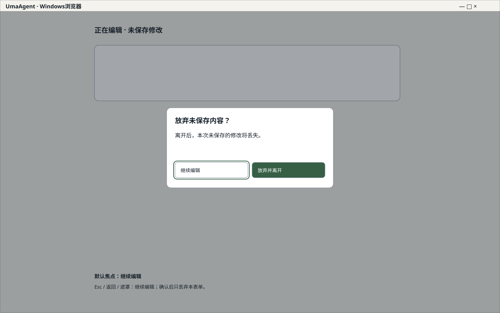

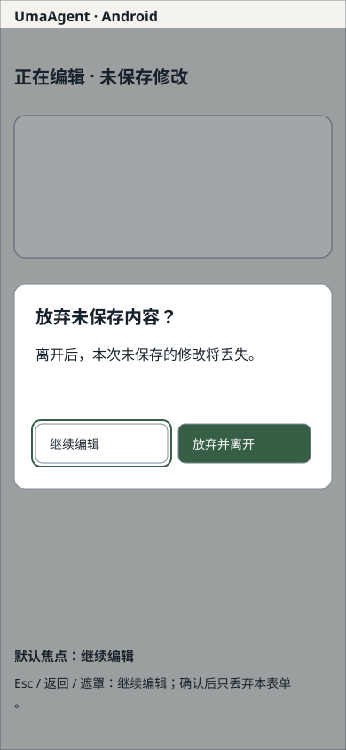

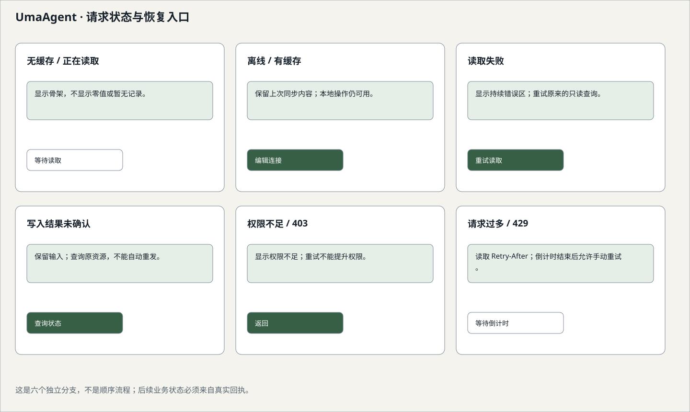

## 4. 状态、数据与权限合同

|域|合同|
|---|---|
|事件与认证|Web PAT登录换服务端会话，嵌入模式使用已配置Core入口；浏览器不提供任意Origin编辑。Android安全保存PAT。成功bootstrap后再启用写操作。|
|消息|sendMessage(sessionId,text,{messageId,mode,attachmentIds})；body text1–1000000、附件最多20；前端正文上限20000（明确更严格UI值），messageId一次提交生成且重试复用。未知结果先查会话快照，不自动重发。|
|模式|plan先规划；免审批开启时服务端自动确认计划，关闭时返回awaiting_confirmation等待确认；agent执行许可同样遵循账号策略，默认开启；mode仅影响下一条消息。|
|Run状态|queued等待处理、preflight分析、awaiting_input等待回复、awaiting_confirmation等待计划确认、running执行、verifying验证、completed完成、failed失败、cancelled取消、interrupted暂停可继续。|
|队列|queue排队、preemptive抢占；切换通过updateSession确认生效；运行中不把取消按钮误称删除。|
|消息历史|历史getSessionHistory(beforeSequence,limit100)，向上加载；lastSequence去重及缺口回放；Snapshot更旧字段不能覆盖已接收较新事件。|
|模型|listModels读取真实provider/id/capabilities；不为自定义名称编造上下文上限。thinkingLevel仅off/minimal/low/medium/high/xhigh/max，并受模型能力约束。|
|删除|deleteSession是服务端删除会话，UI不承诺孤立记录仍可检索；任务仅终态允许删除记录；知识源删除解除索引且不声称删用户原文件。所有删除确认写出对象名。|
|权限|admin才能安装/启停/拒绝Skill、索引服务端路径与操作渠道。普通用户可用已授权知识上传/检索和会话能力；403必须保留权限边界，隐藏入口不替代后端鉴权。|
|优化提案|接受是人工待办，不执行补丁；不在UI添加apply/rollback入口。|

## 5. 页面注册表

|ID|界面|设备|来源|
|---|---|---|---|
|[UM-01](#um-01)|登录与创建账户|Web, Android|`apps/web/src/Login.tsx`|
|[UM-02](#um-02)|一次性令牌保存|Web, Android|`apps/web/src/Login.tsx`|
|[UM-03](#um-03)|工作台与会话导航|Web, Android|`apps/web/src/App.tsx`|
|[UM-04](#um-04)|会话重命名与删除|Web, Android|`apps/web/src/areas/SessionArea.tsx`|
|[UM-05](#um-05)|对话输入与附件草稿|Web, Android|`apps/web/src/App.tsx`|
|[UM-06](#um-06)|回复、引用与消息操作|Web, Android|`apps/web/src/components/ResponseCard.tsx`|
|[UM-07](#um-07)|模型、思考与队列策略|Web, Android|`apps/web/src/components/ConversationHeader.tsx`|
|[UM-08](#um-08)|附件预览与下载|Web, Android|`apps/web/src/Markdown.tsx`|
|[UM-09](#um-09)|消息审查与改进|Web, Android|`apps/web/src/components/QualityPanel.tsx`|
|[UM-10](#um-10)|运行计划、确认与取消|Web, Android|`apps/web/src/areas/RunArea.tsx`|
|[UM-11](#um-11)|工具审批|Web, Android|`apps/web/src/components/InspectorStatusPanels.tsx`|
|[UM-12](#um-12)|消息队列与编辑|Web, Android|`apps/web/src/components/QueueDock.tsx`|
|[UM-13](#um-13)|后台任务|Web, Android|`apps/web/src/areas/BackgroundTaskArea.tsx`|
|[UM-14](#um-14)|调度列表与开关|Web, Android|`apps/web/src/areas/ScheduleArea.tsx`|
|[UM-15](#um-15)|新建调度|Web, Android|`apps/web/src/areas/ScheduleArea.tsx`|
|[UM-16](#um-16)|调度运行历史|Web, Android|`apps/web/src/areas/ScheduleArea.tsx`|
|[UM-17](#um-17)|知识库列表与检索|Web, Android|`apps/web/src/areas/ResourceArea.tsx`|
|[UM-18](#um-18)|添加知识来源|Web, Android|`apps/web/src/areas/ResourceArea.tsx`|
|[UM-19](#um-19)|Skill与MCP资源|Web, Android|`apps/web/src/areas/ResourceArea.tsx`|
|[UM-20](#um-20)|候选记忆审核|Web, Android|`apps/web/src/areas/MemoryArea.tsx`|
|[UM-21](#um-21)|质量中心|Web, Android|`apps/web/src/areas/DiagnosticsArea.tsx`|
|[UM-22](#um-22)|账号执行权限、Profile 与外观|Web, Android|`apps/web/src/components/SessionSettingsPanel.tsx`|
|[UM-23](#um-23)|账户切换、配置与更新|Web, Android|`android/app/src/main/java/site/robotclaw/umaagent/UmaSettings.kt`|
|[UM-24](#um-24)|咸鱼工作台与会话|Web, Android|`apps/web/src/areas/XianyuWorkspace.tsx`|
|[UM-25](#um-25)|咸鱼登录与扫码状态|Web, Android|`apps/web/src/areas/XianyuWorkspace.tsx`|
|[UM-26](#um-26)|渠道服务与自动回复|Web, Android|`apps/web/src/areas/XianyuWorkspace.tsx`|
|[UM-27](#um-27)|渠道草稿与人工发送|Web, Android|`apps/web/src/areas/XianyuWorkspace.tsx`|
|[UM-28](#um-28)|快捷命令与命令结果|Web, Android|`apps/web/src/components/CommandPalette.tsx`|
|[UM-29](#um-29)|平板、更多与离线状态|Tablet, Android|`android/app/src/main/java/site/robotclaw/umaagent/UmaShell.kt`|
|[UM-30](#um-30)|运行诊断报告|Web, Android|`apps/web/src/areas/DiagnosticsArea.tsx`|
|[UM-31](#um-31)|评测历史与用例详情|Web, Android|`apps/web/src/areas/EvaluationArea.tsx`|
|[UM-32](#um-32)|只读优化提案|Web, Android|`apps/web/src/areas/OptimizationArea.tsx`|

## UM-01 · 登录与创建账户

**入口与返回**：未认证进入；登录成功普通用户UM-03、管理员UM-24；注册成功UM-02。

**角色/设备**：未登录；Web, Android。

**导航归属**：认证页不展示业务导航

**布局**：未认证壳：无业务侧栏、无底部导航；桌面居中480宽表单，手机左右16；应用名称、表单标题、字段、操作顺序展示。注册与登录互斥，发行页只显示新令牌。

**数据绑定**：`apps/web/src/Login.tsx`。login(token)/register(label)/syncBootstrap。

|控件（从上到下）|类型|图中示例|校验/显示合同|
|---|---|---|---|
|服务地址|record|由部署配置提供|服务地址由部署/构建配置提供；不把Origin白名单当用户字段|
|访问令牌|password|••••••••••••••••|登录必填；不进入URL、控制台或截图数据|
|令牌名称|input|mobile|注册模式显示；1–80字符；不是账号用户名；只在注册模式可见，图中默认登录隐藏本字段。|

**页面规则**：登录/注册是两个互斥表单，切换模式清除错误；已发行Token不能靠返回键重放注册。

**空态/加载/错误**：初次进入立即显示本页表单；只有读取本机配置期间显示“正在读取配置…”，不显示“暂无记录”或列表空态。服务失败在表单顶部持续显示，字段错误在对应字段下显示，保留输入并聚焦首个错误。认证请求需要在线；本机配置保存按该动作前置条件执行。

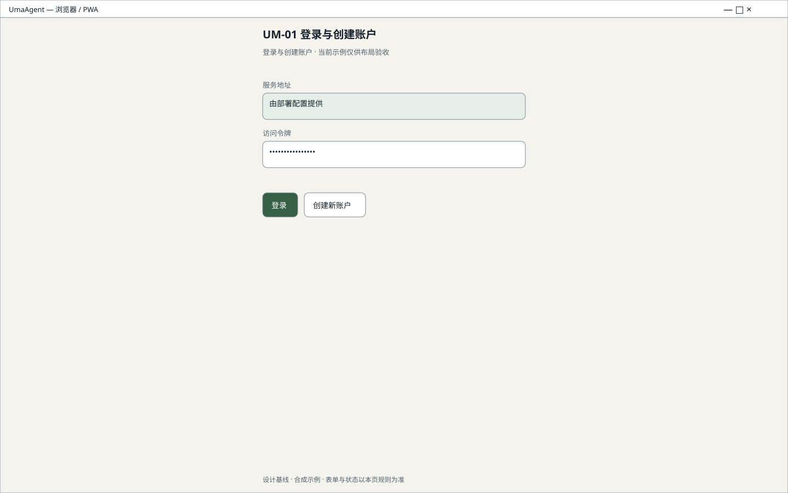

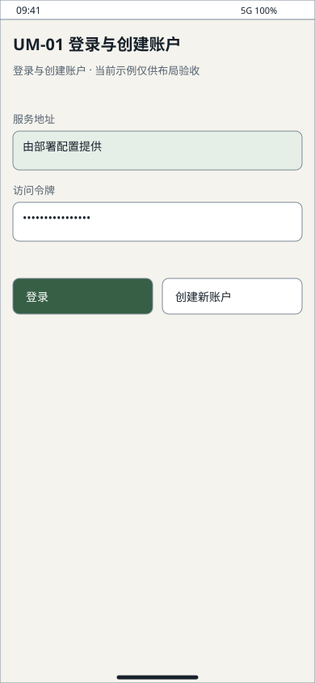

### 交互合同与状态图

**UM-01.I01 — 登录**

|条目|精确定义|
|---|---|
|触发与前置|用户点击“登录”；字段校验通过、在线、权限允许且此动作无在途请求。|
|执行类别|write（按G13解释）|
|事件/调用|`client.login(token);syncBootstrap()`|
|处理中|“登录”禁用并显示“处理中…”；本页对象保留，禁止并发重复提交。|
|成功|按user.role与workspace路由进入工作台；不展示一次性令牌页。|
|失败/重试|错误区显示具体原因；保留本页输入，按G02先核实结果再手动重试。|
|返回/取消|返回触发页面，恢复原焦点/滚动；未保存输入按G03确认；在途操作不被伪装取消。|
|验收|Given 操作前示例数据；When 触发“登录”；Then 只有真实回执后呈现上述结果。另模拟失败、双击、离开页面，核对G02/G03。|

**UM-01.I02 — 创建新账户**

|条目|精确定义|
|---|---|
|触发与前置|用户点击“创建新账户”；字段校验通过、在线、权限允许且此动作无在途请求。|
|执行类别|write（按G13解释）|
|事件/调用|`client.register(label)`|
|处理中|“创建新账户”禁用并显示“处理中…”；本页对象保留，禁止并发重复提交。|
|成功|进入UM-02一次性Token展示；不是密码注册。|
|失败/重试|错误区显示具体原因；保留本页输入，按G02先核实结果再手动重试。|
|返回/取消|返回触发页面，恢复原焦点/滚动；未保存输入按G03确认；在途操作不被伪装取消。|
|验收|Given 操作前示例数据；When 触发“创建新账户”；Then 只有真实回执后呈现上述结果。另模拟失败、双击、离开页面，核对G02/G03。|

### 页面验收

本页每个字段、每个动作和全部失败分支都有对应UI；320宽和200%字号可滚动到所有控件。不得用空值模拟成功。绑定见本页来源文件；实现检查本页所有事件ID。

## UM-02 · 一次性令牌保存

**入口与返回**：仅UM-01注册成功进入；离开不再重复展示。

**角色/设备**：刚注册用户；Web, Android。

**导航归属**：认证页不展示业务导航

**布局**：未认证壳：无业务侧栏、无底部导航；桌面居中480宽表单，手机左右16；应用名称、表单标题、字段、操作顺序展示。注册与登录互斥，发行页只显示新令牌。

**数据绑定**：`apps/web/src/Login.tsx`。register返回的token仅当前内存。

|控件（从上到下）|类型|图中示例|校验/显示合同|
|---|---|---|---|
|访问令牌|textarea|示例：仅此一次显示的新令牌|全值可选取；图稿不得放真实令牌|
|保存状态|record|尚未确认已保存|不会因剪贴板调用失败而标记已保存|

**页面规则**：刷新/进程终止可能丢失展示，离开前必须提示不可再次查看；继续按钮不是无条件丢弃Token。

**空态/加载/错误**：初次进入立即显示本页表单；只有读取本机配置期间显示“正在读取配置…”，不显示“暂无记录”或列表空态。服务失败在表单顶部持续显示，字段错误在对应字段下显示，保留输入并聚焦首个错误。认证请求需要在线；本机配置保存按该动作前置条件执行。一次性令牌页的数据丢失时说明“令牌已不可恢复，请返回登录”，不自动重新注册。

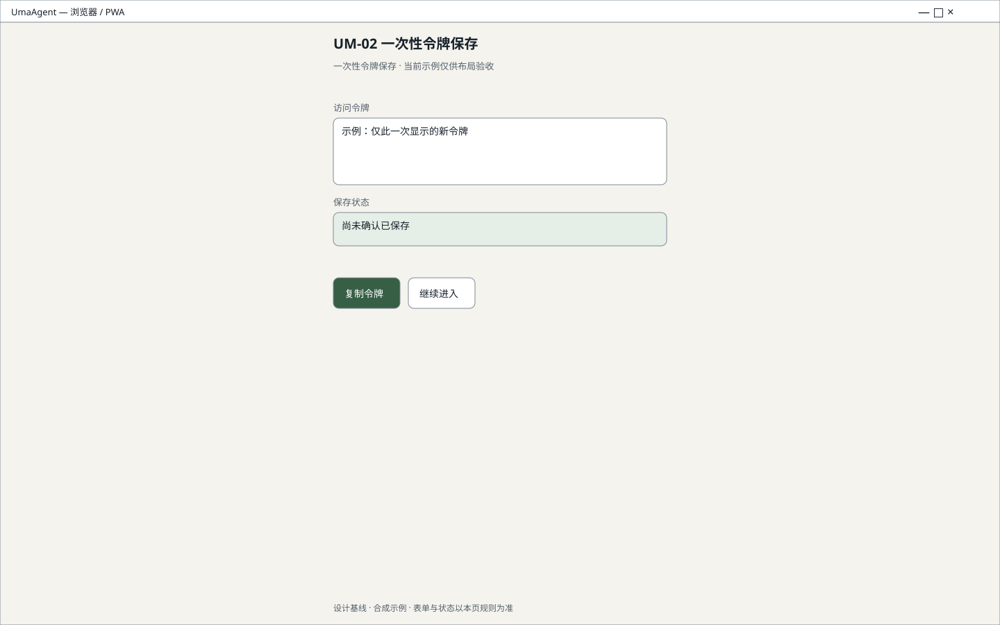

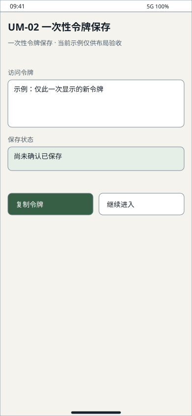

### 交互合同与状态图

**UM-02.I01 — 复制令牌**

|条目|精确定义|
|---|---|
|触发与前置|新Token存在；无需网络。|
|执行类别|system（按G13解释）|
|事件/调用|`navigator.clipboard / Android Clipboard`|
|处理中|等待系统剪贴板写入回调；本动作暂时禁用，不要求联网。|
|成功|成功提示已复制；继续按钮可用。|
|失败/重试|权限拒绝或系统写入失败时显示“复制失败，请手动选择文本复制”；内容不清空，不显示已复制，不自动重试。|
|返回/取消|返回触发页面，恢复原焦点/滚动；未保存输入按G03确认；在途操作不被伪装取消。|
|验收|离线复制成功后显示“已复制”4秒；模拟剪贴板拒绝时保留文本且不显示成功。只有回调成功才能勾记令牌已复制。|

**UM-02.I02 — 继续进入**

|条目|精确定义|
|---|---|
|触发与前置|用户已复制或勾选“我已手动保存令牌”。|
|执行类别|write（按G13解释）|
|事件/调用|`syncBootstrap`|
|处理中|“继续进入”禁用并显示“处理中…”；本页对象保留，禁止并发重复提交。|
|成功|用户明确确认已保存后进入工作台；不再次注册。|
|失败/重试|错误区显示具体原因；保留本页输入，按G02先核实结果再手动重试。|
|返回/取消|返回触发页面，恢复原焦点/滚动；未保存输入按G03确认；在途操作不被伪装取消。|
|验收|Given 操作前示例数据；When 触发“继续进入”；Then 只有真实回执后呈现上述结果。另模拟失败、双击、离开页面，核对G02/G03。|

### 页面验收

本页每个字段、每个动作和全部失败分支都有对应UI；320宽和200%字号可滚动到所有控件。不得用空值模拟成功。绑定见本页来源文件；实现检查本页所有事件ID。

## UM-03 · 工作台与会话导航

**入口与返回**：登录成功/侧栏会话/底部对话；返回优先关闭检查器。

**角色/设备**：已登录用户；Web, Android。

**导航归属**：工作区入口、更多工具、工作台状态、会话列表四组各自拥有唯一职责。

**布局**：使用§3设备壳。字段按表从上到下；主体单独滚动，操作区固定在主体底部；主次操作为交互表前两项，其余为右上“更多操作”。

**数据绑定**：`apps/web/src/App.tsx`。syncBootstrap/getSession/createSession；持久事件游标订阅与缺口补拉。

|控件（从上到下）|类型|图中示例|校验/显示合同|
|---|---|---|---|
|当前会话|record|研究资料梳理|标题从Session返回，200字符上限|
|连接|record|已连接 · 刚刚同步|bootstrap与事件连接各自状态|
|最近会话|record|研究资料 / 今日待办 / 新会话|会话updatedAt降序，ID稳定；本地筛选当前已加载集合|

**页面规则**：桌面侧栏220；抽屉宽480覆盖工作区；移动抽屉全屏。空首页建议只填草稿不自动发。

**空态/加载/错误**：首次读取显示“正在加载工作台与会话导航”；成功无记录显示“暂无工作台与会话导航记录”并保留入口操作。失败就地显示错误区；旧数据标“上次同步”；离线远端写操作禁用；本地查看、返回、复制、外观保存和已明确允许的配置保存仍可用。

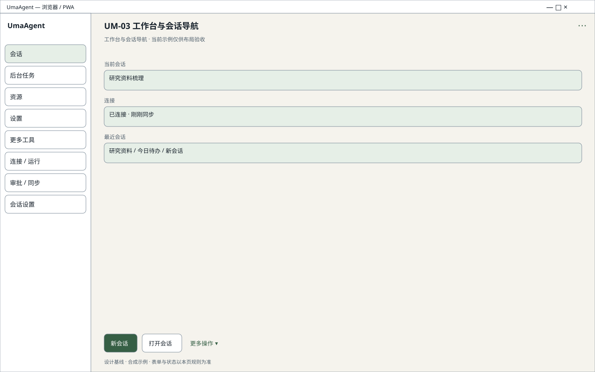

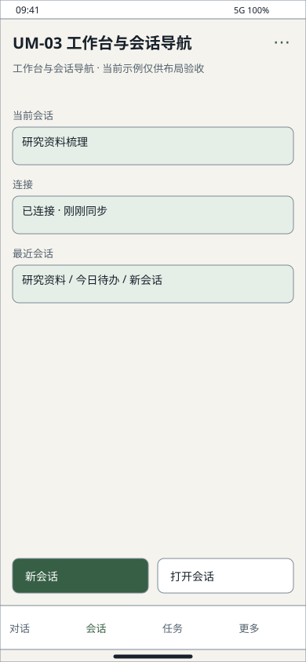

### 交互合同与状态图

**UM-03.I01 — 新会话**

|条目|精确定义|
|---|---|
|触发与前置|用户点击“新会话”；字段校验通过、在线、权限允许且此动作无在途请求。|
|执行类别|write（按G13解释）|
|事件/调用|`createSession()`|
|处理中|“新会话”禁用并显示“处理中…”；本页对象保留，禁止并发重复提交。|
|成功|回执成功才选中新会话，聚焦输入框；失败不生成空白假会话。|
|失败/重试|错误区显示具体原因；保留本页输入，按G02先核实结果再手动重试。|
|返回/取消|返回触发页面，恢复原焦点/滚动；未保存输入按G03确认；在途操作不被伪装取消。|
|验收|Given 操作前示例数据；When 触发“新会话”；Then 只有真实回执后呈现上述结果。另模拟失败、双击、离开页面，核对G02/G03。|

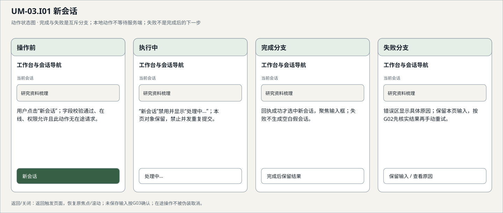

**UM-03.I02 — 打开会话**

|条目|精确定义|
|---|---|
|触发与前置|点击已有会话，可离线读取缓存。|
|执行类别|read（按G13解释）|
|事件/调用|`getSession(id) + subscribeSession(id,cursor)`|
|处理中|“打开会话”禁用并显示“处理中…”；本页对象保留，禁止并发重复提交。|
|成功|切换订阅，载入当前快照，草稿按会话隔离。|
|失败/重试|读取失败保留已加载内容并标“上次同步”，首次无缓存显示错误面板；按G07显示对应错误原因，手动重试相同查询，不要求核实写入结果。|
|返回/取消|返回触发页面，恢复原焦点/滚动；未保存输入按G03确认；在途操作不被伪装取消。|
|验收|Given 操作前示例数据；When 触发“打开会话”；Then 只有真实回执后呈现上述结果。另模拟失败、双击、离开页面，核对G02/G03。|

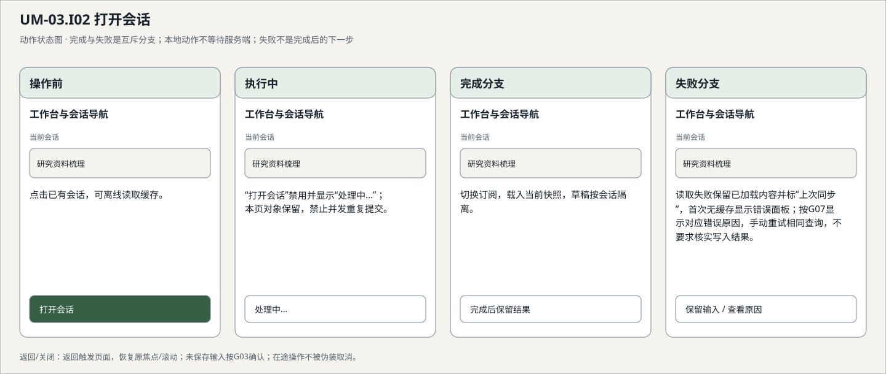

**UM-03.I03 — 打开检查器**

|条目|精确定义|
|---|---|
|触发与前置|无需联网。|
|执行类别|local（按G13解释）|
|事件/调用|`local.inspector`|
|处理中|本地覆盖层。|
|成功|显示运行/连接/审批/同步/设置入口，不压缩窄屏消息区。|
|失败/重试|不产生网络错误；目标对象在本地已移除则提示“内容已不可用”并保留当前页面。前置条件不满足时禁用并说明原因。|
|返回/取消|返回触发页面，恢复原焦点/滚动；未保存输入按G03确认；在途操作不被伪装取消。|
|验收|Given 本页前置条件满足；When 点击“打开检查器”；Then 本地状态立即符合成功规则。断网重复执行仍可用；返回恢复焦点，不产生远端写请求。切换类连续点击按当前值逐次切换。|

### 页面验收

本页每个字段、每个动作和全部失败分支都有对应UI；320宽和200%字号可滚动到所有控件。不得用空值模拟成功。绑定见本页来源文件；实现检查本页所有事件ID。

## UM-04 · 会话重命名与删除

**入口与返回**：当前会话标题→更多；返回同一会话。

**角色/设备**：已登录用户；Web, Android。

**导航归属**：电脑端：会话；Android：会话。返回沿本页规定入口恢复；从系统通知进入时无应用内历史则返回相应导航首页。

**布局**：使用§3设备壳。字段按表从上到下；主体单独滚动，操作区固定在主体底部；主次操作为交互表前两项，其余为右上“更多操作”。

**数据绑定**：`apps/web/src/areas/SessionArea.tsx`。updateSession/deleteSession。

|控件（从上到下）|类型|图中示例|校验/显示合同|
|---|---|---|---|
|会话标题|input|研究资料梳理|1–200字符，提交trim|
|删除范围|record|此会话与服务端相关会话数据|不声称仅删除索引；引用历史的可用性依返回结果|

**页面规则**：无滑动立即删除、无不存在的归档接口；返回放弃未保存标题必须确认。

**空态/加载/错误**：首次读取显示“正在加载会话重命名与删除”；成功无记录显示“暂无会话重命名与删除记录”并保留入口操作。失败就地显示错误区；旧数据标“上次同步”；离线远端写操作禁用；本地查看、返回、复制、外观保存和已明确允许的配置保存仍可用。

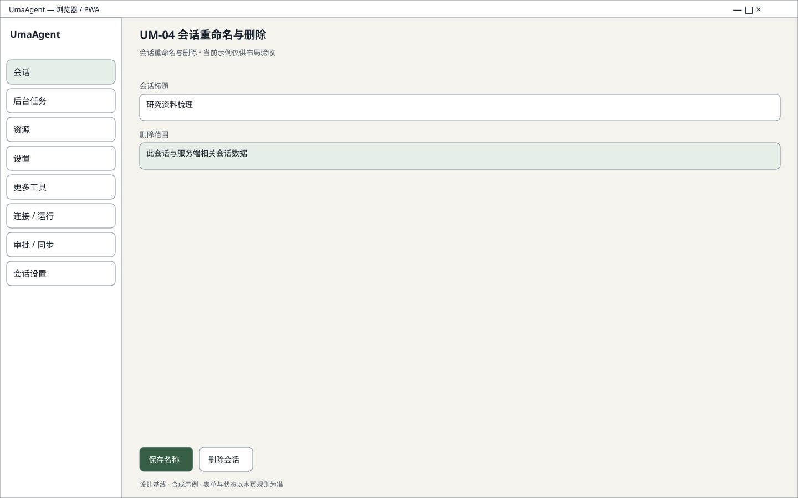

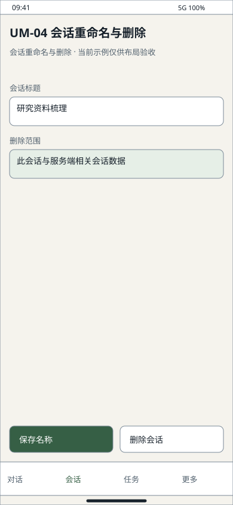

### 交互合同与状态图

**UM-04.I01 — 保存名称**

|条目|精确定义|
|---|---|
|触发与前置|用户点击“保存名称”；字段校验通过、在线、权限允许且此动作无在途请求。|
|执行类别|write（按G13解释）|
|事件/调用|`updateSession(id,{title})`|
|处理中|“保存名称”禁用并显示“处理中…”；本页对象保留，禁止并发重复提交。|
|成功|成功后列表和顶栏同时更新；失败保留原标题与编辑草稿。|
|失败/重试|错误区显示具体原因；保留本页输入，按G02先核实结果再手动重试。|
|返回/取消|返回触发页面，恢复原焦点/滚动；未保存输入按G03确认；在途操作不被伪装取消。|
|验收|Given 操作前示例数据；When 触发“保存名称”；Then 只有真实回执后呈现上述结果。另模拟失败、双击、离开页面，核对G02/G03。|

**UM-04.I02 — 删除会话**

|条目|精确定义|
|---|---|
|触发与前置|用户点删除，确认框展示会话名，默认焦点取消；在线。 按G15确认对象与删除范围；确认前不发送请求。|
|执行类别|write（按G13解释）|
|事件/调用|`deleteSession(id)`|
|处理中|“删除会话”禁用并显示“处理中…”；本页对象保留，禁止并发重复提交。|
|成功|确认对象名后删除；成功清除本会话缓存/订阅，选择剩余最近会话或空首页。|
|失败/重试|409运行中时引导先取消或等待；其他错误保留会话。|
|返回/取消|返回触发页面，恢复原焦点/滚动；未保存输入按G03确认；在途操作不被伪装取消。|
|验收|Given 操作前示例数据；When 触发“删除会话”；Then 只有真实回执后呈现上述结果。另模拟失败、双击、离开页面，核对G02/G03。|

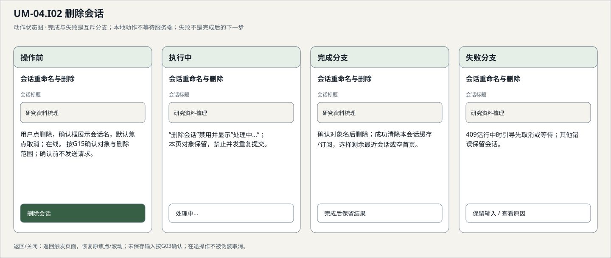

### 页面验收

本页每个字段、每个动作和全部失败分支都有对应UI；320宽和200%字号可滚动到所有控件。不得用空值模拟成功。绑定见本页来源文件；实现检查本页所有事件ID。

## UM-05 · 对话输入与附件草稿

**入口与返回**：当前会话底部输入；从任意资源引用回到此处。

**角色/设备**：已登录用户；Web, Android。

**导航归属**：电脑端：会话；Android：对话。返回沿本页规定入口恢复；从系统通知进入时无应用内历史则返回相应导航首页。

**布局**：聊天模板：顶部会话标题与最多2条上下文信息；用户消息右对齐、助手回答左对齐；消息内容最大960宽，手机铺满减32；正文独立滚动，输入面板按多行内容增长并限制最大高度，固定在操作栏上方；其余字段在消息关联详情中展开。空态不生成假历史消息。

**数据绑定**：`apps/web/src/App.tsx`。sendMessage + upload。

|控件（从上到下）|类型|图中示例|校验/显示合同|
|---|---|---|---|
|工作模式|select|Agent|Agent/Plan，仅下一条请求|
|消息|textarea|请按主题总结这三份资料。|1–20000字符UI上限；IME遵循G05|
|附件|record|research.pdf · 上传完成|最多20项，上传未完成/失败时禁发；通过attachmentId发送|

**页面规则**：正文与附件均为空时禁发；仅有已上传附件时，客户端提供“请查看附件。”默认正文。结果未确认时保留并锁定原正文、附件和模式，先核对历史，再复用原 messageId 手动重试。附件独立上传，不能把上传成功误报为消息已发送。

**空态/加载/错误**：首次读取显示“正在加载对话输入与附件草稿”；成功无记录显示“暂无对话输入与附件草稿记录”并保留入口操作。失败就地显示错误区；旧数据标“上次同步”；离线远端写操作禁用；本地查看、返回、复制、外观保存和已明确允许的配置保存仍可用。

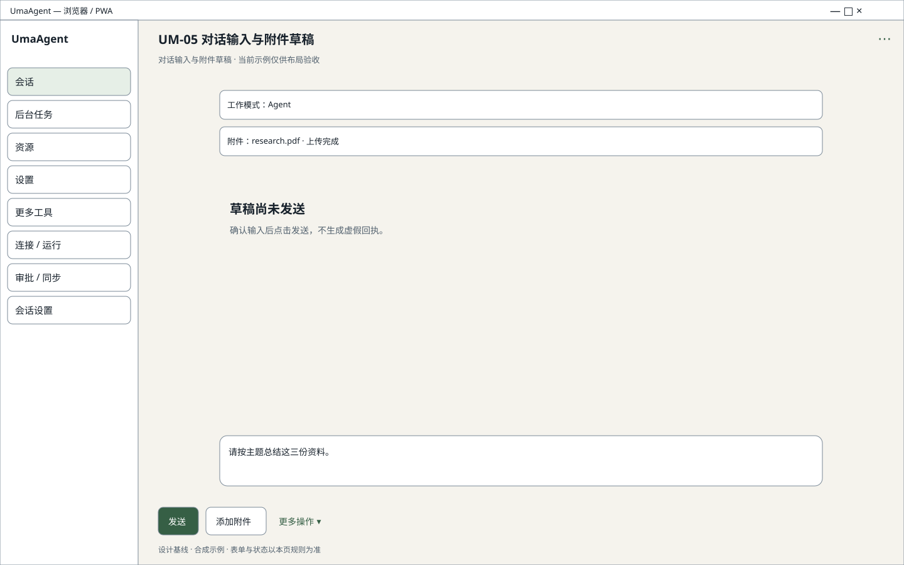

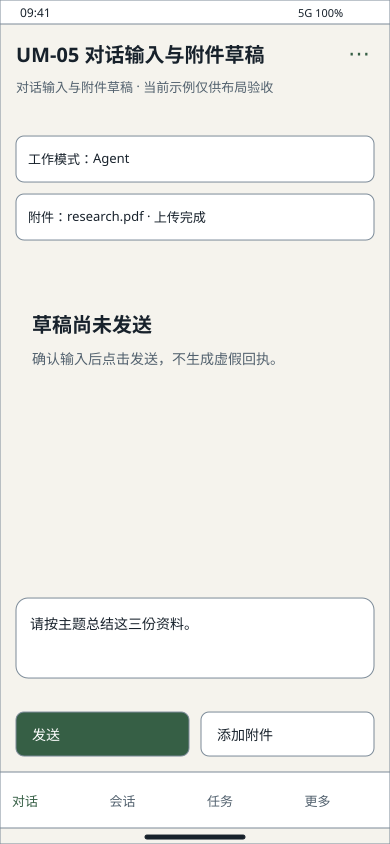

### 交互合同与状态图

**UM-05.I01 — 发送**

|条目|精确定义|
|---|---|
|触发与前置|用户点击“发送”；字段校验通过、在线、权限允许且此动作无在途请求。|
|执行类别|write（按G13解释）|
|事件/调用|`sendMessage(sessionId,text,{messageId,mode,attachmentIds})`|
|处理中|“发送”禁用并显示“处理中…”；本页对象保留，禁止并发重复提交。|
|成功|收到runId后将草稿变为已提交消息，进入UM-06；服务端排队显示队列位置。|
|失败/重试|错误区显示具体原因；保留本页输入，按G02先核实结果再手动重试。|
|返回/取消|返回触发页面，恢复原焦点/滚动；未保存输入按G03确认；在途操作不被伪装取消。|
|验收|Given 操作前示例数据；When 触发“发送”；Then 只有真实回执后呈现上述结果。另模拟失败、双击、离开页面，核对G02/G03。|

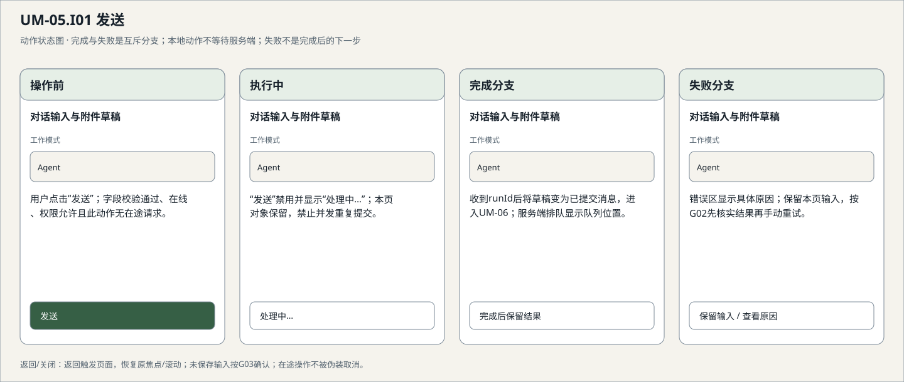

**UM-05.I02 — 添加附件**

|条目|精确定义|
|---|---|
|触发与前置|用户点击“添加附件”；字段校验通过、在线、权限允许且此动作无在途请求。|
|执行类别|write（按G13解释）|
|事件/调用|`upload(file,name,sessionId)`|
|处理中|“添加附件”禁用并显示“处理中…”；本页对象保留，禁止并发重复提交。|
|成功|上传完成显示文件名和可移除状态；不发送消息。|
|失败/重试|失败保留附件卡，提供重试和移除；不得清空正文。|
|返回/取消|返回触发页面，恢复原焦点/滚动；未保存输入按G03确认；在途操作不被伪装取消。|
|验收|Given 操作前示例数据；When 触发“添加附件”；Then 只有真实回执后呈现上述结果。另模拟失败、双击、离开页面，核对G02/G03。|

**UM-05.I03 — 移除草稿附件**

|条目|精确定义|
|---|---|
|触发与前置|附件属于未发送草稿。|
|执行类别|local（按G13解释）|
|事件/调用|`local.removeAttachment`|
|处理中|本地即时移除。|
|成功|只解除本次消息附件关联，不删除已上传资源。|
|失败/重试|不产生网络错误；目标对象在本地已移除则提示“内容已不可用”并保留当前页面。前置条件不满足时禁用并说明原因。|
|返回/取消|返回触发页面，恢复原焦点/滚动；未保存输入按G03确认；在途操作不被伪装取消。|
|验收|Given 本页前置条件满足；When 点击“移除草稿附件”；Then 本地状态立即符合成功规则。断网重复执行仍可用；返回恢复焦点，不产生远端写请求。切换类连续点击按当前值逐次切换。|

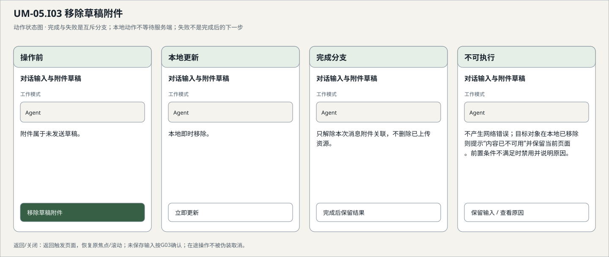

### 页面验收

本页每个字段、每个动作和全部失败分支都有对应UI；320宽和200%字号可滚动到所有控件。不得用空值模拟成功。绑定见本页来源文件；实现检查本页所有事件ID。

## UM-06 · 回复、引用与消息操作

**入口与返回**：UM-05提交后或历史消息点击；返回保持滚动。

**角色/设备**：已登录用户；Web, Android。

**导航归属**：电脑端：会话；Android：对话。返回沿本页规定入口恢复；从系统通知进入时无应用内历史则返回相应导航首页。

**布局**：聊天模板：顶部会话标题与最多2条上下文信息；用户消息右对齐、助手回答左对齐；消息内容最大960宽，手机铺满减32；正文独立滚动，输入面板按多行内容增长并限制最大高度，固定在操作栏上方；其余字段在消息关联详情中展开。空态不生成假历史消息。

**数据绑定**：`apps/web/src/components/ResponseCard.tsx`。Response/TranscriptItem；quality操作API。

|控件（从上到下）|类型|图中示例|校验/显示合同|
|---|---|---|---|
|当前阶段|record|正在执行|真实Run/Response状态，不以定时器模拟|
|回答|message|资料分为方法、实验与结论三个主题。|安全Markdown；不执行内嵌脚本|
|引用|record|资料A · 第2节|链接目标来自返回数据，未提供页码不编造|

**页面规则**：流式滚动按G06。用户消息编辑→editMessage并形成新运行，不能假装修改旧执行结果；在更多菜单提供“编辑后提交”进入正文表单并保留原消息。

**空态/加载/错误**：首次读取显示“正在加载回复、引用与消息操作”；成功无记录显示“暂无回复、引用与消息操作记录”并保留入口操作。失败就地显示错误区；旧数据标“上次同步”；离线远端写操作禁用；本地查看、返回、复制、外观保存和已明确允许的配置保存仍可用。

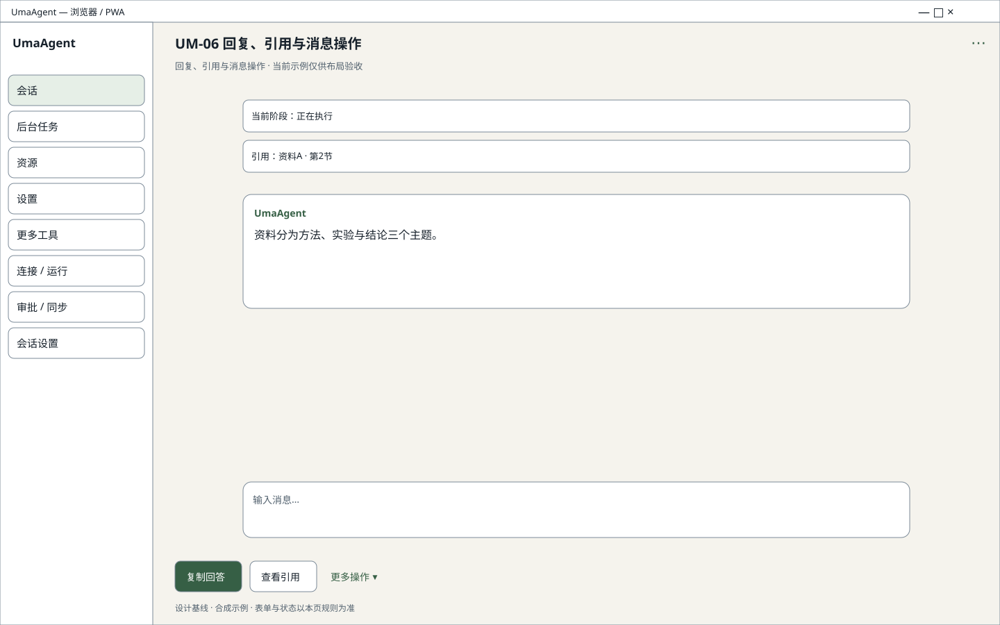

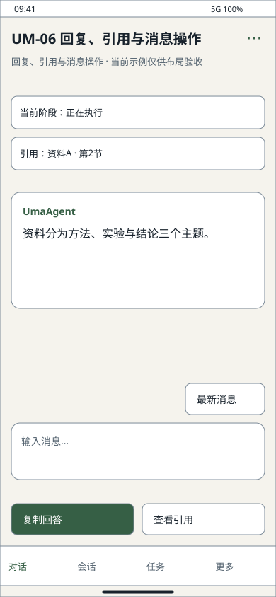

### 交互合同与状态图

**UM-06.I01 — 复制回答**

|条目|精确定义|
|---|---|
|触发与前置|存在可读文本；无需在线。|
|执行类别|system（按G13解释）|
|事件/调用|`clipboard.writeText(message.content)`|
|处理中|等待系统剪贴板写入回调；本动作暂时禁用，不要求联网。|
|成功|复制选定回答；成功Toast。|
|失败/重试|权限拒绝或系统写入失败时显示“复制失败，请手动选择文本复制”；内容不清空，不显示已复制，不自动重试。|
|返回/取消|返回触发页面，恢复原焦点/滚动；未保存输入按G03确认；在途操作不被伪装取消。|
|验收|离线复制成功后显示已复制反馈；模拟剪贴板拒绝时保留正文且不显示成功。反馈仅表示复制完成，不改变消息状态。|

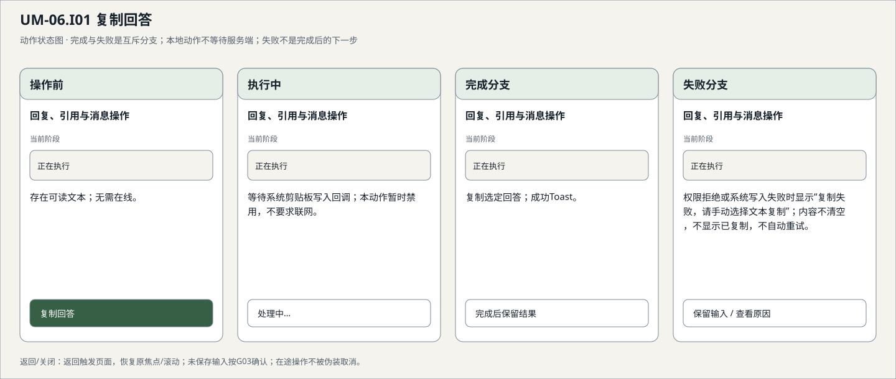

**UM-06.I02 — 查看引用**

|条目|精确定义|
|---|---|
|触发与前置|用户点击“查看引用”；字段校验通过、在线、权限允许且此动作无在途请求。|
|执行类别|read（按G13解释）|
|事件/调用|`attachmentContent / safe external URL`|
|处理中|“查看引用”禁用并显示“处理中…”；本页对象保留，禁止并发重复提交。|
|成功|打开UM-08附件预览或系统浏览器；只允许明确协议。|
|失败/重试|读取失败保留已加载内容并标“上次同步”，首次无缓存显示错误面板；按G07显示对应错误原因，手动重试相同查询，不要求核实写入结果。|
|返回/取消|返回触发页面，恢复原焦点/滚动；未保存输入按G03确认；在途操作不被伪装取消。|
|验收|Given 操作前示例数据；When 触发“查看引用”；Then 只有真实回执后呈现上述结果。另模拟失败、双击、离开页面，核对G02/G03。|

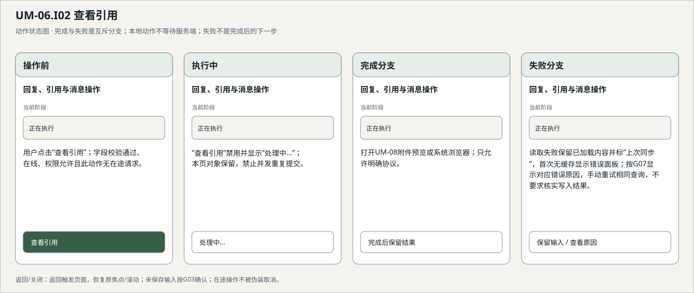

**UM-06.I03 — 审查与改进**

|条目|精确定义|
|---|---|
|触发与前置|用户点击“审查与改进”；字段校验通过、在线、权限允许且此动作无在途请求。|
|执行类别|write（按G13解释）|
|事件/调用|`reviewMessage / improveMessage`|
|处理中|“审查与改进”禁用并显示“处理中…”；本页对象保留，禁止并发重复提交。|
|成功|进入UM-09，质量运行按messageId关联，不覆盖原回答。|
|失败/重试|错误区显示具体原因；保留本页输入，按G02先核实结果再手动重试。|
|返回/取消|返回触发页面，恢复原焦点/滚动；未保存输入按G03确认；在途操作不被伪装取消。|
|验收|Given 操作前示例数据；When 触发“审查与改进”；Then 只有真实回执后呈现上述结果。另模拟失败、双击、离开页面，核对G02/G03。|

### 页面验收

本页每个字段、每个动作和全部失败分支都有对应UI；320宽和200%字号可滚动到所有控件。不得用空值模拟成功。绑定见本页来源文件；实现检查本页所有事件ID。

## UM-07 · 模型、思考与队列策略

**入口与返回**：会话顶栏模型入口；关闭返回对话。

**角色/设备**：已登录用户；Web, Android。

**导航归属**：电脑端：会话；Android：对话。返回沿本页规定入口恢复；从系统通知进入时无应用内历史则返回相应导航首页。

**布局**：使用§3设备壳。字段按表从上到下；主体单独滚动，操作区固定在主体底部；主次操作为交互表前两项，其余为右上“更多操作”。

**数据绑定**：`apps/web/src/components/ConversationHeader.tsx`。listModels/updateSession。

|控件（从上到下）|类型|图中示例|校验/显示合同|
|---|---|---|---|
|模型|select|gpt-6-astra|内置项+自定义名称；provider保持当前值|
|自定义模型名|input|my-model|1–200字符UI上限；不含空白控制字符；相同provider/id去重|
|思考强度|select|high|仅协议枚举与模型能力交集|
|消息策略|select|queue|queue排队 / preemptive抢占|

**页面规则**：自定义名称不修改baseURL/API key/Provider配置；首次模型请求失败显示服务端原因，不改用其他模型。

**空态/加载/错误**：首次读取显示“正在加载模型、思考与队列策略”；成功无记录显示“暂无模型、思考与队列策略记录”并保留入口操作。失败就地显示错误区；旧数据标“上次同步”；离线远端写操作禁用；本地查看、返回、复制、外观保存和已明确允许的配置保存仍可用。

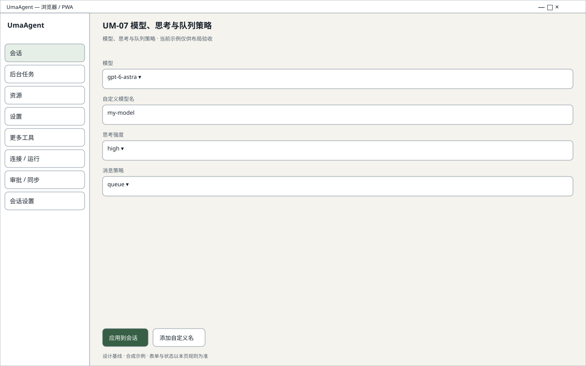

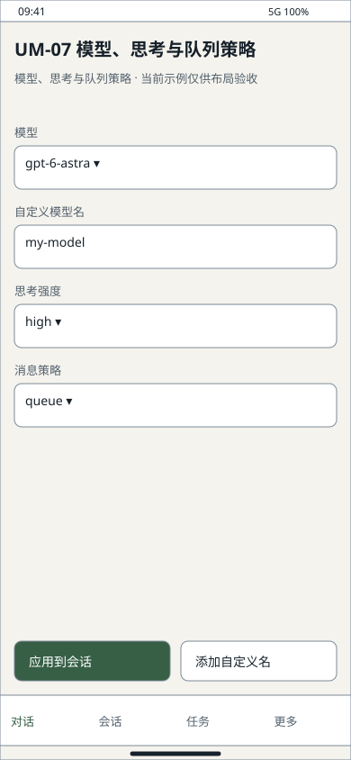

### 交互合同与状态图

**UM-07.I01 — 应用到会话**

|条目|精确定义|
|---|---|
|触发与前置|用户点击“应用到会话”；字段校验通过、在线、权限允许且此动作无在途请求。|
|执行类别|write（按G13解释）|
|事件/调用|`updateSession(id,{model,thinkingLevel,queueMode})`|
|处理中|“应用到会话”禁用并显示“处理中…”；本页对象保留，禁止并发重复提交。|
|成功|回执后顶栏和设置同时更新；草稿/历史不变。|
|失败/重试|错误区显示具体原因；保留本页输入，按G02先核实结果再手动重试。|
|返回/取消|返回触发页面，恢复原焦点/滚动；未保存输入按G03确认；在途操作不被伪装取消。|
|验收|Given 操作前示例数据；When 触发“应用到会话”；Then 只有真实回执后呈现上述结果。另模拟失败、双击、离开页面，核对G02/G03。|

**UM-07.I02 — 添加自定义名**

|条目|精确定义|
|---|---|
|触发与前置|名称合法且不重复；无需验证模型真实可用。|
|执行类别|local（按G13解释）|
|事件/调用|`local.modelChoices`|
|处理中|本地选择项更新，不调用模型。|
|成功|本设备当前provider下记忆该名称；无能力元数据标“能力未提供”。|
|失败/重试|不产生网络错误；目标对象在本地已移除则提示“内容已不可用”并保留当前页面。前置条件不满足时禁用并说明原因。|
|返回/取消|返回触发页面，恢复原焦点/滚动；未保存输入按G03确认；在途操作不被伪装取消。|
|验收|Given 本页前置条件满足；When 点击“添加自定义名”；Then 本地状态立即符合成功规则。断网重复执行仍可用；返回恢复焦点，不产生远端写请求。切换类连续点击按当前值逐次切换。|

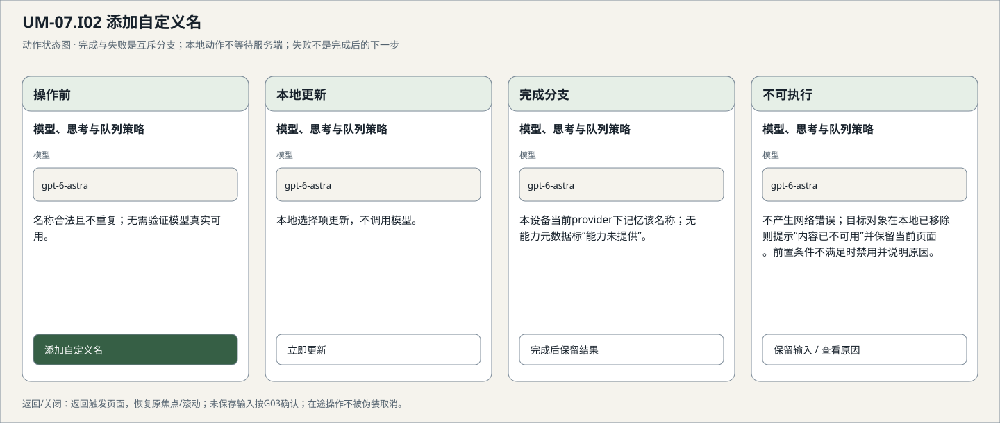

### 页面验收

本页每个字段、每个动作和全部失败分支都有对应UI；320宽和200%字号可滚动到所有控件。不得用空值模拟成功。绑定见本页来源文件；实现检查本页所有事件ID。

## UM-08 · 附件预览与下载

**入口与返回**：消息附件/知识引用；返回原消息锚点。

**角色/设备**：已登录用户；Web, Android。

**导航归属**：电脑端：会话；Android：对话。返回沿本页规定入口恢复；从系统通知进入时无应用内历史则返回相应导航首页。

**布局**：使用§3设备壳。字段按表从上到下；主体单独滚动，操作区固定在主体底部；主次操作为交互表前两项，其余为右上“更多操作”。

**数据绑定**：`apps/web/src/Markdown.tsx`。attachmentContent(id)/downloadAttachment(id)。

|控件（从上到下）|类型|图中示例|校验/显示合同|
|---|---|---|---|
|附件|record|research.pdf|服务端name/MIME/size|
|预览|record|第1页 · 适配宽度|图片contain；文本转义；PDF使用安全查看器，缺支持显示下载入口|
|来源|record|当前会话附件|不能把它说成电脑任意本地文件|

**页面规则**：未知/不支持MIME显示文件卡与下载，不嵌入可执行HTML；预览失败仍保留文件元数据。

**空态/加载/错误**：首次读取显示“正在加载附件预览与下载”；成功无记录显示“暂无附件预览与下载记录”并保留入口操作。失败就地显示错误区；旧数据标“上次同步”；离线远端写操作禁用；本地查看、返回、复制、外观保存和已明确允许的配置保存仍可用。

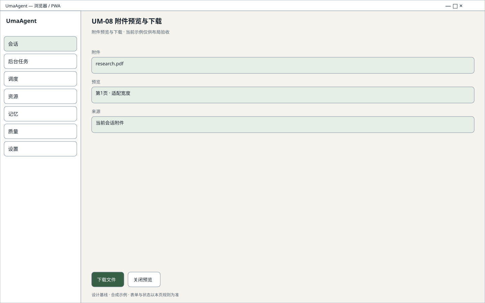

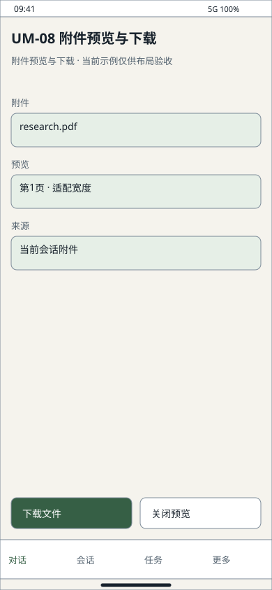

### 交互合同与状态图

**UM-08.I01 — 下载文件**

|条目|精确定义|
|---|---|
|触发与前置|用户点击“下载文件”；字段校验通过、在线、权限允许且此动作无在途请求。|
|执行类别|read（按G13解释）|
|事件/调用|`downloadAttachment(id)`|
|处理中|“下载文件”禁用并显示“处理中…”；本页对象保留，禁止并发重复提交。|
|成功|经鉴权获取blob后系统保存；取消保存不显示已下载。|
|失败/重试|读取失败保留已加载内容并标“上次同步”，首次无缓存显示错误面板；按G07显示对应错误原因，手动重试相同查询，不要求核实写入结果。|
|返回/取消|返回触发页面，恢复原焦点/滚动；未保存输入按G03确认；在途操作不被伪装取消。|
|验收|Given 操作前示例数据；When 触发“下载文件”；Then 只有真实回执后呈现上述结果。另模拟失败、双击、离开页面，核对G02/G03。|

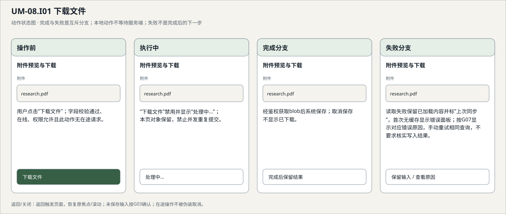

**UM-08.I02 — 关闭预览**

|条目|精确定义|
|---|---|
|触发与前置|无需联网。|
|执行类别|local（按G13解释）|
|事件/调用|`local.closePreview`|
|处理中|本地关闭。|
|成功|释放objectURL，返回原消息与滚动位置。|
|失败/重试|不产生网络错误；目标对象在本地已移除则提示“内容已不可用”并保留当前页面。前置条件不满足时禁用并说明原因。|
|返回/取消|返回触发页面，恢复原焦点/滚动；未保存输入按G03确认；在途操作不被伪装取消。|
|验收|Given 本页前置条件满足；When 点击“关闭预览”；Then 本地状态立即符合成功规则。断网重复执行仍可用；返回恢复焦点，不产生远端写请求。切换类连续点击按当前值逐次切换。|

### 页面验收

本页每个字段、每个动作和全部失败分支都有对应UI；320宽和200%字号可滚动到所有控件。不得用空值模拟成功。绑定见本页来源文件；实现检查本页所有事件ID。

## UM-09 · 消息审查与改进

**入口与返回**：UM-06更多→审查或改进。

**角色/设备**：已登录用户；Web, Android。

**导航归属**：电脑端：会话；Android：对话。返回沿本页规定入口恢复；从系统通知进入时无应用内历史则返回相应导航首页。

**布局**：使用§3设备壳。字段按表从上到下；主体单独滚动，操作区固定在主体底部；主次操作为交互表前两项，其余为右上“更多操作”。

**数据绑定**：`apps/web/src/components/QualityPanel.tsx`。reviewMessage/improveMessage/listMessageQuality。

|控件（从上到下）|类型|图中示例|校验/显示合同|
|---|---|---|---|
|目标消息|record|资料总结回答|固定messageId|
|审查反馈|textarea|补充引用并精简结论|仅审查使用，可空；UI最多2000字符；改进不提交此字段|
|质量结果|record|完整性：待检查|没有结果时不显示分数|

**页面规则**：进行中禁止同消息并发质量请求；失败不覆盖先前报告；评测百分比分母0时显示未提供。

**空态/加载/错误**：首次读取显示“正在加载消息审查与改进”；成功无记录显示“暂无消息审查与改进记录”并保留入口操作。失败就地显示错误区；旧数据标“上次同步”；离线远端写操作禁用；本地查看、返回、复制、外观保存和已明确允许的配置保存仍可用。

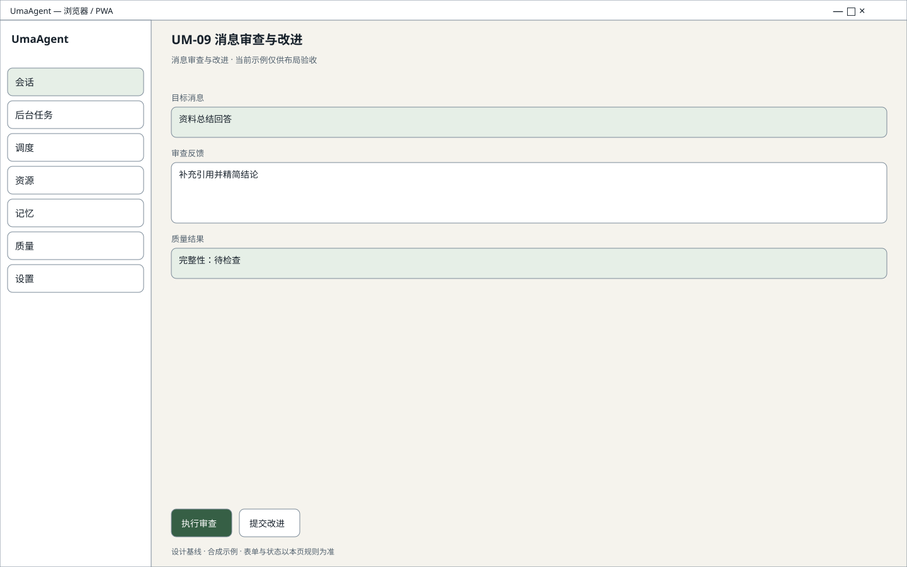

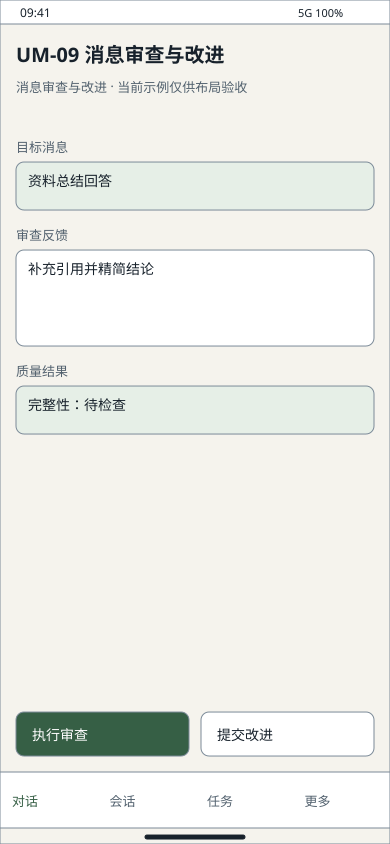

### 交互合同与状态图

**UM-09.I01 — 执行审查**

|条目|精确定义|
|---|---|
|触发与前置|用户点击“执行审查”；字段校验通过、在线、权限允许且此动作无在途请求。|
|执行类别|write（按G13解释）|
|事件/调用|`reviewMessage(messageId,feedback)`|
|处理中|“执行审查”禁用并显示“处理中…”；本页对象保留，禁止并发重复提交。|
|成功|显示独立审查运行与历史，成功后展开证据。|
|失败/重试|错误区显示具体原因；保留本页输入，按G02先核实结果再手动重试。|
|返回/取消|返回触发页面，恢复原焦点/滚动；未保存输入按G03确认；在途操作不被伪装取消。|
|验收|Given 操作前示例数据；When 触发“执行审查”；Then 只有真实回执后呈现上述结果。另模拟失败、双击、离开页面，核对G02/G03。|

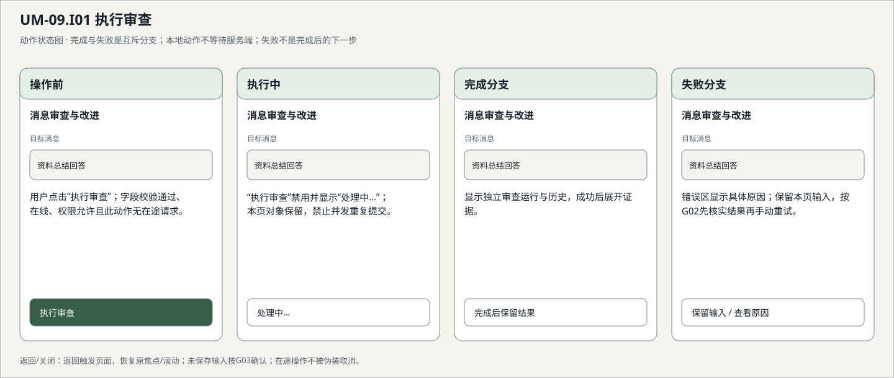

**UM-09.I02 — 提交改进**

|条目|精确定义|
|---|---|
|触发与前置|用户点击“提交改进”；字段校验通过、在线、权限允许且此动作无在途请求。|
|执行类别|write（按G13解释）|
|事件/调用|`improveMessage(messageId,{})`|
|处理中|“提交改进”禁用并显示“处理中…”；本页对象保留，禁止并发重复提交。|
|成功|生成独立改进运行，保留原回答和历史。|
|失败/重试|错误区显示具体原因；保留本页输入，按G02先核实结果再手动重试。|
|返回/取消|返回触发页面，恢复原焦点/滚动；未保存输入按G03确认；在途操作不被伪装取消。|
|验收|Given 操作前示例数据；When 触发“提交改进”；Then 只有真实回执后呈现上述结果。另模拟失败、双击、离开页面，核对G02/G03。|

### 页面验收

本页每个字段、每个动作和全部失败分支都有对应UI；320宽和200%字号可滚动到所有控件。不得用空值模拟成功。绑定见本页来源文件；实现检查本页所有事件ID。

## UM-10 · 运行计划、确认与取消

**入口与返回**：检查器→运行；Plan消息返回计划时自动提示。

**角色/设备**：已登录用户；Web, Android。

**导航归属**：电脑端：会话；Android：对话。返回沿本页规定入口恢复；从系统通知进入时无应用内历史则返回相应导航首页。

**布局**：使用§3设备壳。字段按表从上到下；主体单独滚动，操作区固定在主体底部；主次操作为交互表前两项，其余为右上“更多操作”。

**数据绑定**：`apps/web/src/areas/RunArea.tsx`。getRun/listRunActions/listRunCheckpoints/confirmPlan/resumeRun/cancelRun。

|控件（从上到下）|类型|图中示例|校验/显示合同|
|---|---|---|---|
|运行|record|等待确认执行计划|Run.status|
|计划步骤|record|1.读取资料  2.生成摘要  3.验证引用|以返回顺序展示，列表可展开|
|假设与成功标准|record|每个结论附来源|服务端字段存在才显示|

**页面规则**：计划确认与工具审批分别展示；失败/已完成运行不可再次确认；不直接重放原任务作为“继续”。

**空态/加载/错误**：首次读取显示“正在加载运行计划、确认与取消”；成功无记录显示“暂无运行计划、确认与取消记录”并保留入口操作。失败就地显示错误区；旧数据标“上次同步”；离线远端写操作禁用；本地查看、返回、复制、外观保存和已明确允许的配置保存仍可用。

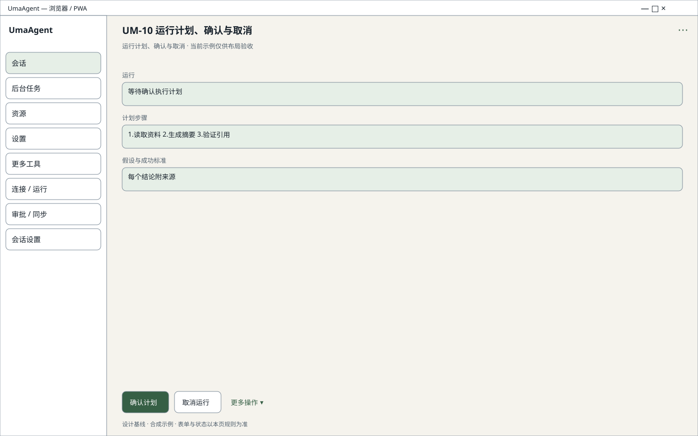

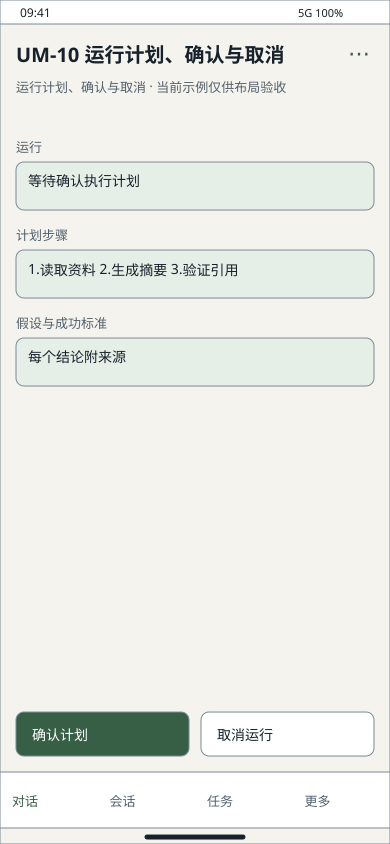

### 交互合同与状态图

**UM-10.I01 — 确认计划**

|条目|精确定义|
|---|---|
|触发与前置|状态awaiting_confirmation且在线。|
|执行类别|write（按G13解释）|
|事件/调用|`confirmPlan(runId)`|
|处理中|“确认计划”禁用并显示“处理中…”；本页对象保留，禁止并发重复提交。|
|成功|只在awaiting_confirmation时有效；成功显示运行状态，不等同工具权限全获批。|
|失败/重试|错误区显示具体原因；保留本页输入，按G02先核实结果再手动重试。|
|返回/取消|返回触发页面，恢复原焦点/滚动；未保存输入按G03确认；在途操作不被伪装取消。|
|验收|Given 操作前示例数据；When 触发“确认计划”；Then 只有真实回执后呈现上述结果。另模拟失败、双击、离开页面，核对G02/G03。|

**UM-10.I02 — 取消运行**

|条目|精确定义|
|---|---|
|触发与前置|用户点击“取消运行”；字段校验通过、在线、权限允许且此动作无在途请求。|
|执行类别|write（按G13解释）|
|事件/调用|`cancelRun(runId)`|
|处理中|“取消运行”禁用并显示“处理中…”；本页对象保留，禁止并发重复提交。|
|成功|收到cancelled才显示已取消；期间取消按钮禁用。|
|失败/重试|错误区显示具体原因；保留本页输入，按G02先核实结果再手动重试。|
|返回/取消|返回触发页面，恢复原焦点/滚动；未保存输入按G03确认；在途操作不被伪装取消。|
|验收|Given 操作前示例数据；When 触发“取消运行”；Then 只有真实回执后呈现上述结果。另模拟失败、双击、离开页面，核对G02/G03。|

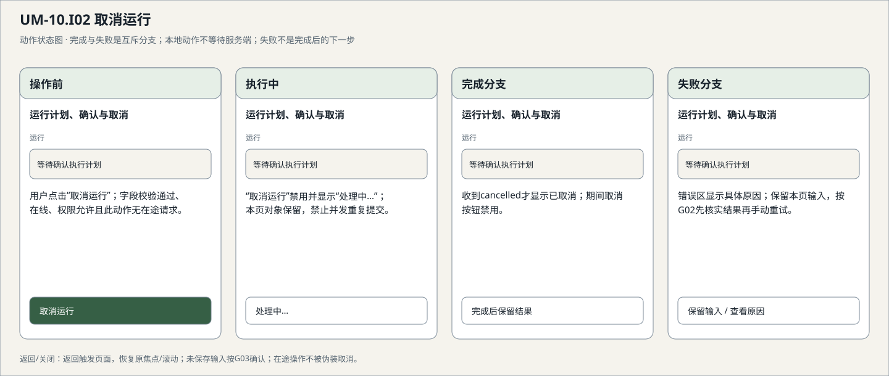

**UM-10.I03 — 继续运行**

|条目|精确定义|
|---|---|
|触发与前置|服务端Run.resume可恢复。|
|执行类别|write（按G13解释）|
|事件/调用|`resumeRun(runId)`|
|处理中|“继续运行”禁用并显示“处理中…”；本页对象保留，禁止并发重复提交。|
|成功|仅interrupted且可恢复时启用；成功显示新运行进度。|
|失败/重试|错误区显示具体原因；保留本页输入，按G02先核实结果再手动重试。|
|返回/取消|返回触发页面，恢复原焦点/滚动；未保存输入按G03确认；在途操作不被伪装取消。|
|验收|Given 操作前示例数据；When 触发“继续运行”；Then 只有真实回执后呈现上述结果。另模拟失败、双击、离开页面，核对G02/G03。|

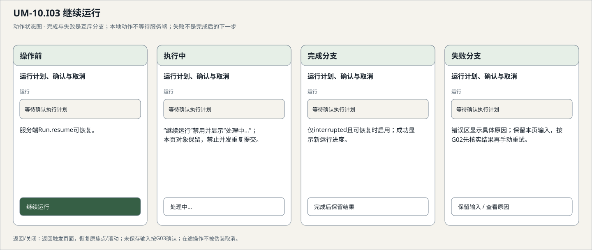

### 页面验收

本页每个字段、每个动作和全部失败分支都有对应UI；320宽和200%字号可滚动到所有控件。不得用空值模拟成功。绑定见本页来源文件；实现检查本页所有事件ID。

## UM-11 · 工具审批

**入口与返回**：审批条/检查器审批入口；处理后回运行。

**角色/设备**：已登录用户；Web, Android。

**导航归属**：电脑端：会话；Android：对话。返回沿本页规定入口恢复；从系统通知进入时无应用内历史则返回相应导航首页。

**布局**：使用§3设备壳。字段按表从上到下；主体单独滚动，操作区固定在主体底部；主次操作为交互表前两项，其余为右上“更多操作”。

**数据绑定**：`apps/web/src/components/InspectorStatusPanels.tsx`。resolveApproval(id,approved)。

|控件（从上到下）|类型|图中示例|校验/显示合同|
|---|---|---|---|
|操作|record|写入摘要文件|工具名/动作说明来自Approval|
|影响范围|record|当前授权工作目录|仅列服务端提供的对象|
|决策|record|等待你的批准|未决定时有批准/拒绝；已决定只读|

**页面规则**：只有待审批项可操作；深链403禁止显示可用按钮；点击遮罩等同暂不处理，不自动拒绝。

**空态/加载/错误**：只有实际待审批项才显示入口；默认免审批且无待处理项时隐藏空审批区。读取失败显示错误并可重试，已作出的决策以服务端回执为准。

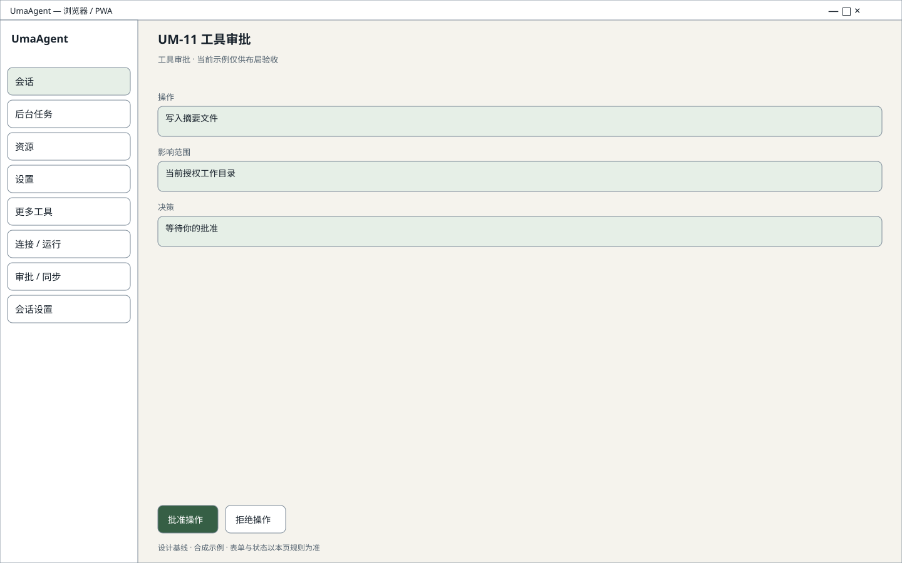

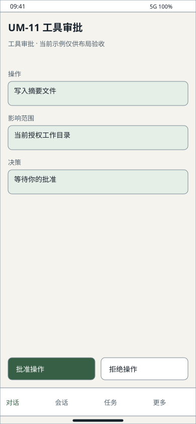

### 交互合同与状态图

**UM-11.I01 — 批准操作**

|条目|精确定义|
|---|---|
|触发与前置|用户点击“批准操作”；字段校验通过、在线、权限允许且此动作无在途请求。|
|执行类别|write（按G13解释）|
|事件/调用|`resolveApproval(id,true)`|
|处理中|“批准操作”禁用并显示“处理中…”；本页对象保留，禁止并发重复提交。|
|成功|只有成功回执后解除审批阻塞；保留决策结果。|
|失败/重试|错误区显示具体原因；保留本页输入，按G02先核实结果再手动重试。|
|返回/取消|返回触发页面，恢复原焦点/滚动；未保存输入按G03确认；在途操作不被伪装取消。|
|验收|Given 操作前示例数据；When 触发“批准操作”；Then 只有真实回执后呈现上述结果。另模拟失败、双击、离开页面，核对G02/G03。|

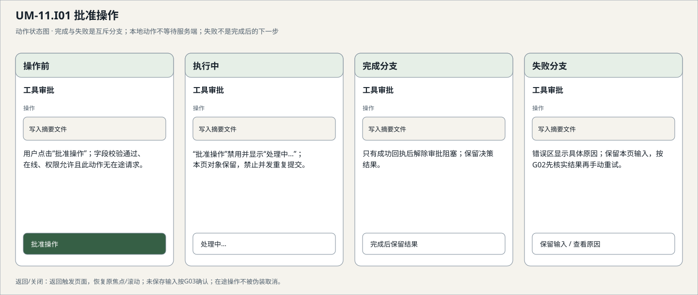

**UM-11.I02 — 拒绝操作**

|条目|精确定义|
|---|---|
|触发与前置|用户点击“拒绝操作”；字段校验通过、在线、权限允许且此动作无在途请求。|
|执行类别|write（按G13解释）|
|事件/调用|`resolveApproval(id,false)`|
|处理中|“拒绝操作”禁用并显示“处理中…”；本页对象保留，禁止并发重复提交。|
|成功|显示已拒绝，运行后续由Core决定，不自动改成失败。|
|失败/重试|错误区显示具体原因；保留本页输入，按G02先核实结果再手动重试。|
|返回/取消|返回触发页面，恢复原焦点/滚动；未保存输入按G03确认；在途操作不被伪装取消。|
|验收|Given 操作前示例数据；When 触发“拒绝操作”；Then 只有真实回执后呈现上述结果。另模拟失败、双击、离开页面，核对G02/G03。|

### 页面验收

本页每个字段、每个动作和全部失败分支都有对应UI；320宽和200%字号可滚动到所有控件。不得用空值模拟成功。绑定见本页来源文件；实现检查本页所有事件ID。

## UM-12 · 消息队列与编辑

**入口与返回**：队列摘要→展开。

**角色/设备**：已登录用户；Web, Android。

**导航归属**：电脑端：会话；Android：对话。返回沿本页规定入口恢复；从系统通知进入时无应用内历史则返回相应导航首页。

**布局**：使用§3设备壳。字段按表从上到下；主体单独滚动，操作区固定在主体底部；主次操作为交互表前两项，其余为右上“更多操作”。

**数据绑定**：`apps/web/src/components/QueueDock.tsx`。listQueue/reorderQueue/editMessage/prioritizeRun。

|控件（从上到下）|类型|图中示例|校验/显示合同|
|---|---|---|---|
|当前运行|record|正在总结资料|只读|
|队列|record|1.补充引用  2.生成待办|稳定messageId/runId|
|待发送文本|textarea|补充每个结论的来源|仅排队项可编辑|

**页面规则**：顺序以服务端为准；409重载队列，不静默覆盖另一设备改动；运行中项不能被当作排队项重排。

**空态/加载/错误**：首次读取显示“正在加载消息队列与编辑”；成功无记录显示“暂无消息队列与编辑记录”并保留入口操作。失败就地显示错误区；旧数据标“上次同步”；离线远端写操作禁用；本地查看、返回、复制、外观保存和已明确允许的配置保存仍可用。

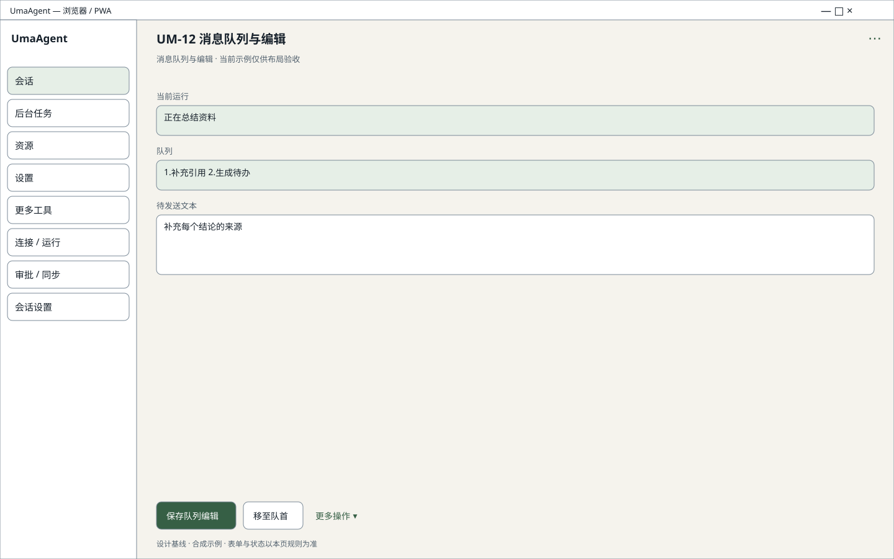

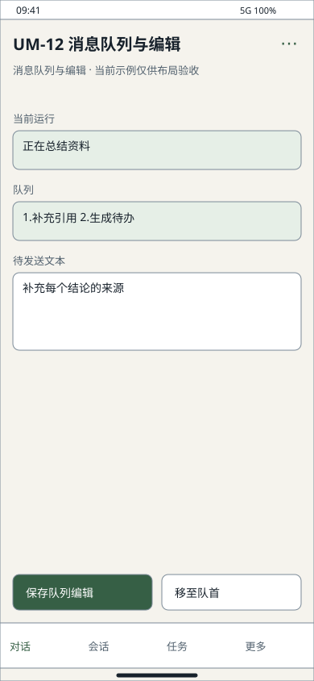

### 交互合同与状态图

**UM-12.I01 — 保存队列编辑**

|条目|精确定义|
|---|---|
|触发与前置|用户点击“保存队列编辑”；字段校验通过、在线、权限允许且此动作无在途请求。|
|执行类别|write（按G13解释）|
|事件/调用|`editMessage(messageId,text)`|
|处理中|“保存队列编辑”禁用并显示“处理中…”；本页对象保留，禁止并发重复提交。|
|成功|回执替换该排队项正文，保留其他位置。|
|失败/重试|错误区显示具体原因；保留本页输入，按G02先核实结果再手动重试。|
|返回/取消|返回触发页面，恢复原焦点/滚动；未保存输入按G03确认；在途操作不被伪装取消。|
|验收|Given 操作前示例数据；When 触发“保存队列编辑”；Then 只有真实回执后呈现上述结果。另模拟失败、双击、离开页面，核对G02/G03。|

**UM-12.I02 — 移至队首**

|条目|精确定义|
|---|---|
|触发与前置|用户点击“移至队首”；字段校验通过、在线、权限允许且此动作无在途请求。 此控件仅触发“移至队首”。|
|执行类别|write（按G13解释）|
|事件/调用|`prioritizeRun(runId)`|
|处理中|“移至队首”禁用并显示“处理中…”；其它冲突动作锁定。|
|成功|上移/下移/移至队首三菜单项生成完整新序列；首项上移与末项下移禁用。|
|失败/重试|错误区显示具体原因；保留本页输入，按G02先核实结果再手动重试。|
|返回/取消|返回触发页面，恢复原焦点/滚动；未保存输入按G03确认；在途操作不被伪装取消。|
|验收|When点击“移至队首”，仅调用prioritizeRun(runId)一次；按本页状态及G02判定成功/失败。|

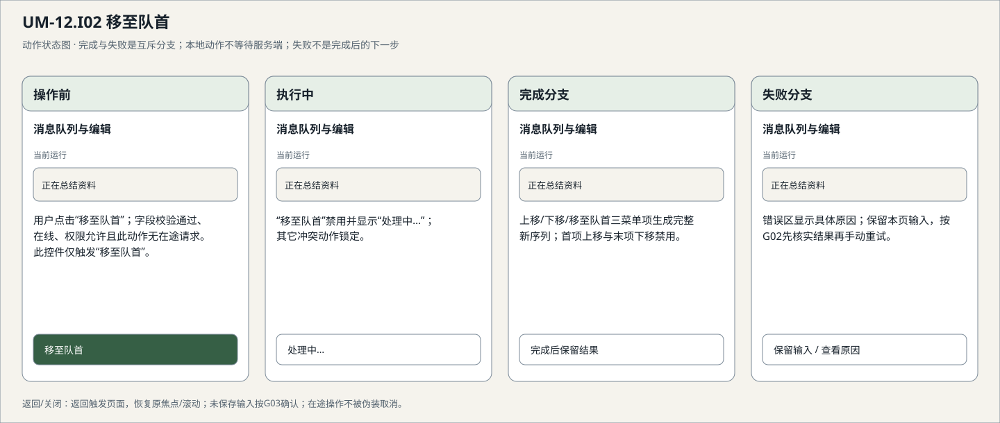

**UM-12.I03 — 上移**

|条目|精确定义|
|---|---|
|触发与前置|用户点击“上移”；字段校验通过、在线、权限允许且此动作无在途请求。 此控件仅触发“上移”。|
|执行类别|write（按G13解释）|
|事件/调用|`reorderQueue(sessionId,runIds)`|
|处理中|“上移”禁用并显示“处理中…”；其它冲突动作锁定。|
|成功|上移/下移/移至队首三菜单项生成完整新序列；首项上移与末项下移禁用。|
|失败/重试|错误区显示具体原因；保留本页输入，按G02先核实结果再手动重试。|
|返回/取消|返回触发页面，恢复原焦点/滚动；未保存输入按G03确认；在途操作不被伪装取消。|
|验收|When点击“上移”，仅调用reorderQueue(sessionId,runIds)一次；按本页状态及G02判定成功/失败。|

**UM-12.I04 — 下移**

|条目|精确定义|
|---|---|
|触发与前置|用户点击“下移”；字段校验通过、在线、权限允许且此动作无在途请求。 此控件仅触发“下移”。|
|执行类别|write（按G13解释）|
|事件/调用|`reorderQueue(sessionId,runIds)`|
|处理中|“下移”禁用并显示“处理中…”；其它冲突动作锁定。|
|成功|上移/下移/移至队首三菜单项生成完整新序列；首项上移与末项下移禁用。|
|失败/重试|错误区显示具体原因；保留本页输入，按G02先核实结果再手动重试。|
|返回/取消|返回触发页面，恢复原焦点/滚动；未保存输入按G03确认；在途操作不被伪装取消。|
|验收|When点击“下移”，仅调用reorderQueue(sessionId,runIds)一次；按本页状态及G02判定成功/失败。|

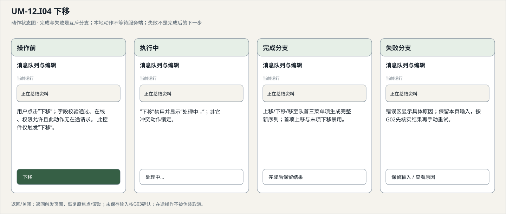

**UM-12.I05 — 取消队列项**

|条目|精确定义|
|---|---|
|触发与前置|用户点击“取消队列项”；字段校验通过、在线、权限允许且此动作无在途请求。|
|执行类别|write（按G13解释）|
|事件/调用|`cancelRun(runId)`|
|处理中|“取消队列项”禁用并显示“处理中…”；本页对象保留，禁止并发重复提交。|
|成功|仅取消选中排队运行；不清空整个队列。|
|失败/重试|错误区显示具体原因；保留本页输入，按G02先核实结果再手动重试。|
|返回/取消|返回触发页面，恢复原焦点/滚动；未保存输入按G03确认；在途操作不被伪装取消。|
|验收|Given 操作前示例数据；When 触发“取消队列项”；Then 只有真实回执后呈现上述结果。另模拟失败、双击、离开页面，核对G02/G03。|

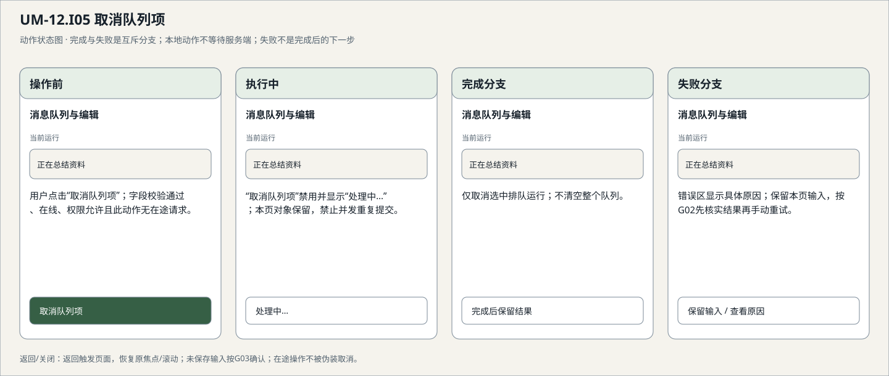

### 页面验收

本页每个字段、每个动作和全部失败分支都有对应UI；320宽和200%字号可滚动到所有控件。不得用空值模拟成功。绑定见本页来源文件；实现检查本页所有事件ID。

## UM-13 · 后台任务

**入口与返回**：任务导航/更多→后台任务。

**角色/设备**：已登录用户；Web, Android。

**导航归属**：电脑端：后台任务；Android：任务。返回沿本页规定入口恢复；从系统通知进入时无应用内历史则返回相应导航首页。

**布局**：使用§3设备壳。字段按表从上到下；主体单独滚动，操作区固定在主体底部；主次操作为交互表前两项，其余为右上“更多操作”。

**数据绑定**：`apps/web/src/areas/BackgroundTaskArea.tsx`。listTasks/createTask/getTask/cancelTask/deleteTask。

|控件（从上到下）|类型|图中示例|校验/显示合同|
|---|---|---|---|
|任务内容|textarea|每天研究进展汇总|1–20000字符UI值|
|任务列表|record|研究汇总 · 执行中|返回status+sessionId，终态与进行中分组|

**页面规则**：任务“打开运行”是导航到其sessionId和runId，不创建第二次任务。失败重试只能由用户另建任务，未提供retry API不加重试任务按钮。

**空态/加载/错误**：首次读取显示“正在加载后台任务”；成功无记录显示“暂无后台任务记录”并保留入口操作。失败就地显示错误区；旧数据标“上次同步”；离线远端写操作禁用；本地查看、返回、复制、外观保存和已明确允许的配置保存仍可用。

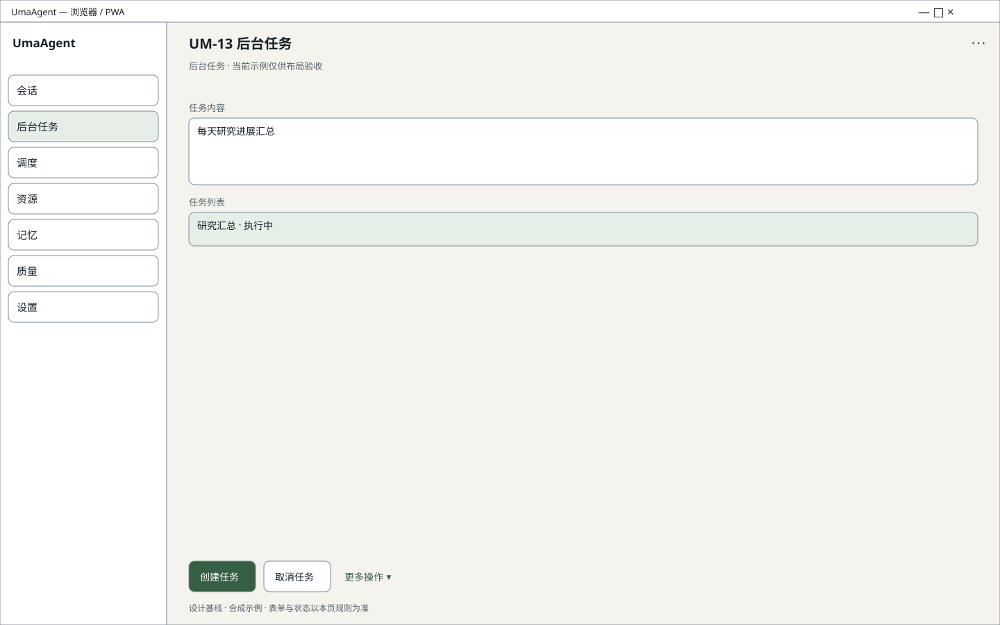

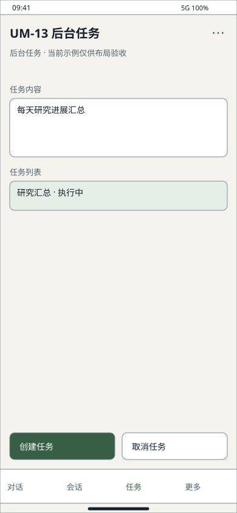

### 交互合同与状态图

**UM-13.I01 — 创建任务**

|条目|精确定义|
|---|---|
|触发与前置|用户点击“创建任务”；字段校验通过、在线、权限允许且此动作无在途请求。|
|执行类别|write（按G13解释）|
|事件/调用|`createTask(prompt,parentSessionId)`|
|处理中|“创建任务”禁用并显示“处理中…”；本页对象保留，禁止并发重复提交。|
|成功|成功插入新任务，点击其会话可追踪；表单清空。|
|失败/重试|错误区显示具体原因；保留本页输入，按G02先核实结果再手动重试。|
|返回/取消|返回触发页面，恢复原焦点/滚动；未保存输入按G03确认；在途操作不被伪装取消。|
|验收|Given 操作前示例数据；When 触发“创建任务”；Then 只有真实回执后呈现上述结果。另模拟失败、双击、离开页面，核对G02/G03。|

**UM-13.I02 — 取消任务**

|条目|精确定义|
|---|---|
|触发与前置|用户点击“取消任务”；字段校验通过、在线、权限允许且此动作无在途请求。|
|执行类别|write（按G13解释）|
|事件/调用|`cancelTask(id)`|
|处理中|“取消任务”禁用并显示“处理中…”；本页对象保留，禁止并发重复提交。|
|成功|回执显示cancelled；不删除历史。|
|失败/重试|错误区显示具体原因；保留本页输入，按G02先核实结果再手动重试。|
|返回/取消|返回触发页面，恢复原焦点/滚动；未保存输入按G03确认；在途操作不被伪装取消。|
|验收|Given 操作前示例数据；When 触发“取消任务”；Then 只有真实回执后呈现上述结果。另模拟失败、双击、离开页面，核对G02/G03。|

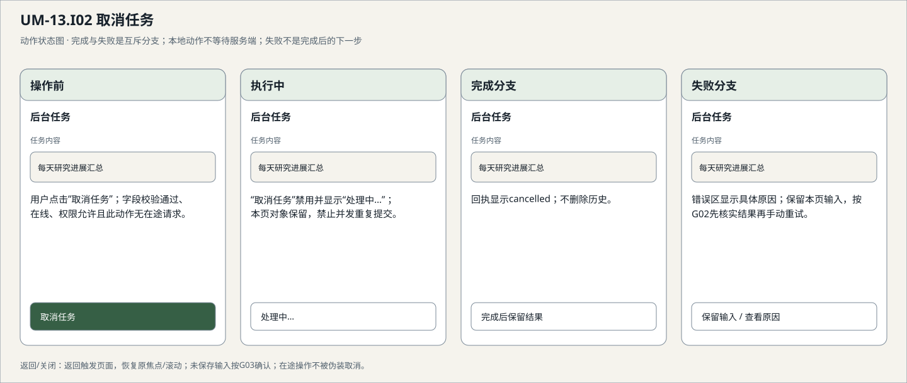

**UM-13.I03 — 删除记录**

|条目|精确定义|
|---|---|
|触发与前置|目标为终态，确认框明确任务名。 按G15确认对象与删除范围；确认前不发送请求。|
|执行类别|write（按G13解释）|
|事件/调用|`deleteTask(id)`|
|处理中|“删除记录”禁用并显示“处理中…”；本页对象保留，禁止并发重复提交。|
|成功|只允许completed/failed/cancelled，确认后移除记录。|
|失败/重试|错误区显示具体原因；保留本页输入，按G02先核实结果再手动重试。|
|返回/取消|返回触发页面，恢复原焦点/滚动；未保存输入按G03确认；在途操作不被伪装取消。|
|验收|Given 操作前示例数据；When 触发“删除记录”；Then 只有真实回执后呈现上述结果。另模拟失败、双击、离开页面，核对G02/G03。|

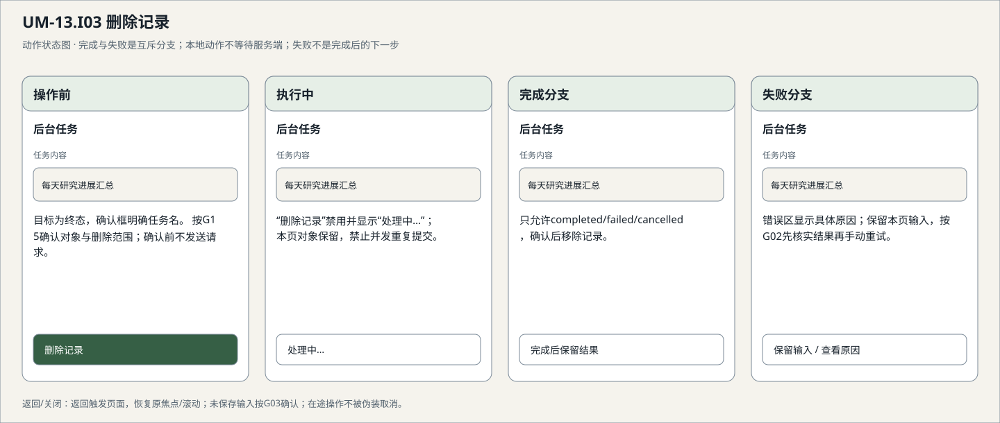

### 页面验收

本页每个字段、每个动作和全部失败分支都有对应UI；320宽和200%字号可滚动到所有控件。不得用空值模拟成功。绑定见本页来源文件；实现检查本页所有事件ID。

## UM-14 · 调度列表与开关

**入口与返回**：更多→调度。

**角色/设备**：已登录用户；Web, Android。

**导航归属**：电脑端：调度；Android：更多。返回沿本页规定入口恢复；从系统通知进入时无应用内历史则返回相应导航首页。

**布局**：使用§3设备壳。字段按表从上到下；主体单独滚动，操作区固定在主体底部；主次操作为交互表前两项，其余为右上“更多操作”。

**数据绑定**：`apps/web/src/areas/ScheduleArea.tsx`。listSchedules/updateSchedule/runSchedule/deleteSchedule。

|控件（从上到下）|类型|图中示例|校验/显示合同|
|---|---|---|---|
|调度|record|早间简报|名称、规则摘要、enabled|
|下次时间|record|2026-09-10 09:00 UTC+08:00|按明确时区显示；无nextRunAt显示未安排|

**页面规则**：新建入口进入UM-15；历史入口UM-16；disabled不阻止查看历史。

**空态/加载/错误**：首次读取显示“正在加载调度列表与开关”；成功无记录显示“暂无调度列表与开关记录”并保留入口操作。失败就地显示错误区；旧数据标“上次同步”；离线远端写操作禁用；本地查看、返回、复制、外观保存和已明确允许的配置保存仍可用。

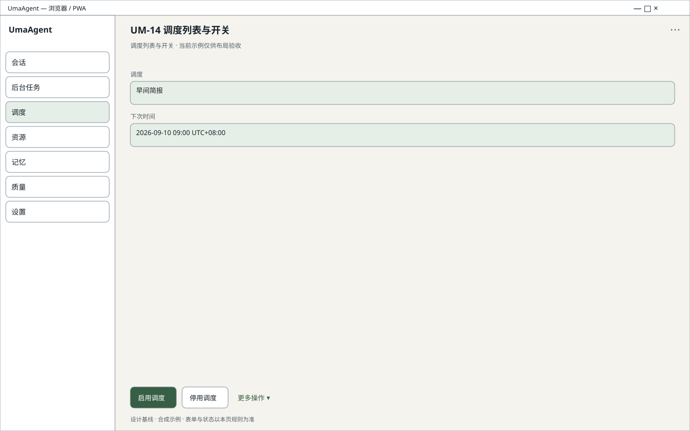

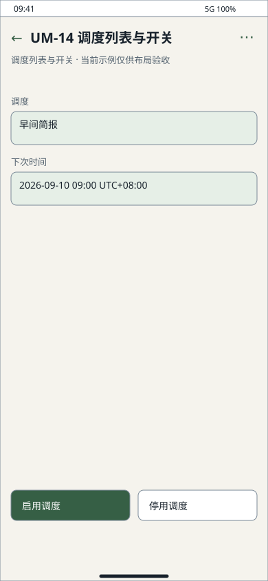

### 交互合同与状态图

**UM-14.I01 — 启用调度**

|条目|精确定义|
|---|---|
|触发与前置|用户点击“启用调度”；字段校验通过、在线、权限允许且此动作无在途请求。 此控件仅触发“启用调度”。|
|执行类别|write（按G13解释）|
|事件/调用|`updateSchedule(id,{enabled:true})`|
|处理中|“启用调度”禁用并显示“处理中…”；其它冲突动作锁定。|
|成功|回执更新开关与下次时间；失败回滚，不影响已运行实例。|
|失败/重试|错误区显示具体原因；保留本页输入，按G02先核实结果再手动重试。|
|返回/取消|返回触发页面，恢复原焦点/滚动；未保存输入按G03确认；在途操作不被伪装取消。|
|验收|When点击“启用调度”，仅调用updateSchedule(id,{enabled:true})一次；按本页状态及G02判定成功/失败。|

**UM-14.I02 — 停用调度**

|条目|精确定义|
|---|---|
|触发与前置|用户点击“停用调度”；字段校验通过、在线、权限允许且此动作无在途请求。 此控件仅触发“停用调度”。|
|执行类别|write（按G13解释）|
|事件/调用|`updateSchedule(id,{enabled:false})`|
|处理中|“停用调度”禁用并显示“处理中…”；其它冲突动作锁定。|
|成功|回执更新开关与下次时间；失败回滚，不影响已运行实例。|
|失败/重试|错误区显示具体原因；保留本页输入，按G02先核实结果再手动重试。|
|返回/取消|返回触发页面，恢复原焦点/滚动；未保存输入按G03确认；在途操作不被伪装取消。|
|验收|When点击“停用调度”，仅调用updateSchedule(id,{enabled:false})一次；按本页状态及G02判定成功/失败。|

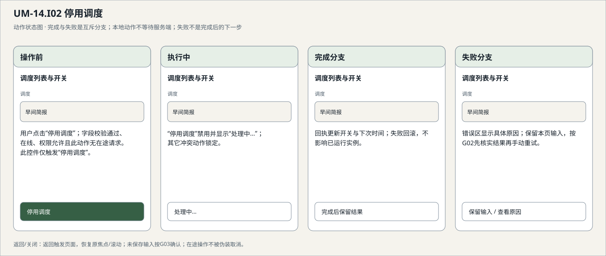

**UM-14.I03 — 立即运行**

|条目|精确定义|
|---|---|
|触发与前置|用户点击“立即运行”；字段校验通过、在线、权限允许且此动作无在途请求。|
|执行类别|write（按G13解释）|
|事件/调用|`runSchedule(id)`|
|处理中|“立即运行”禁用并显示“处理中…”；本页对象保留，禁止并发重复提交。|
|成功|创建一次manual实例并显示runId，不改变定时规则。|
|失败/重试|错误区显示具体原因；保留本页输入，按G02先核实结果再手动重试。|
|返回/取消|返回触发页面，恢复原焦点/滚动；未保存输入按G03确认；在途操作不被伪装取消。|
|验收|Given 操作前示例数据；When 触发“立即运行”；Then 只有真实回执后呈现上述结果。另模拟失败、双击、离开页面，核对G02/G03。|

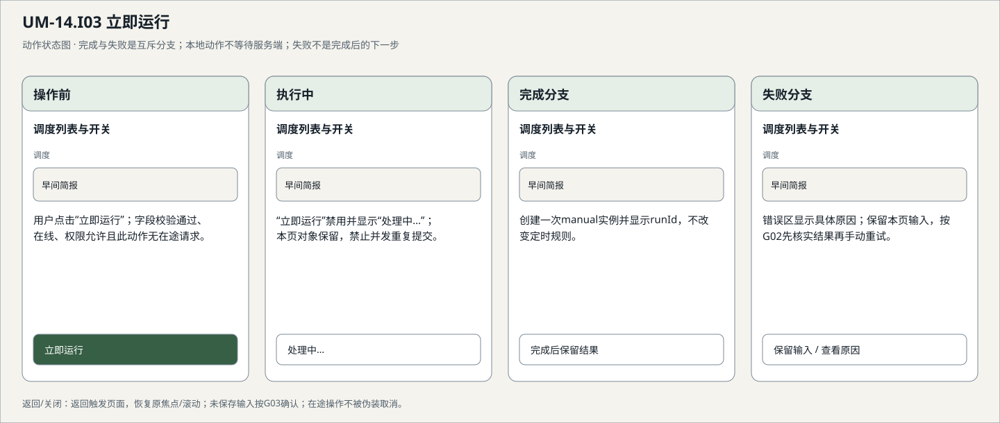

**UM-14.I04 — 删除调度**

|条目|精确定义|
|---|---|
|触发与前置|用户点击“删除调度”；字段校验通过、在线、权限允许且此动作无在途请求。 按G15确认对象与删除范围；确认前不发送请求。|
|执行类别|write（按G13解释）|
|事件/调用|`deleteSchedule(id)`|
|处理中|“删除调度”禁用并显示“处理中…”；本页对象保留，禁止并发重复提交。|
|成功|确认后不再产生新实例，当前运行状态依服务端回执，不假称全部取消。|
|失败/重试|错误区显示具体原因；保留本页输入，按G02先核实结果再手动重试。|
|返回/取消|返回触发页面，恢复原焦点/滚动；未保存输入按G03确认；在途操作不被伪装取消。|
|验收|Given 操作前示例数据；When 触发“删除调度”；Then 只有真实回执后呈现上述结果。另模拟失败、双击、离开页面，核对G02/G03。|

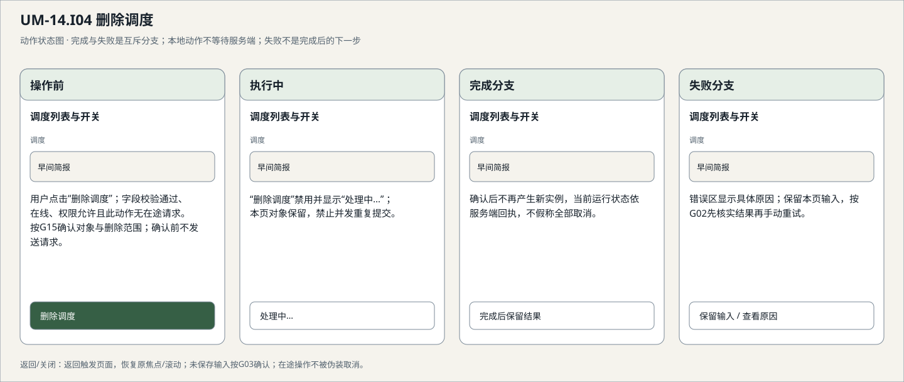

### 页面验收

本页每个字段、每个动作和全部失败分支都有对应UI；320宽和200%字号可滚动到所有控件。不得用空值模拟成功。绑定见本页来源文件；实现检查本页所有事件ID。

## UM-15 · 新建调度

**入口与返回**：UM-14新建；取消回列表。

**角色/设备**：已登录用户；Web, Android。

**导航归属**：电脑端：调度；Android：更多。返回沿本页规定入口恢复；从系统通知进入时无应用内历史则返回相应导航首页。

**布局**：使用§3设备壳。字段按表从上到下；主体单独滚动，操作区固定在主体底部；主次操作为交互表前两项，其余为右上“更多操作”。

**数据绑定**：`apps/web/src/areas/ScheduleArea.tsx`。createSchedule({name,prompt,schedule})。

|控件（从上到下）|类型|图中示例|校验/显示合同|
|---|---|---|---|
|名称|input|早间简报|1–200字符UI限制|
|任务|textarea|整理今天需要跟进的事项|1–20000字符UI限制|
|类型|select|interval|once / interval / cron|
|时间规则|input|3600000|interval 输入整数毫秒，至少1000；once 输入带时区偏移的 ISO 时间；cron 输入表达式|
|时区|input|Asia/Shanghai|仅 cron 展示 IANA 时区，当前默认 Asia/Shanghai；once 的时区由 ISO 值给出|

**页面规则**：当前界面按间隔毫秒直接提交 everyMs；once 将 ISO 时间解析为 epoch 毫秒并校验未来时间；cron 向服务端提交 expression 与 timezone。当前没有日期选择器、分钟单位换算或 DST 专用交互，不把这些目标描述为已有能力。

**空态/加载/错误**：首次读取显示“正在加载新建调度”；成功无记录显示“暂无新建调度记录”并保留入口操作。失败就地显示错误区；旧数据标“上次同步”；离线远端写操作禁用；本地查看、返回、复制、外观保存和已明确允许的配置保存仍可用。

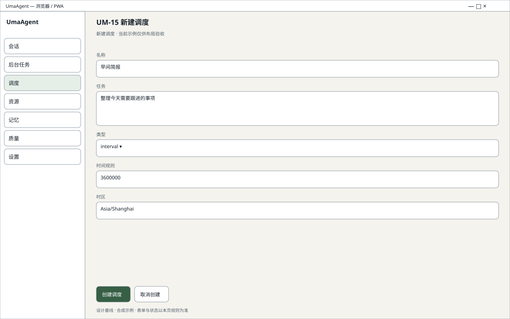

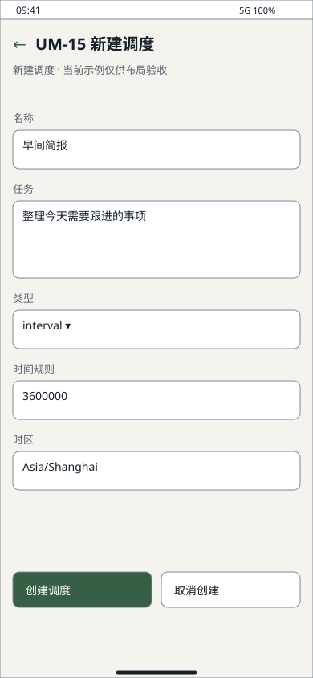

### 交互合同与状态图

**UM-15.I01 — 创建调度**

|条目|精确定义|
|---|---|
|触发与前置|用户点击“创建调度”；字段校验通过、在线、权限允许且此动作无在途请求。|
|执行类别|write（按G13解释）|
|事件/调用|`createSchedule`|
|处理中|“创建调度”禁用并显示“处理中…”；本页对象保留，禁止并发重复提交。|
|成功|服务端成功才关闭并清空表单；列表显示真实nextRunAt。|
|失败/重试|错误区显示具体原因；保留本页输入，按G02先核实结果再手动重试。|
|返回/取消|返回触发页面，恢复原焦点/滚动；未保存输入按G03确认；在途操作不被伪装取消。|
|验收|Given 操作前示例数据；When 触发“创建调度”；Then 只有真实回执后呈现上述结果。另模拟失败、双击、离开页面，核对G02/G03。|

**UM-15.I02 — 取消创建**

|条目|精确定义|
|---|---|
|触发与前置|用户取消。|
|执行类别|local（按G13解释）|
|事件/调用|`local.closeForm`|
|处理中|无远端请求。|
|成功|保留列表；非空编辑按G03确认。|
|失败/重试|不产生网络错误；目标对象在本地已移除则提示“内容已不可用”并保留当前页面。前置条件不满足时禁用并说明原因。|
|返回/取消|返回触发页面，恢复原焦点/滚动；未保存输入按G03确认；在途操作不被伪装取消。|
|验收|Given 本页前置条件满足；When 点击“取消创建”；Then 本地状态立即符合成功规则。断网重复执行仍可用；返回恢复焦点，不产生远端写请求。切换类连续点击按当前值逐次切换。|

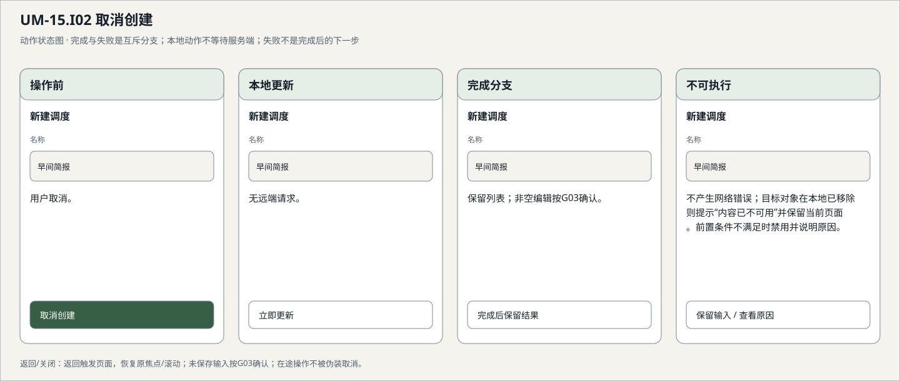

### 页面验收

本页每个字段、每个动作和全部失败分支都有对应UI；320宽和200%字号可滚动到所有控件。不得用空值模拟成功。绑定见本页来源文件；实现检查本页所有事件ID。

## UM-16 · 调度运行历史

**入口与返回**：UM-14某调度历史；返回该调度。

**角色/设备**：已登录用户；Web, Android。

**导航归属**：电脑端：调度；Android：更多。返回沿本页规定入口恢复；从系统通知进入时无应用内历史则返回相应导航首页。

**布局**：使用§3设备壳。字段按表从上到下；主体单独滚动，操作区固定在主体底部；主次操作为交互表前两项，其余为右上“更多操作”。

**数据绑定**：`apps/web/src/areas/ScheduleArea.tsx`。listScheduleRuns/cancelScheduleRun/getScheduleRun。

|控件（从上到下）|类型|图中示例|校验/显示合同|
|---|---|---|---|
|历史实例|record|早间简报 · 手动 · 执行中|created/scheduledFor及trigger|
|运行结果|record|等待回复|claimed/running/completed/failed/cancelled/awaiting_resume|

**页面规则**：记录为空与请求失败必须区分；时区显示与调度编辑一致。

**空态/加载/错误**：首次读取显示“正在加载调度运行历史”；成功无记录显示“暂无调度运行历史记录”并保留入口操作。失败就地显示错误区；旧数据标“上次同步”；离线远端写操作禁用；本地查看、返回、复制、外观保存和已明确允许的配置保存仍可用。

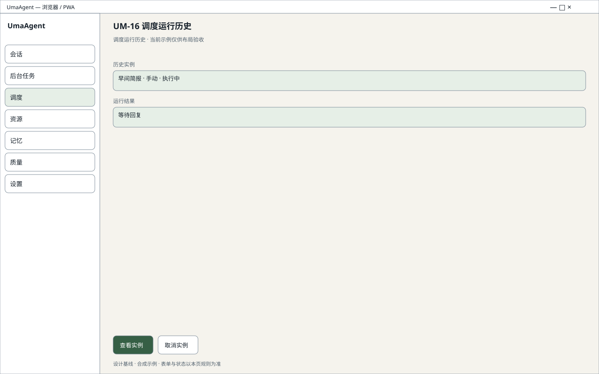

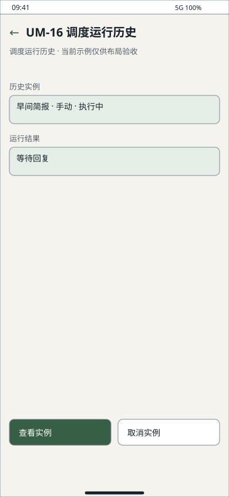

### 交互合同与状态图

**UM-16.I01 — 查看实例**

|条目|精确定义|
|---|---|
|触发与前置|用户点击“查看实例”；字段校验通过、在线、权限允许且此动作无在途请求。|
|执行类别|read（按G13解释）|
|事件/调用|`getScheduleRun(id)`|
|处理中|“查看实例”禁用并显示“处理中…”；本页对象保留，禁止并发重复提交。|
|成功|展示独立实例结果与运行链接，不修改调度。|
|失败/重试|读取失败保留已加载内容并标“上次同步”，首次无缓存显示错误面板；按G07显示对应错误原因，手动重试相同查询，不要求核实写入结果。|
|返回/取消|返回触发页面，恢复原焦点/滚动；未保存输入按G03确认；在途操作不被伪装取消。|
|验收|Given 操作前示例数据；When 触发“查看实例”；Then 只有真实回执后呈现上述结果。另模拟失败、双击、离开页面，核对G02/G03。|

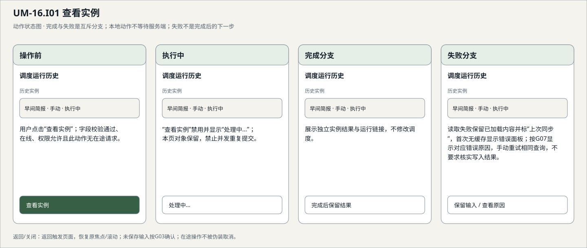

**UM-16.I02 — 取消实例**

|条目|精确定义|
|---|---|
|触发与前置|实例状态允许取消。|
|执行类别|write（按G13解释）|
|事件/调用|`cancelScheduleRun(id)`|
|处理中|“取消实例”禁用并显示“处理中…”；本页对象保留，禁止并发重复提交。|
|成功|只取消claimed/running/awaiting_resume实例，调度规则不变。|
|失败/重试|错误区显示具体原因；保留本页输入，按G02先核实结果再手动重试。|
|返回/取消|返回触发页面，恢复原焦点/滚动；未保存输入按G03确认；在途操作不被伪装取消。|
|验收|Given 操作前示例数据；When 触发“取消实例”；Then 只有真实回执后呈现上述结果。另模拟失败、双击、离开页面，核对G02/G03。|

### 页面验收

本页每个字段、每个动作和全部失败分支都有对应UI；320宽和200%字号可滚动到所有控件。不得用空值模拟成功。绑定见本页来源文件；实现检查本页所有事件ID。

## UM-17 · 知识库列表与检索

**入口与返回**：更多→资源→知识库。

**角色/设备**：已登录用户；Web, Android。

**导航归属**：电脑端：资源；Android：更多。返回沿本页规定入口恢复；从系统通知进入时无应用内历史则返回相应导航首页。

**布局**：使用§3设备壳。字段按表从上到下；主体单独滚动，操作区固定在主体底部；主次操作为交互表前两项，其余为右上“更多操作”。

**数据绑定**：`apps/web/src/areas/ResourceArea.tsx`。listKnowledge/searchKnowledge/deleteKnowledge/reindexKnowledge。

|控件（从上到下）|类型|图中示例|校验/显示合同|
|---|---|---|---|
|关键词|input|断线恢复|非空检索；可选知识源ID|
|知识源|record|研究笔记 · ready|名称、documentCount、状态|
|搜索命中|message|恢复后先获取快照再接收增量|sourceName/filePath/snippet；不伪造引用|

**页面规则**：添加来源进入UM-18；Skill/MCP单独页不混成通用文件删除。

**空态/加载/错误**：首次读取显示“正在加载知识库列表与检索”；成功无记录显示“暂无知识库列表与检索记录”并保留入口操作。失败就地显示错误区；旧数据标“上次同步”；离线远端写操作禁用；本地查看、返回、复制、外观保存和已明确允许的配置保存仍可用。

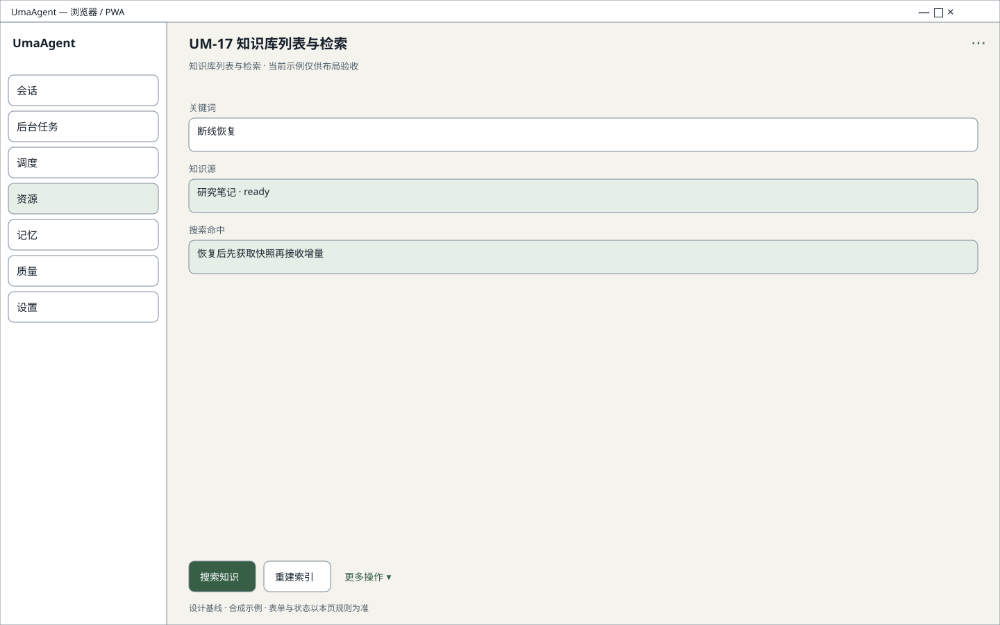

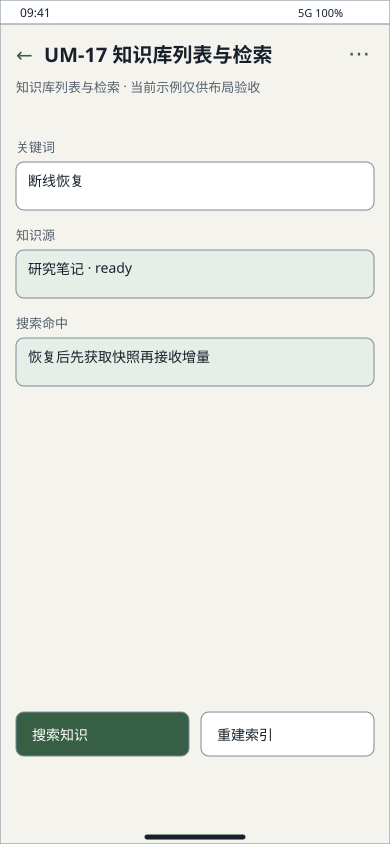

### 交互合同与状态图

**UM-17.I01 — 搜索知识**

|条目|精确定义|
|---|---|
|触发与前置|用户点击“搜索知识”；字段校验通过、在线、权限允许且此动作无在途请求。|
|执行类别|read（按G13解释）|
|事件/调用|`searchKnowledge(query,sourceId,20)`|
|处理中|“搜索知识”禁用并显示“处理中…”；本页对象保留，禁止并发重复提交。|
|成功|展示当前范围前20命中，注明范围与数量。|
|失败/重试|读取失败保留已加载内容并标“上次同步”，首次无缓存显示错误面板；按G07显示对应错误原因，手动重试相同查询，不要求核实写入结果。|
|返回/取消|返回触发页面，恢复原焦点/滚动；未保存输入按G03确认；在途操作不被伪装取消。|
|验收|Given 操作前示例数据；When 触发“搜索知识”；Then 只有真实回执后呈现上述结果。另模拟失败、双击、离开页面，核对G02/G03。|

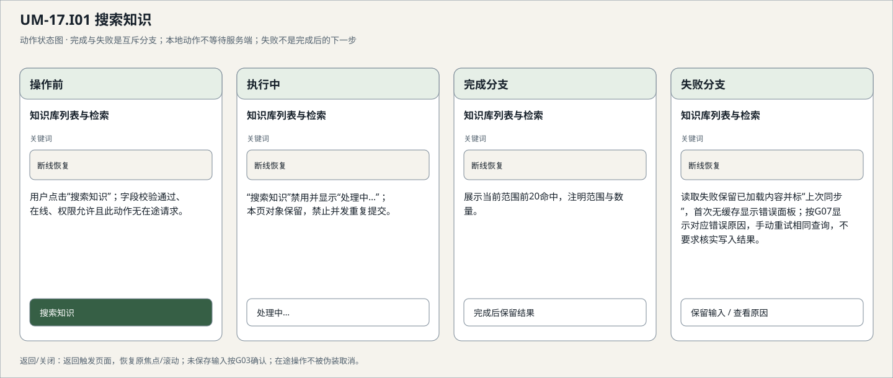

**UM-17.I02 — 重建索引**

|条目|精确定义|
|---|---|
|触发与前置|用户点击“重建索引”；字段校验通过、在线、权限允许且此动作无在途请求。|
|执行类别|write（按G13解释）|
|事件/调用|`reindexKnowledge(id)`|
|处理中|“重建索引”禁用并显示“处理中…”；本页对象保留，禁止并发重复提交。|
|成功|回执后显示indexing，完成状态由刷新返回；不立即宣称ready。|
|失败/重试|错误区显示具体原因；保留本页输入，按G02先核实结果再手动重试。|
|返回/取消|返回触发页面，恢复原焦点/滚动；未保存输入按G03确认；在途操作不被伪装取消。|
|验收|Given 操作前示例数据；When 触发“重建索引”；Then 只有真实回执后呈现上述结果。另模拟失败、双击、离开页面，核对G02/G03。|

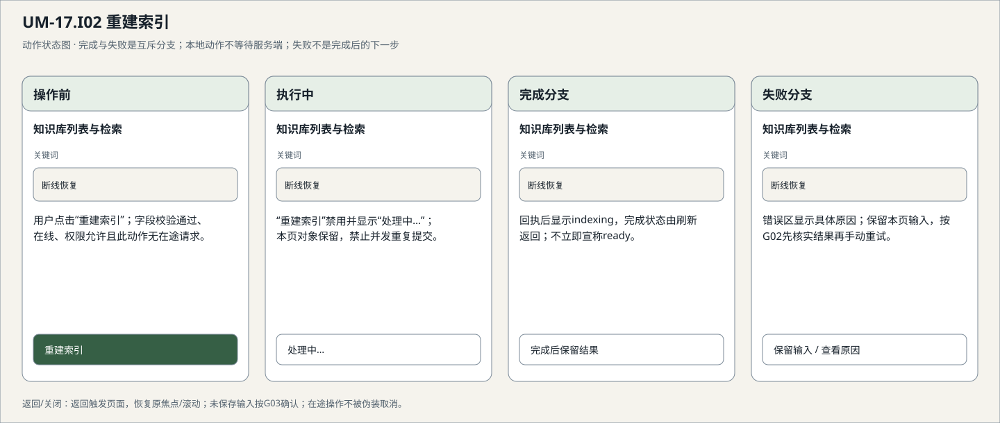

**UM-17.I03 — 删除知识源**

|条目|精确定义|
|---|---|
|触发与前置|用户点击“删除知识源”；字段校验通过、在线、权限允许且此动作无在途请求。 按G15确认对象与删除范围；确认前不发送请求。|
|执行类别|write（按G13解释）|
|事件/调用|`deleteKnowledge(id)`|
|处理中|“删除知识源”禁用并显示“处理中…”；本页对象保留，禁止并发重复提交。|
|成功|确认名称后删除索引来源；不声称删除用户原文件。|
|失败/重试|错误区显示具体原因；保留本页输入，按G02先核实结果再手动重试。|
|返回/取消|返回触发页面，恢复原焦点/滚动；未保存输入按G03确认；在途操作不被伪装取消。|
|验收|Given 操作前示例数据；When 触发“删除知识源”；Then 只有真实回执后呈现上述结果。另模拟失败、双击、离开页面，核对G02/G03。|

### 页面验收

本页每个字段、每个动作和全部失败分支都有对应UI；320宽和200%字号可滚动到所有控件。不得用空值模拟成功。绑定见本页来源文件；实现检查本页所有事件ID。

## UM-18 · 添加知识来源

**入口与返回**：资源→添加知识。

**角色/设备**：已登录用户；Web, Android。

**导航归属**：电脑端：资源；Android：更多。返回沿本页规定入口恢复；从系统通知进入时无应用内历史则返回相应导航首页。

**布局**：使用§3设备壳。字段按表从上到下；主体单独滚动，操作区固定在主体底部；主次操作为交互表前两项，其余为右上“更多操作”。

**数据绑定**：`apps/web/src/areas/ResourceArea.tsx`。uploadKnowledge/indexKnowledgeAttachment或admin indexKnowledge。

|控件（从上到下）|类型|图中示例|校验/显示合同|
|---|---|---|---|
|名称|input|研究资料|1–200字符UI限制|
|文件|record|research.pdf|系统文件选择；上传成功取得attachmentId|
|服务端路径|input|/srv/knowledge/research|仅管理员可见，明确是Core服务器路径，不是浏览器电脑路径|

**页面规则**：不发明依赖引用数阻止删除的功能；没有该字段时不得写死保护。

**空态/加载/错误**：首次读取显示“正在加载添加知识来源”；成功无记录显示“暂无添加知识来源记录”并保留入口操作。失败就地显示错误区；旧数据标“上次同步”；离线远端写操作禁用；本地查看、返回、复制、外观保存和已明确允许的配置保存仍可用。

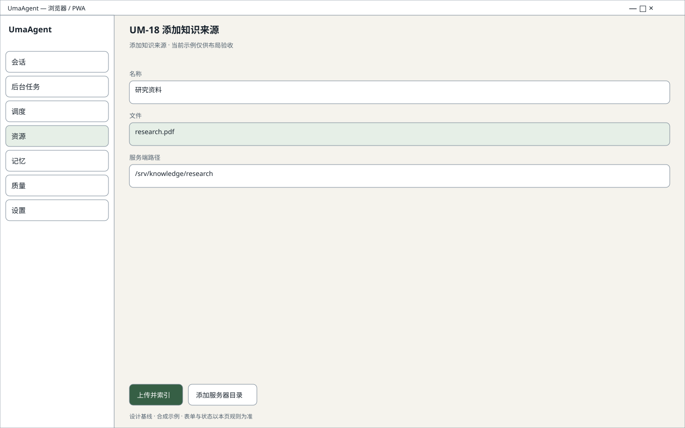

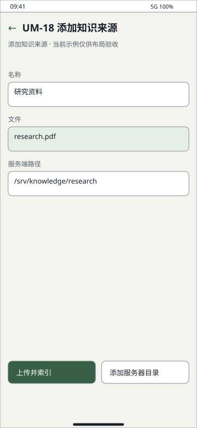

### 交互合同与状态图

**UM-18.I01 — 上传并索引**

|条目|精确定义|
|---|---|
|触发与前置|用户点击“上传并索引”；字段校验通过、在线、权限允许且此动作无在途请求。|
|执行类别|write（按G13解释）|
|事件/调用|`upload→indexKnowledgeAttachment(name,attachmentId,sessionId)`|
|处理中|“上传并索引”禁用并显示“处理中…”；本页对象保留，禁止并发重复提交。|
|成功|上传成功再建索引；失败区分上传和索引阶段，保留成功attachmentId。|
|失败/重试|错误区显示具体原因；保留本页输入，按G02先核实结果再手动重试。|
|返回/取消|返回触发页面，恢复原焦点/滚动；未保存输入按G03确认；在途操作不被伪装取消。|
|验收|Given 操作前示例数据；When 触发“上传并索引”；Then 只有真实回执后呈现上述结果。另模拟失败、双击、离开页面，核对G02/G03。|

**UM-18.I02 — 添加服务器目录**

|条目|精确定义|
|---|---|
|触发与前置|admin角色且路径合法；普通用户隐藏此操作。|
|执行类别|write（按G13解释）|
|事件/调用|`indexKnowledge(name,path)`|
|处理中|“添加服务器目录”禁用并显示“处理中…”；本页对象保留，禁止并发重复提交。|
|成功|仅管理员、在线；服务端验证路径范围后返回知识源。|
|失败/重试|错误区显示具体原因；保留本页输入，按G02先核实结果再手动重试。|
|返回/取消|返回触发页面，恢复原焦点/滚动；未保存输入按G03确认；在途操作不被伪装取消。|
|验收|Given 操作前示例数据；When 触发“添加服务器目录”；Then 只有真实回执后呈现上述结果。另模拟失败、双击、离开页面，核对G02/G03。|

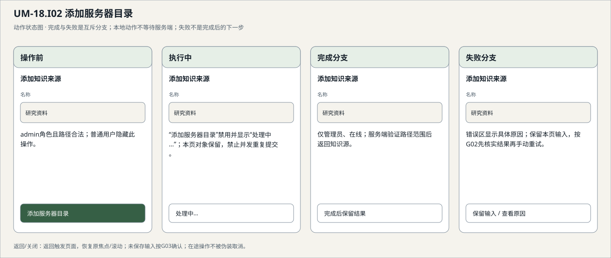

### 页面验收

本页每个字段、每个动作和全部失败分支都有对应UI；320宽和200%字号可滚动到所有控件。不得用空值模拟成功。绑定见本页来源文件；实现检查本页所有事件ID。

## UM-19 · Skill与MCP资源

**入口与返回**：资源→技能与MCP。

**角色/设备**：已登录用户；Web, Android。

**导航归属**：电脑端：资源；Android：更多。返回沿本页规定入口恢复；从系统通知进入时无应用内历史则返回相应导航首页。

**布局**：使用§3设备壳。字段按表从上到下；主体单独滚动，操作区固定在主体底部；主次操作为交互表前两项，其余为右上“更多操作”。

**数据绑定**：`apps/web/src/areas/ResourceArea.tsx`。skillState/refreshSkills/installSkill/setSkillStatus/mcpStatus。

|控件（从上到下）|类型|图中示例|校验/显示合同|
|---|---|---|---|
|技能引用|input|owner/repository/skill|管理员安装输入；不自动执行下载内容|
|技能包|record|research-helper · disabled|来源、状态与审核信息|
|MCP|record|knowledge · 已连接 · 3工具|只读状态，无假开关|

**页面规则**：普通用户仅查看已授权资源；不显示修改Core密钥字段。

**空态/加载/错误**：首次读取显示“正在加载Skill与MCP资源”；成功无记录显示“暂无Skill与MCP资源记录”并保留入口操作。失败就地显示错误区；旧数据标“上次同步”；离线远端写操作禁用；本地查看、返回、复制、外观保存和已明确允许的配置保存仍可用。

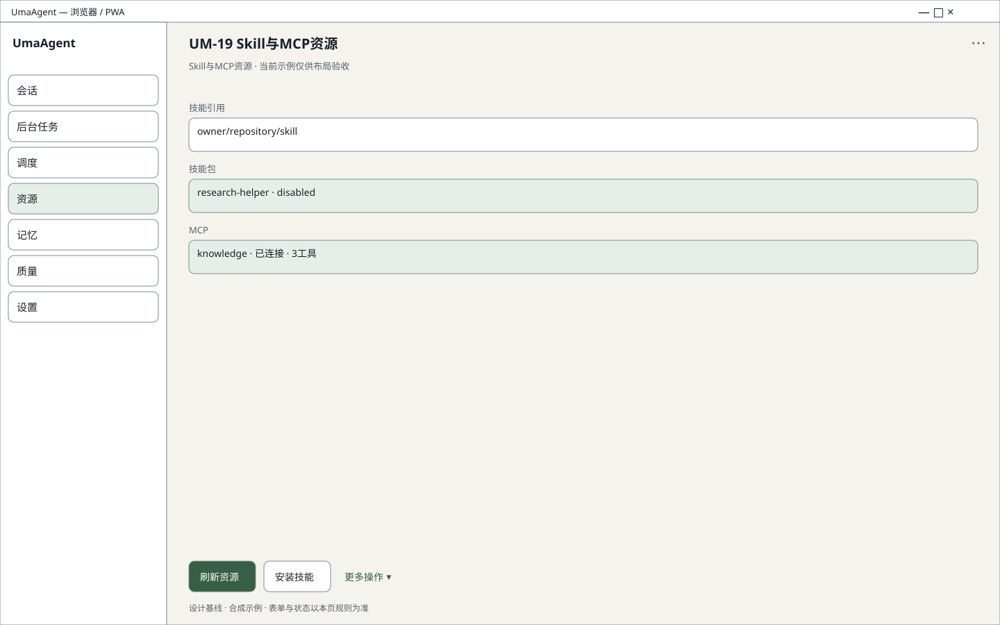

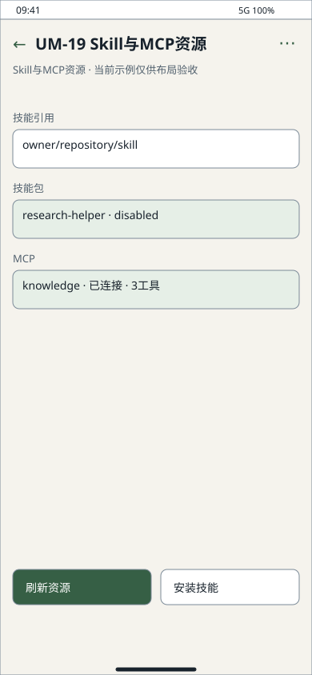

### 交互合同与状态图

**UM-19.I01 — 刷新资源**

|条目|精确定义|
|---|---|
|触发与前置|用户点击“刷新资源”；字段校验通过、在线、权限允许且此动作无在途请求。|
|执行类别|write（按G13解释）|
|事件/调用|`refreshSkills; mcpStatus`|
|处理中|“刷新资源”禁用并显示“处理中…”；本页对象保留，禁止并发重复提交。|
|成功|更新可用技能和MCP状态，不重启服务。|
|失败/重试|错误区显示具体原因；保留本页输入，按G02先核实结果再手动重试。|
|返回/取消|返回触发页面，恢复原焦点/滚动；未保存输入按G03确认；在途操作不被伪装取消。|
|验收|Given 操作前示例数据；When 触发“刷新资源”；Then 只有真实回执后呈现上述结果。另模拟失败、双击、离开页面，核对G02/G03。|

**UM-19.I02 — 安装技能**

|条目|精确定义|
|---|---|
|触发与前置|admin且引用非空。|
|执行类别|write（按G13解释）|
|事件/调用|`installSkill({reference})`|
|处理中|“安装技能”禁用并显示“处理中…”；本页对象保留，禁止并发重复提交。|
|成功|admin提交，显示返回安装/待审核状态，不默认启用。|
|失败/重试|错误区显示具体原因；保留本页输入，按G02先核实结果再手动重试。|
|返回/取消|返回触发页面，恢复原焦点/滚动；未保存输入按G03确认；在途操作不被伪装取消。|
|验收|Given 操作前示例数据；When 触发“安装技能”；Then 只有真实回执后呈现上述结果。另模拟失败、双击、离开页面，核对G02/G03。|

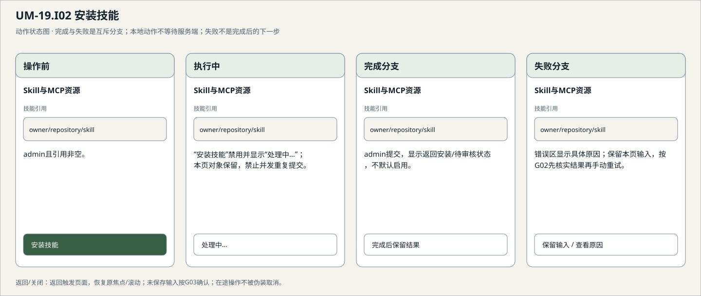

**UM-19.I03 — 启用技能**

|条目|精确定义|
|---|---|
|触发与前置|admin且操作与当前状态不同。 此控件仅触发“启用技能”。|
|执行类别|write（按G13解释）|
|事件/调用|`setSkillStatus(id,enable)`|
|处理中|“启用技能”禁用并显示“处理中…”；其它冲突动作锁定。|
|成功|菜单三项分别提交对应枚举；回执更新，拒绝需确认对象名。|
|失败/重试|错误区显示具体原因；保留本页输入，按G02先核实结果再手动重试。|
|返回/取消|返回触发页面，恢复原焦点/滚动；未保存输入按G03确认；在途操作不被伪装取消。|
|验收|When点击“启用技能”，仅调用setSkillStatus(id,enable)一次；按本页状态及G02判定成功/失败。|

**UM-19.I04 — 停用技能**

|条目|精确定义|
|---|---|
|触发与前置|admin且操作与当前状态不同。 此控件仅触发“停用技能”。|
|执行类别|write（按G13解释）|
|事件/调用|`setSkillStatus(id,disable)`|
|处理中|“停用技能”禁用并显示“处理中…”；其它冲突动作锁定。|
|成功|菜单三项分别提交对应枚举；回执更新，拒绝需确认对象名。|
|失败/重试|错误区显示具体原因；保留本页输入，按G02先核实结果再手动重试。|
|返回/取消|返回触发页面，恢复原焦点/滚动；未保存输入按G03确认；在途操作不被伪装取消。|
|验收|When点击“停用技能”，仅调用setSkillStatus(id,disable)一次；按本页状态及G02判定成功/失败。|

**UM-19.I05 — 拒绝技能**

|条目|精确定义|
|---|---|
|触发与前置|admin且操作与当前状态不同。 此控件仅触发“拒绝技能”。|
|执行类别|write（按G13解释）|
|事件/调用|`setSkillStatus(id,reject)`|
|处理中|“拒绝技能”禁用并显示“处理中…”；其它冲突动作锁定。|
|成功|菜单三项分别提交对应枚举；回执更新，拒绝需确认对象名。|
|失败/重试|错误区显示具体原因；保留本页输入，按G02先核实结果再手动重试。|
|返回/取消|返回触发页面，恢复原焦点/滚动；未保存输入按G03确认；在途操作不被伪装取消。|
|验收|When点击“拒绝技能”，仅调用setSkillStatus(id,reject)一次；按本页状态及G02判定成功/失败。|

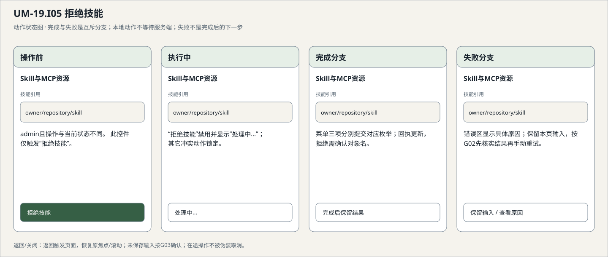

### 页面验收

本页每个字段、每个动作和全部失败分支都有对应UI；320宽和200%字号可滚动到所有控件。不得用空值模拟成功。绑定见本页来源文件；实现检查本页所有事件ID。

## UM-20 · 候选记忆审核

**入口与返回**：更多→记忆。

**角色/设备**：已登录用户；Web, Android。

**导航归属**：电脑端：记忆；Android：更多。返回沿本页规定入口恢复；从系统通知进入时无应用内历史则返回相应导航首页。

**布局**：使用§3设备壳。字段按表从上到下；主体单独滚动，操作区固定在主体底部；主次操作为交互表前两项，其余为右上“更多操作”。

**数据绑定**：`apps/web/src/areas/MemoryArea.tsx`。listMemoryFacts/reviewMemoryFact。

|控件（从上到下）|类型|图中示例|校验/显示合同|
|---|---|---|---|
|候选信息|record|偏好：回答先结论后证据|key/value来自服务端|
|可信度|record|0.86|0–1；无证据不自行补推断|

**页面规则**：MemoryFact 状态为 candidate 候选、active 生效、superseded 被替代和 rejected 拒绝；更多菜单提供接受/拒绝，当前已生效的对应动作禁用。服务端回执后更新状态，不删除原始审计记录。

**空态/加载/错误**：首次读取显示“正在加载候选记忆审核”；成功无记录显示“暂无候选记忆审核记录”并保留入口操作。失败就地显示错误区；旧数据标“上次同步”；离线远端写操作禁用；本地查看、返回、复制、外观保存和已明确允许的配置保存仍可用。

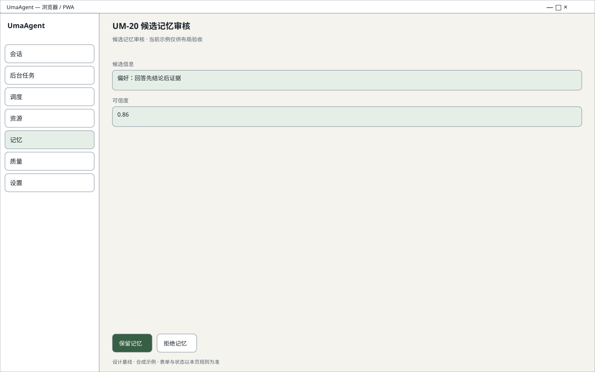

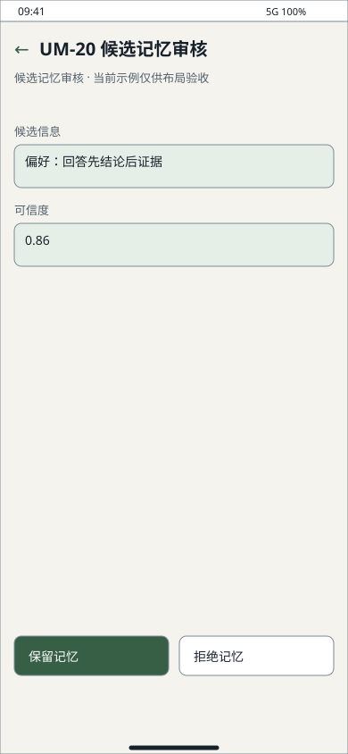

### 交互合同与状态图

**UM-20.I01 — 保留记忆**

|条目|精确定义|
|---|---|
|触发与前置|用户点击“保留记忆”；字段校验通过、在线、权限允许且此动作无在途请求。|
|执行类别|write（按G13解释）|
|事件/调用|`reviewMemoryFact(id,active)`|
|处理中|“保留记忆”禁用并显示“处理中…”；本页对象保留，禁止并发重复提交。|
|成功|服务端确认后从待审列表更新状态。|
|失败/重试|错误区显示具体原因；保留本页输入，按G02先核实结果再手动重试。|
|返回/取消|返回触发页面，恢复原焦点/滚动；未保存输入按G03确认；在途操作不被伪装取消。|
|验收|Given 操作前示例数据；When 触发“保留记忆”；Then 只有真实回执后呈现上述结果。另模拟失败、双击、离开页面，核对G02/G03。|

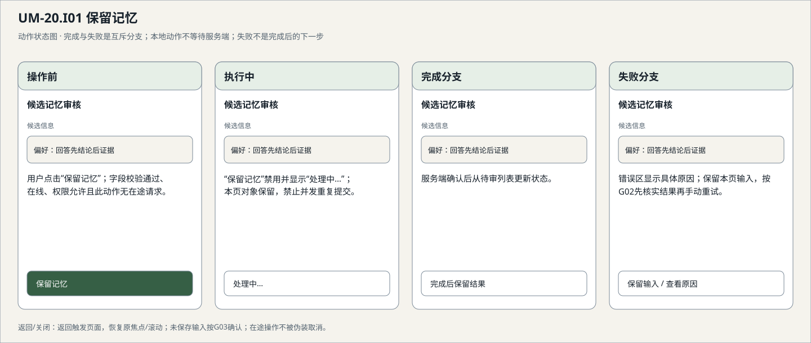

**UM-20.I02 — 拒绝记忆**

|条目|精确定义|
|---|---|
|触发与前置|用户点击“拒绝记忆”；字段校验通过、在线、权限允许且此动作无在途请求。|
|执行类别|write（按G13解释）|
|事件/调用|`reviewMemoryFact(id,rejected)`|
|处理中|“拒绝记忆”禁用并显示“处理中…”；本页对象保留，禁止并发重复提交。|
|成功|显示拒绝状态，不删除其他记忆。|
|失败/重试|错误区显示具体原因；保留本页输入，按G02先核实结果再手动重试。|
|返回/取消|返回触发页面，恢复原焦点/滚动；未保存输入按G03确认；在途操作不被伪装取消。|
|验收|Given 操作前示例数据；When 触发“拒绝记忆”；Then 只有真实回执后呈现上述结果。另模拟失败、双击、离开页面，核对G02/G03。|

### 页面验收

本页每个字段、每个动作和全部失败分支都有对应UI；320宽和200%字号可滚动到所有控件。不得用空值模拟成功。绑定见本页来源文件；实现检查本页所有事件ID。

## UM-21 · 质量中心

**入口与返回**：更多→质量；分为诊断/评测/优化三个标签。

**角色/设备**：已登录用户；Web, Android。

**导航归属**：电脑端：质量；Android：更多。返回沿本页规定入口恢复；从系统通知进入时无应用内历史则返回相应导航首页。

**布局**：使用§3设备壳。字段按表从上到下；主体单独滚动，操作区固定在主体底部；主次操作为交互表前两项，其余为右上“更多操作”。

**数据绑定**：`apps/web/src/areas/DiagnosticsArea.tsx`。diagnosticsReport/listEvaluationReports/listEvaluationTrends/listOptimizationProposals。

|控件（从上到下）|类型|图中示例|校验/显示合同|
|---|---|---|---|
|诊断|record|运行12 / 成功10 · 工具失败2|真实计数；Trace缺数据为未提供|
|评测|record|faux · 8/10 · P95 420ms|显示mode/suiteVersion/时间，不能解释为真机指标|
|优化提案|record|减少重复读取 · 待决策|风险、证据、建议，接受不会自动改代码|

**页面规则**：本页只做导航与概览；三个入口各自独立页面、独立加载、错误与滚动，不同时渲染全部报告。

**空态/加载/错误**：首次读取显示“正在加载诊断、评测与人工优化”；成功无记录显示“暂无诊断、评测与人工优化记录”并保留入口操作。失败就地显示错误区；旧数据标“上次同步”；离线远端写操作禁用；本地查看、返回、复制、外观保存和已明确允许的配置保存仍可用。

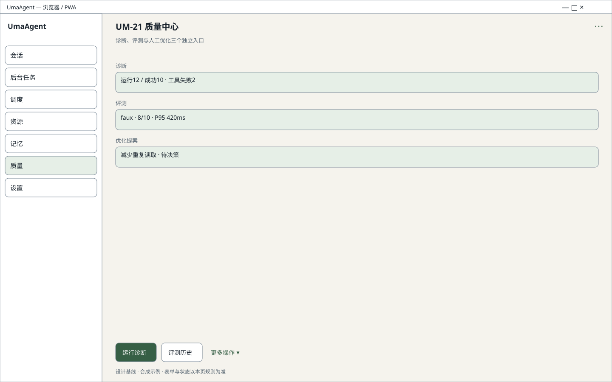

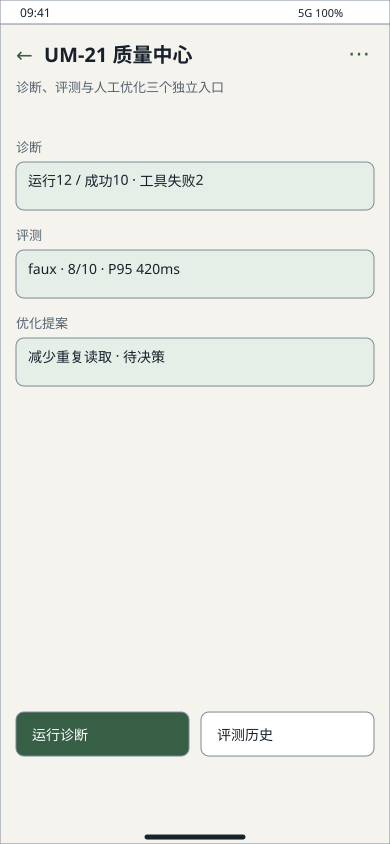

### 交互合同与状态图

**UM-21.I01 — 运行诊断**

|条目|精确定义|
|---|---|
|触发与前置|已登录，可先读缓存。|
|执行类别|local（按G13解释）|
|事件/调用|`local.open(UM-30)`|
|处理中|本地导航。|
|成功|进入运行诊断页，失败反馈与其它报告独立。|
|失败/重试|不产生网络错误；目标对象在本地已移除则提示“内容已不可用”并保留当前页面。前置条件不满足时禁用并说明原因。|
|返回/取消|返回触发页面，恢复原焦点/滚动；未保存输入按G03确认；在途操作不被伪装取消。|
|验收|Given 本页前置条件满足；When 点击“运行诊断”；Then 本地状态立即符合成功规则。断网重复执行仍可用；返回恢复焦点，不产生远端写请求。切换类连续点击按当前值逐次切换。|

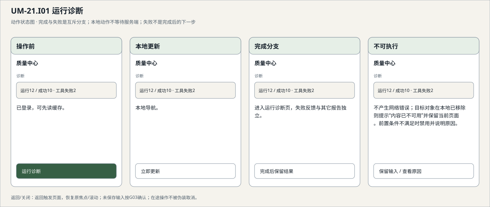

**UM-21.I02 — 评测历史**

|条目|精确定义|
|---|---|
|触发与前置|已登录，可先读缓存。|
|执行类别|local（按G13解释）|
|事件/调用|`local.open(UM-31)`|
|处理中|本地导航。|
|成功|进入评测列表，默认最近30天趋势。|
|失败/重试|不产生网络错误；目标对象在本地已移除则提示“内容已不可用”并保留当前页面。前置条件不满足时禁用并说明原因。|
|返回/取消|返回触发页面，恢复原焦点/滚动；未保存输入按G03确认；在途操作不被伪装取消。|
|验收|Given 本页前置条件满足；When 点击“评测历史”；Then 本地状态立即符合成功规则。断网重复执行仍可用；返回恢复焦点，不产生远端写请求。切换类连续点击按当前值逐次切换。|

**UM-21.I03 — 人工优化**

|条目|精确定义|
|---|---|
|触发与前置|已登录，可先读缓存。|
|执行类别|local（按G13解释）|
|事件/调用|`local.open(UM-32)`|
|处理中|本地导航。|
|成功|进入只读优化提案页。|
|失败/重试|不产生网络错误；目标对象在本地已移除则提示“内容已不可用”并保留当前页面。前置条件不满足时禁用并说明原因。|
|返回/取消|返回触发页面，恢复原焦点/滚动；未保存输入按G03确认；在途操作不被伪装取消。|
|验收|Given 本页前置条件满足；When 点击“人工优化”；Then 本地状态立即符合成功规则。断网重复执行仍可用；返回恢复焦点，不产生远端写请求。切换类连续点击按当前值逐次切换。|

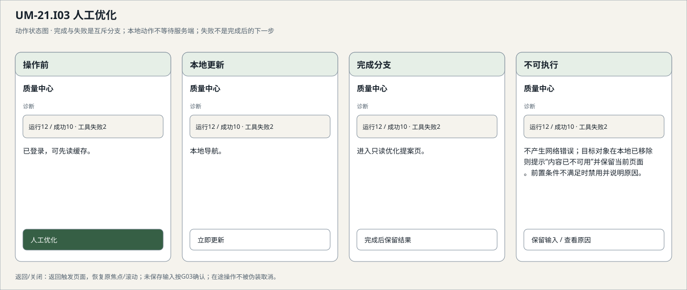

### 页面验收

三个标签可键盘切换；标签切换请求互不覆盖；评测展开每case字段完整；任何接受提案都不会调用applyOptimization。

## UM-22 · 账号执行权限、Profile 与外观

**入口与返回**：更多→设置。

**角色/设备**：已登录用户；Web, Android。

**导航归属**：电脑端：设置；Android：更多。返回沿本页规定入口恢复；从系统通知进入时无应用内历史则返回相应导航首页。

**布局**：设置按执行权限、本机外观、助手偏好、连接、应用更新和账户分组。Profile 为带返回导航的子页，开关保存期间明确反馈。

**数据绑定**：`apps/web/src/components/SessionSettingsPanel.tsx`。getExecutionSettings/updateExecutionSettings/updateAgentProfile/publicConfig。

|控件（从上到下）|类型|图中示例|校验/显示合同|
|---|---|---|---|
|免审批|select|开启（默认）|账号级 autoApprove；工具、Shell、计划、调度和渠道统一遵循；保存成功才更新开关|
|Agent Profile|textarea|以简洁中文回答，优先说明结论。|最多50000字符；真实保存回执后更新|
|主题|select|跟随系统|system/light/dark；Android使用固定品牌色|

**页面规则**：账号执行权限和 Profile 只在设置编辑，本机主题独立存储。助手名称、头像及模型属于当前会话，只在会话设置编辑；不能在账号设置重复提供编辑入口。

**空态/加载/错误**：首次读取显示“正在加载账号设置”；Profile内容为空显示可编辑空表单；执行策略未读到回执时禁用开关。失败就地显示错误区；旧数据标“上次同步”；离线远端写操作禁用；本地查看、返回、复制、外观保存和已明确允许的配置保存仍可用。

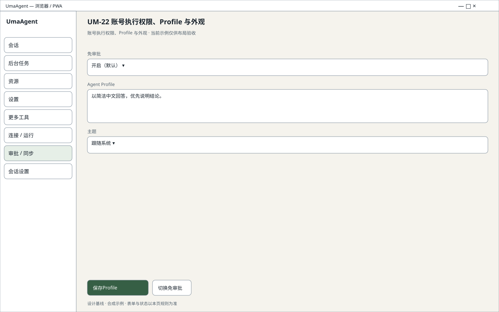

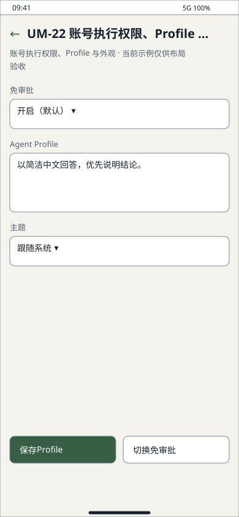

### 交互合同与状态图

**UM-22.I02 — 保存Profile**

|条目|精确定义|
|---|---|
|触发与前置|用户点击“保存Profile”；字段校验通过、在线、权限允许且此动作无在途请求。|
|执行类别|write（按G13解释）|
|事件/调用|`updateAgentProfile(content)`|
|处理中|“保存Profile”禁用并显示“处理中…”；本页对象保留，禁止并发重复提交。|
|成功|回执显示已保存；失败保留草稿。|
|失败/重试|错误区显示具体原因；保留本页输入，按G02先核实结果再手动重试。|
|返回/取消|返回触发页面，恢复原焦点/滚动；未保存输入按G03确认；在途操作不被伪装取消。|
|验收|Given 操作前示例数据；When 触发“保存Profile”；Then 只有真实回执后呈现上述结果。另模拟失败、双击、离开页面，核对G02/G03。|

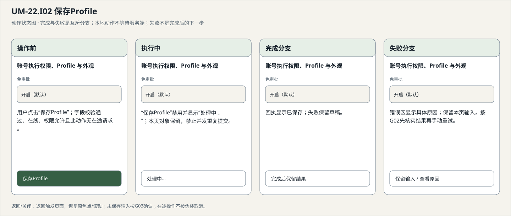

**UM-22.I04 — 切换免审批**

|条目|精确定义|
|---|---|
|触发与前置|已读取账号策略且在线；保存期间禁用开关。|
|执行类别|write（按G13解释）|
|事件/调用|`getExecutionSettings/updateExecutionSettings(autoApprove)`|
|处理中|显示正在保存，保留服务端已确认值。|
|成功|采用服务端回执；开启时处理该账号既有待审批并记录审计，关闭影响后续审批点。|
|失败/重试|保留原值，显示错误和重新读取入口。|
|返回/取消|返回设置；退出账号丢弃迟到响应。|
|验收|默认开启、关闭再开启、失败回滚、跨账号隔离及既有待审批释放。|

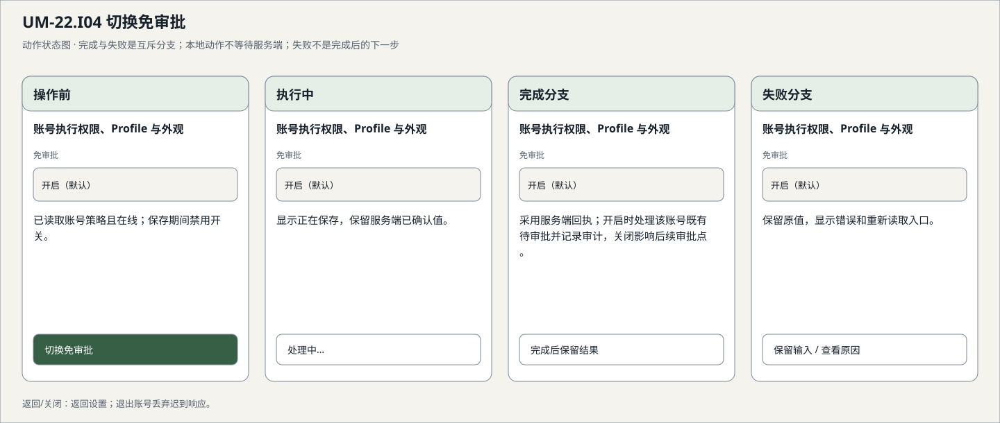

### 页面验收

本页每个字段、每个动作和全部失败分支都有对应UI；320宽和200%字号可滚动到所有控件。不得用空值模拟成功。绑定见本页来源文件；实现检查本页所有事件ID。

## UM-23 · 账户切换、配置与更新

**入口与返回**：设置→账户/关于。

**角色/设备**：已登录用户；Web, Android。

**导航归属**：电脑端：设置；Android：更多。返回沿本页规定入口恢复；从系统通知进入时无应用内历史则返回相应导航首页。

**布局**：账户操作归设置页账户分组。Android普通环境仅保留切换账号；测试包另显示退出账号及测试网关。更新使用独立应用更新分组，重新加载配置归管理员快捷命令。

**数据绑定**：`android/app/src/main/java/site/robotclaw/umaagent/UmaSettings.kt`。logout/close/clearCacheNamespace；reloadConfig；Android Update。

|控件（从上到下）|类型|图中示例|校验/显示合同|
|---|---|---|---|
|身份|record|普通用户|读取服务端role；不能由客户端选角色|
|Core版本|record|服务端返回值|只读，不使用文档硬编码|
|客户端版本|record|构建返回值|Android按实际versionCode检查|

**页面规则**：退出前检查所有会话的未发送正文、附件及未确认发送，非空时先确认；不停止后台任务或渠道Adapter；断网仍可完成本地退出。

**空态/加载/错误**：首次读取显示“正在加载账户切换、配置与更新”；成功无记录显示“暂无账户切换、配置与更新记录”并保留入口操作。失败就地显示错误区；旧数据标“上次同步”；离线远端写操作禁用；本地查看、返回、复制、外观保存和已明确允许的配置保存仍可用。

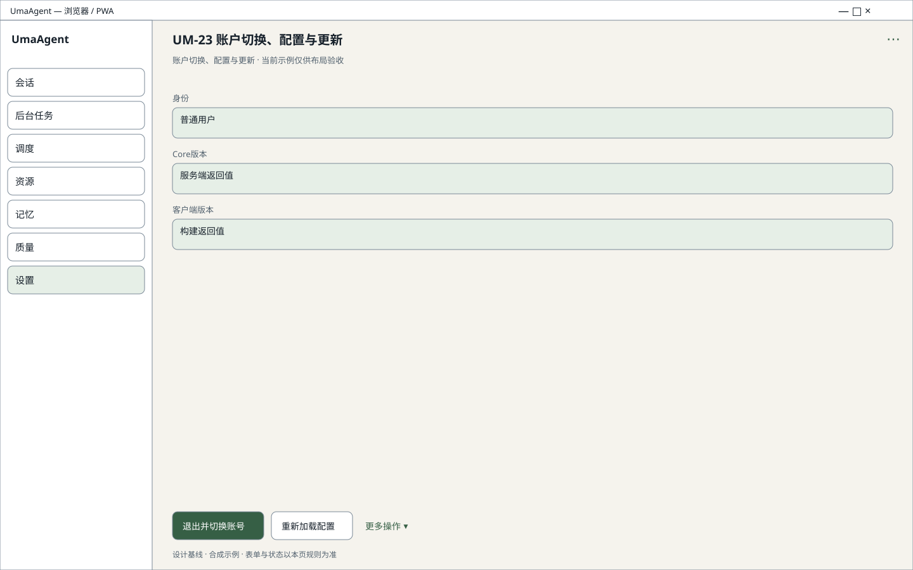

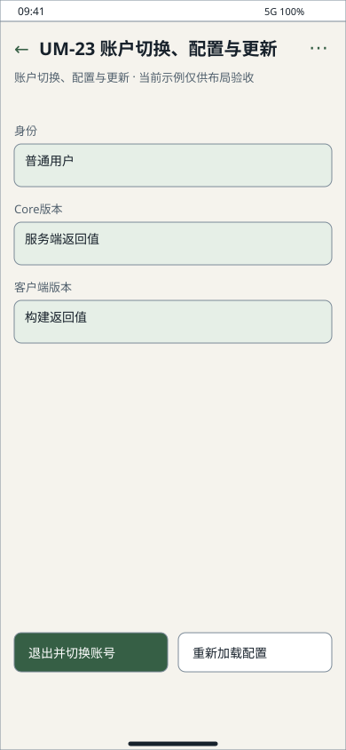

### 交互合同与状态图

**UM-23.I01 — 退出并切换账号**

|条目|精确定义|
|---|---|
|触发与前置|用户明确退出；有未保存表单先按G14确认；离线可执行，不要求认证仍有效。|
|执行类别|system（按G13解释）|
|事件/调用|`logout;close;clearCacheNamespace`|
|处理中|关闭本账号订阅，清理本账号凭据、内存草稿与缓存命名空间；不等待服务端。|
|成功|清除本机凭据、缓存及所有会话草稿后回到登录；旧请求及订阅取消，旧账号回执丢弃。Android切换账号保留测试网关认证，测试环境的退出账号及测试网关同时清理该认证。|
|失败/重试|系统调用失败时保留当前界面并显示系统返回原因；允许手动重试。没有系统回调时只能显示“已发起”，不能推断目标动作完成。退出账户的本地清理不等待网络回执。|
|返回/取消|返回触发页面，恢复原焦点/滚动；未保存输入按G03确认；在途操作不被伪装取消。|
|验收|离线触发“退出并切换账号”，按系统回调和成功规则核对结果；拒绝系统权限或对象消失时显示真实错误，不显示服务端成功。|

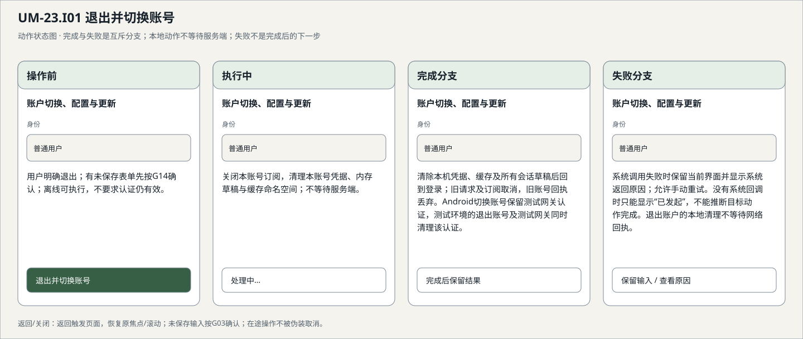

**UM-23.I02 — 重新加载配置**

|条目|精确定义|
|---|---|
|触发与前置|当前账号有权限；403不自动重试。|
|执行类别|write（按G13解释）|
|事件/调用|`reloadConfig`|
|处理中|“重新加载配置”禁用并显示“处理中…”；本页对象保留，禁止并发重复提交。|
|成功|按授权返回需要重启/已重载状态；不显示API key。|
|失败/重试|错误区显示具体原因；保留本页输入，按G02先核实结果再手动重试。|
|返回/取消|返回触发页面，恢复原焦点/滚动；未保存输入按G03确认；在途操作不被伪装取消。|
|验收|Given 操作前示例数据；When 触发“重新加载配置”；Then 只有真实回执后呈现上述结果。另模拟失败、双击、离开页面，核对G02/G03。|

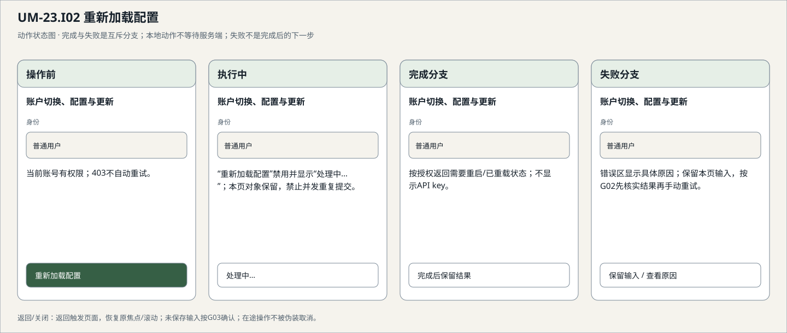

**UM-23.I03 — 检查更新**

|条目|精确定义|
|---|---|
|触发与前置|用户点击“检查更新”；字段校验通过、在线、权限允许且此动作无在途请求。|
|执行类别|system（按G13解释）|
|事件/调用|`Android Update / Web install prompt`|
|处理中|“检查更新”禁用并显示“处理中…”；本页对象保留，禁止并发重复提交。|
|成功|Android显示真实清单与下载入口；Web仅在浏览器可安装时提供PWA安装。|
|失败/重试|按系统更新/下载/节点控制回调显示具体失败原因，保留可核实的当前阶段。只在前一阶段满足本页规则时允许下一动作；重试不跳过权限、文件完整性或签名检查。|
|返回/取消|返回触发页面，恢复原焦点/滚动；未保存输入按G03确认；在途操作不被伪装取消。|
|验收|核对本页系统调用及成功规则；模拟拒绝、取消、离线和重复点击，不能把已发起、下载完成或打开安装器当作安装成功。节点停止只改变本机节点。|

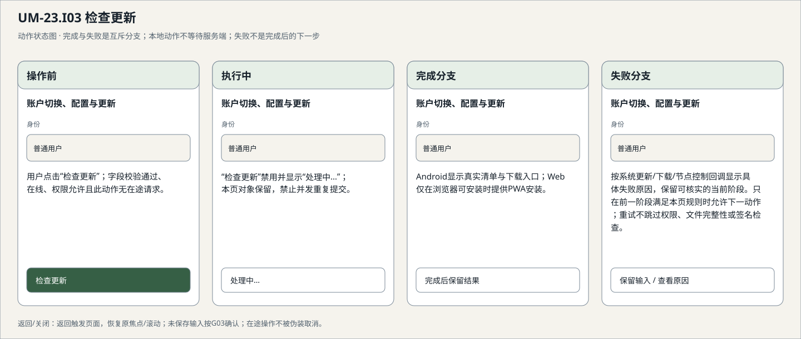

### 页面验收

本页每个字段、每个动作和全部失败分支都有对应UI；320宽和200%字号可滚动到所有控件。不得用空值模拟成功。绑定见本页来源文件；实现检查本页所有事件ID。

## UM-24 · 咸鱼工作台与会话

**入口与返回**：管理员登录默认入口；普通Agent设置→咸鱼；返回普通工作台保持管理员身份。

**角色/设备**：仅管理员；Web, Android。

**导航归属**：电脑端：咸鱼工作台；Android：更多。返回沿本页规定入口恢复；从系统通知进入时无应用内历史则返回相应导航首页。

**布局**：使用§3设备壳。字段按表从上到下；主体单独滚动，操作区固定在主体底部；主次操作为交互表前两项，其余为右上“更多操作”。

**数据绑定**：`apps/web/src/areas/XianyuWorkspace.tsx`。xianyuWorkspace/getSession/xianyuMarkRead。

|控件（从上到下）|类型|图中示例|校验/显示合同|
|---|---|---|---|
|工作区|record|咸鱼工作台 · 管理员|常驻独立标题|
|渠道会话|record|买家A · 商品咨询 · 未读2|来自渠道会话列表，不混普通Agent会话|
|草稿|message|您好，这款商品目前有货。|消息草稿必须显式发送才进入外部渠道|

**页面规则**：角色只有admin可到达；深链403显示无权限；不能把“进入普通工作台”和“切换普通账号”合并。

**空态/加载/错误**：首次读取显示“正在加载咸鱼工作台与会话”；成功无记录显示“暂无咸鱼工作台与会话记录”并保留入口操作。失败就地显示错误区；旧数据标“上次同步”；离线远端写操作禁用；本地查看、返回、复制、外观保存和已明确允许的配置保存仍可用。

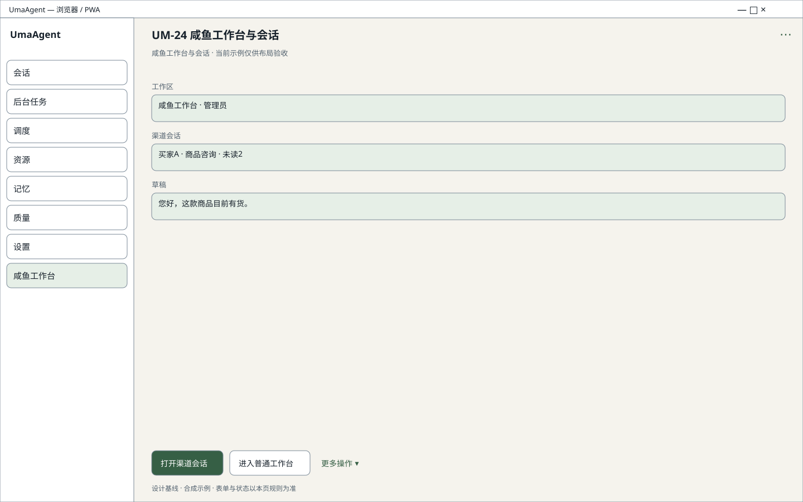

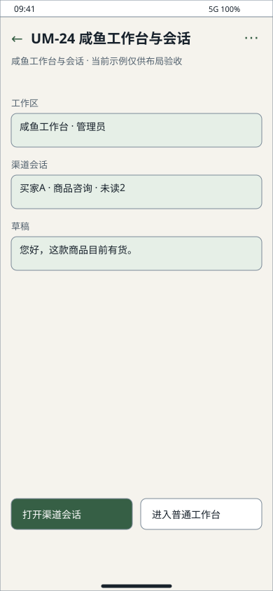

### 交互合同与状态图

**UM-24.I01 — 打开渠道会话**

|条目|精确定义|
|---|---|
|触发与前置|用户点击“打开渠道会话”；字段校验通过、在线、权限允许且此动作无在途请求。|
|执行类别|read（按G13解释）|
|事件/调用|`getSession(id);xianyuMarkRead(id)`|
|处理中|“打开渠道会话”禁用并显示“处理中…”；本页对象保留，禁止并发重复提交。|
|成功|加载已选渠道历史并更新其未读数；不发送内容。|
|失败/重试|读取失败保留已加载内容并标“上次同步”，首次无缓存显示错误面板；按G07显示对应错误原因，手动重试相同查询，不要求核实写入结果。|
|返回/取消|返回触发页面，恢复原焦点/滚动；未保存输入按G03确认；在途操作不被伪装取消。|
|验收|Given 操作前示例数据；When 触发“打开渠道会话”；Then 只有真实回执后呈现上述结果。另模拟失败、双击、离开页面，核对G02/G03。|

**UM-24.I02 — 进入普通工作台**

|条目|精确定义|
|---|---|
|触发与前置|admin已认证；无需换Token。|
|执行类别|local（按G13解释）|
|事件/调用|`local.workspace=agent`|
|处理中|本地导航。|
|成功|同一管理员认证切换Agent工作台；不清Cookie、不停止Adapter。|
|失败/重试|不产生网络错误；目标对象在本地已移除则提示“内容已不可用”并保留当前页面。前置条件不满足时禁用并说明原因。|
|返回/取消|返回触发页面，恢复原焦点/滚动；未保存输入按G03确认；在途操作不被伪装取消。|
|验收|Given 本页前置条件满足；When 点击“进入普通工作台”；Then 本地状态立即符合成功规则。断网重复执行仍可用；返回恢复焦点，不产生远端写请求。切换类连续点击按当前值逐次切换。|

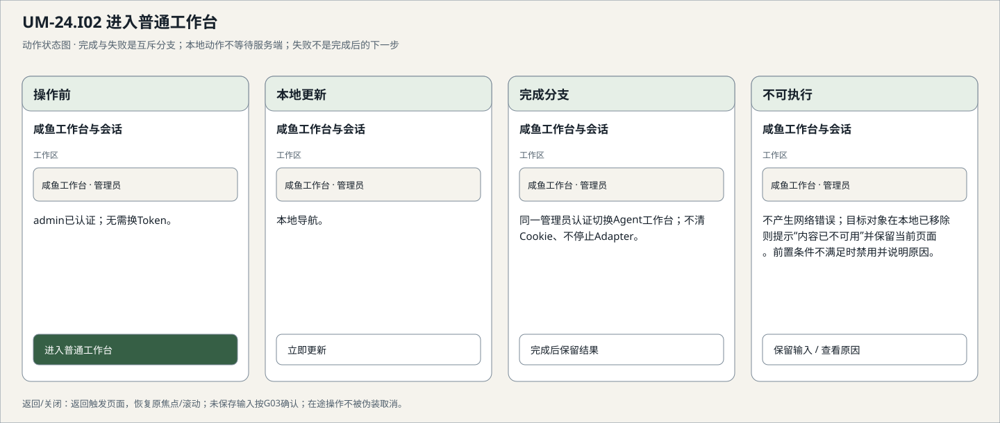

**UM-24.I03 — 切换普通账号**

|条目|精确定义|
|---|---|
|触发与前置|用户明确退出；有未保存表单先按G14确认；离线可执行，不要求认证仍有效。|
|执行类别|system（按G13解释）|
|事件/调用|`logout / UM-01`|
|处理中|关闭本账号订阅，清理本账号凭据、内存草稿与缓存命名空间；不等待服务端。|
|成功|清理当前客户端认证与缓存，由另一PAT重新登录。|
|失败/重试|系统调用失败时保留当前界面并显示系统返回原因；允许手动重试。没有系统回调时只能显示“已发起”，不能推断目标动作完成。退出账户的本地清理不等待网络回执。|
|返回/取消|返回触发页面，恢复原焦点/滚动；未保存输入按G03确认；在途操作不被伪装取消。|
|验收|离线触发“切换普通账号”，按系统回调和成功规则核对结果；拒绝系统权限或对象消失时显示真实错误，不显示服务端成功。|

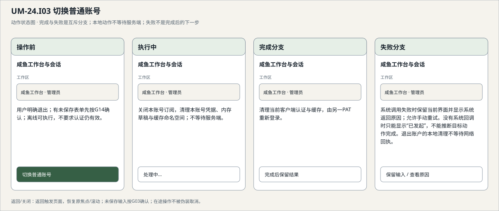

### 页面验收

本页每个字段、每个动作和全部失败分支都有对应UI；320宽和200%字号可滚动到所有控件。不得用空值模拟成功。绑定见本页来源文件；实现检查本页所有事件ID。

## UM-25 · 咸鱼登录与扫码状态

**入口与返回**：UM-24渠道未登录→渠道登录。

**角色/设备**：仅管理员；Web, Android。

**导航归属**：电脑端：咸鱼工作台；Android：更多。返回沿本页规定入口恢复；从系统通知进入时无应用内历史则返回相应导航首页。

**布局**：使用§3设备壳。字段按表从上到下；主体单独滚动，操作区固定在主体底部；主次操作为交互表前两项，其余为右上“更多操作”。

**数据绑定**：`apps/web/src/areas/XianyuWorkspace.tsx`。xianyuLoginStart/xianyuLoginStatus。

|控件（从上到下）|类型|图中示例|校验/显示合同|
|---|---|---|---|
|登录状态|record|等待扫码|按Adapter返回状态映射|
|扫码信息|record|二维码/授权页面由服务端返回|真实二维码图片区域，不绘制假可扫二维码|
|有效期|record|由返回数据提供|未提供时显示未提供，不伪造倒计时|

**页面规则**：离开停止前端状态轮询但不自动清渠道Cookie；服务登录不同于Core账号登录。

**空态/加载/错误**：首次读取显示“正在加载咸鱼登录与扫码状态”；成功无记录显示“暂无咸鱼登录与扫码状态记录”并保留入口操作。失败就地显示错误区；旧数据标“上次同步”；离线远端写操作禁用；本地查看、返回、复制、外观保存和已明确允许的配置保存仍可用。

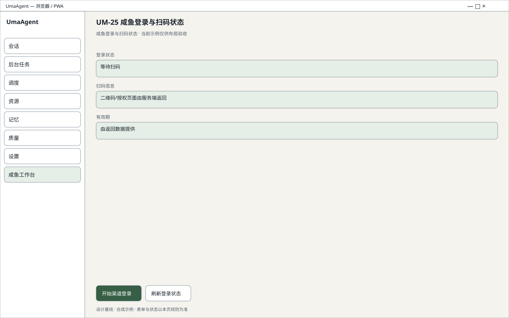

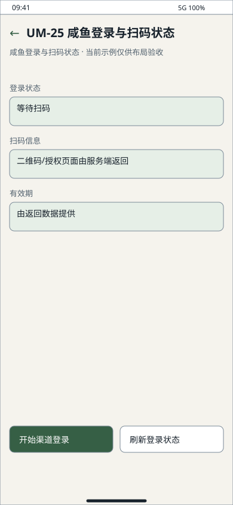

### 交互合同与状态图

**UM-25.I01 — 开始渠道登录**

|条目|精确定义|
|---|---|
|触发与前置|用户点击“开始渠道登录”；字段校验通过、在线、权限允许且此动作无在途请求。|
|执行类别|write（按G13解释）|
|事件/调用|`xianyuLoginStart`|
|处理中|“开始渠道登录”禁用并显示“处理中…”；本页对象保留，禁止并发重复提交。|
|成功|显示返回二维码/安全授权链接并读取loginStatus；不重复启动登录。|
|失败/重试|错误区显示具体原因；保留本页输入，按G02先核实结果再手动重试。|
|返回/取消|返回触发页面，恢复原焦点/滚动；未保存输入按G03确认；在途操作不被伪装取消。|
|验收|Given 操作前示例数据；When 触发“开始渠道登录”；Then 只有真实回执后呈现上述结果。另模拟失败、双击、离开页面，核对G02/G03。|

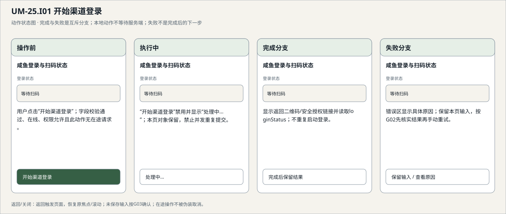

**UM-25.I02 — 刷新登录状态**

|条目|精确定义|
|---|---|
|触发与前置|用户点击“刷新登录状态”；字段校验通过、在线、权限允许且此动作无在途请求。|
|执行类别|read（按G13解释）|
|事件/调用|`xianyuLoginStatus`|
|处理中|“刷新登录状态”禁用并显示“处理中…”；本页对象保留，禁止并发重复提交。|
|成功|成功回执才显示已登录；过期显示重新开始。|
|失败/重试|读取失败保留已加载内容并标“上次同步”，首次无缓存显示错误面板；按G07显示对应错误原因，手动重试相同查询，不要求核实写入结果。|
|返回/取消|返回触发页面，恢复原焦点/滚动；未保存输入按G03确认；在途操作不被伪装取消。|
|验收|Given 操作前示例数据；When 触发“刷新登录状态”；Then 只有真实回执后呈现上述结果。另模拟失败、双击、离开页面，核对G02/G03。|

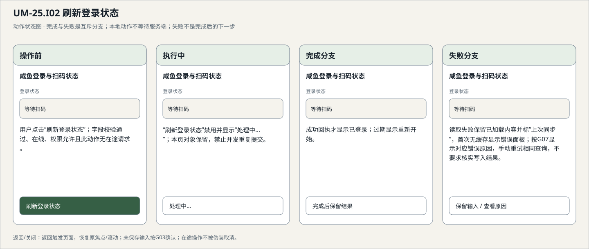

### 页面验收

本页每个字段、每个动作和全部失败分支都有对应UI；320宽和200%字号可滚动到所有控件。不得用空值模拟成功。绑定见本页来源文件；实现检查本页所有事件ID。

## UM-26 · 渠道服务与自动回复

**入口与返回**：UM-24展开服务控制。

**角色/设备**：仅管理员；Web, Android。

**导航归属**：电脑端：咸鱼工作台；Android：更多。返回沿本页规定入口恢复；从系统通知进入时无应用内历史则返回相应导航首页。

**布局**：使用§3设备壳。字段按表从上到下；主体单独滚动，操作区固定在主体底部；主次操作为交互表前两项，其余为右上“更多操作”。

**数据绑定**：`apps/web/src/areas/XianyuWorkspace.tsx`。xianyuStart/Pause/Resume/Stop/SetAutoReply。

|控件（从上到下）|类型|图中示例|校验/显示合同|
|---|---|---|---|
|服务状态|record|运行中|真实Adapter状态|
|自动回复|record|关闭|开关实际影响对外回复；默认以服务端当前值为准|

**页面规则**：普通导航退出不触发服务控制。所有外部回复能力必须有明确文案，不用不明“继续”。

**空态/加载/错误**：首次读取显示“正在加载渠道服务与自动回复”；成功无记录显示“暂无渠道服务与自动回复记录”并保留入口操作。失败就地显示错误区；旧数据标“上次同步”；离线远端写操作禁用；本地查看、返回、复制、外观保存和已明确允许的配置保存仍可用。

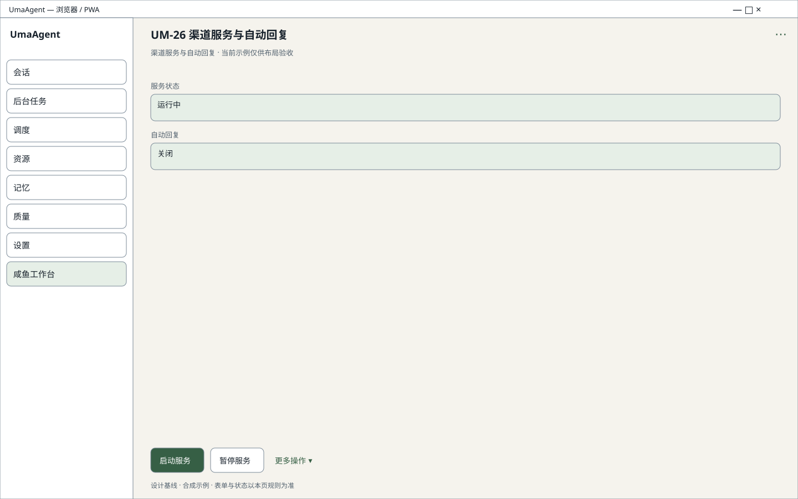

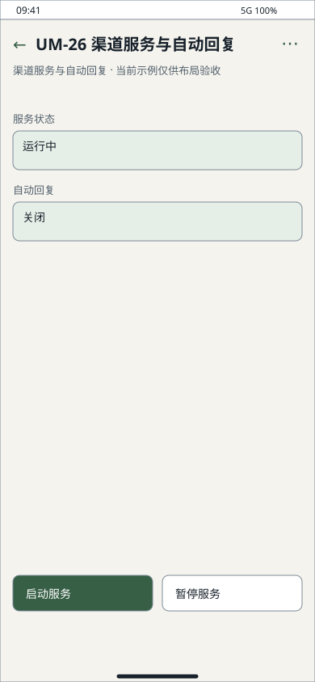

### 交互合同与状态图

**UM-26.I01 — 启动服务**

|条目|精确定义|
|---|---|
|触发与前置|用户点击“启动服务”；字段校验通过、在线、权限允许且此动作无在途请求。 此控件仅触发“启动服务”。|
|执行类别|write（按G13解释）|
|事件/调用|`xianyuStart()`|
|处理中|“启动服务”禁用并显示“处理中…”；其它冲突动作锁定。|
|成功|菜单明确各动作，仅对应状态启用；回执刷新服务状态。|
|失败/重试|错误区显示具体原因；保留本页输入，按G02先核实结果再手动重试。|
|返回/取消|返回触发页面，恢复原焦点/滚动；未保存输入按G03确认；在途操作不被伪装取消。|
|验收|When点击“启动服务”，仅调用xianyuStart()一次；按本页状态及G02判定成功/失败。|

**UM-26.I02 — 暂停服务**

|条目|精确定义|
|---|---|
|触发与前置|用户点击“暂停服务”；字段校验通过、在线、权限允许且此动作无在途请求。 此控件仅触发“暂停服务”。|
|执行类别|write（按G13解释）|
|事件/调用|`xianyuPause()`|
|处理中|“暂停服务”禁用并显示“处理中…”；其它冲突动作锁定。|
|成功|菜单明确各动作，仅对应状态启用；回执刷新服务状态。|
|失败/重试|错误区显示具体原因；保留本页输入，按G02先核实结果再手动重试。|
|返回/取消|返回触发页面，恢复原焦点/滚动；未保存输入按G03确认；在途操作不被伪装取消。|
|验收|When点击“暂停服务”，仅调用xianyuPause()一次；按本页状态及G02判定成功/失败。|

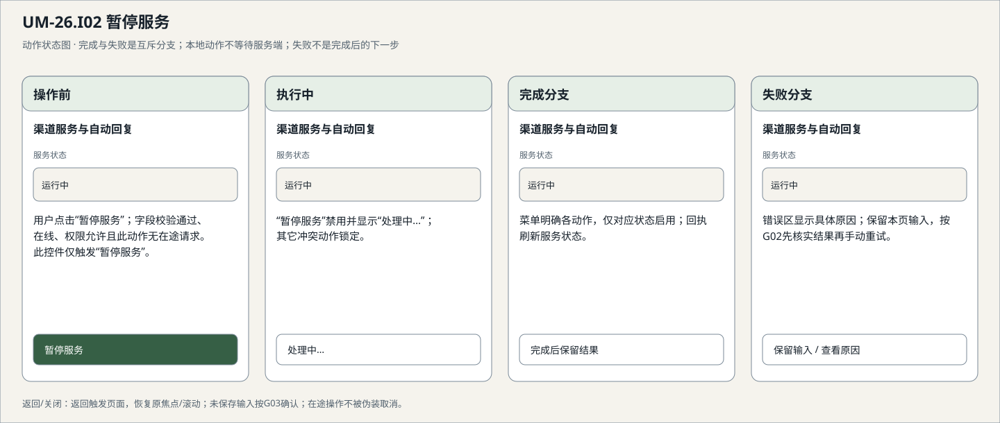

**UM-26.I03 — 恢复服务**

|条目|精确定义|
|---|---|
|触发与前置|用户点击“恢复服务”；字段校验通过、在线、权限允许且此动作无在途请求。 此控件仅触发“恢复服务”。|
|执行类别|write（按G13解释）|
|事件/调用|`xianyuResume()`|
|处理中|“恢复服务”禁用并显示“处理中…”；其它冲突动作锁定。|
|成功|菜单明确各动作，仅对应状态启用；回执刷新服务状态。|
|失败/重试|错误区显示具体原因；保留本页输入，按G02先核实结果再手动重试。|
|返回/取消|返回触发页面，恢复原焦点/滚动；未保存输入按G03确认；在途操作不被伪装取消。|
|验收|When点击“恢复服务”，仅调用xianyuResume()一次；按本页状态及G02判定成功/失败。|

**UM-26.I04 — 停止服务**

|条目|精确定义|
|---|---|
|触发与前置|用户点击“停止服务”；字段校验通过、在线、权限允许且此动作无在途请求。|
|执行类别|write（按G13解释）|
|事件/调用|`xianyuStop`|
|处理中|“停止服务”禁用并显示“处理中…”；本页对象保留，禁止并发重复提交。|
|成功|确认停止影响后提交；成功显示已停止，不注销Core账户。|
|失败/重试|错误区显示具体原因；保留本页输入，按G02先核实结果再手动重试。|
|返回/取消|返回触发页面，恢复原焦点/滚动；未保存输入按G03确认；在途操作不被伪装取消。|
|验收|Given 操作前示例数据；When 触发“停止服务”；Then 只有真实回执后呈现上述结果。另模拟失败、双击、离开页面，核对G02/G03。|

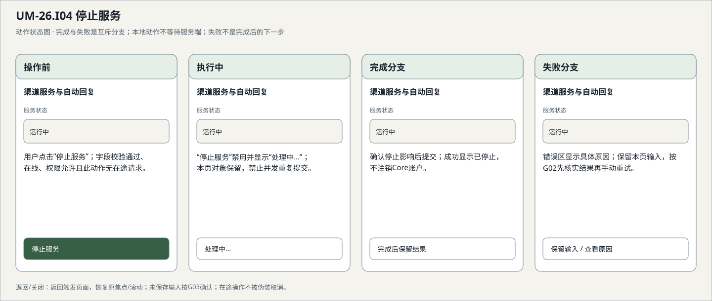

**UM-26.I05 — 修改自动回复**

|条目|精确定义|
|---|---|
|触发与前置|用户点击“修改自动回复”；字段校验通过、在线、权限允许且此动作无在途请求。|
|执行类别|write（按G13解释）|
|事件/调用|`xianyuSetAutoReply(enabled)`|
|处理中|“修改自动回复”禁用并显示“处理中…”；本页对象保留，禁止并发重复提交。|
|成功|开启前说明将自动向渠道回复并确认；保存成功后更新开关。|
|失败/重试|错误区显示具体原因；保留本页输入，按G02先核实结果再手动重试。|
|返回/取消|返回触发页面，恢复原焦点/滚动；未保存输入按G03确认；在途操作不被伪装取消。|
|验收|Given 操作前示例数据；When 触发“修改自动回复”；Then 只有真实回执后呈现上述结果。另模拟失败、双击、离开页面，核对G02/G03。|

### 页面验收

本页每个字段、每个动作和全部失败分支都有对应UI；320宽和200%字号可滚动到所有控件。不得用空值模拟成功。绑定见本页来源文件；实现检查本页所有事件ID。

## UM-27 · 渠道草稿与人工发送

**入口与返回**：UM-24选择回复草稿→发送预览。

**角色/设备**：仅管理员；Web, Android。

**导航归属**：电脑端：咸鱼工作台；Android：更多。返回沿本页规定入口恢复；从系统通知进入时无应用内历史则返回相应导航首页。

**布局**：使用§3设备壳。字段按表从上到下；主体单独滚动，操作区固定在主体底部；主次操作为交互表前两项，其余为右上“更多操作”。

**数据绑定**：`apps/web/src/areas/XianyuWorkspace.tsx`。xianyuSendDraft(activeSessionId,messageId)。

|控件（从上到下）|类型|图中示例|校验/显示合同|
|---|---|---|---|
|接收会话|record|买家A · 商品咨询|只读接收目标，必须可见|
|待发送内容|textarea|您好，这款商品目前有货。|固定草稿messageId，不允许预览后偷偷变更|

**页面规则**：这是外部消息发送，按钮不称“保存”；发送前始终可预览目标与正文，不借普通Agent对话入口隐式发送。

**空态/加载/错误**：首次读取显示“正在加载渠道草稿与人工发送”；成功无记录显示“暂无渠道草稿与人工发送记录”并保留入口操作。失败就地显示错误区；旧数据标“上次同步”；离线远端写操作禁用；本地查看、返回、复制、外观保存和已明确允许的配置保存仍可用。

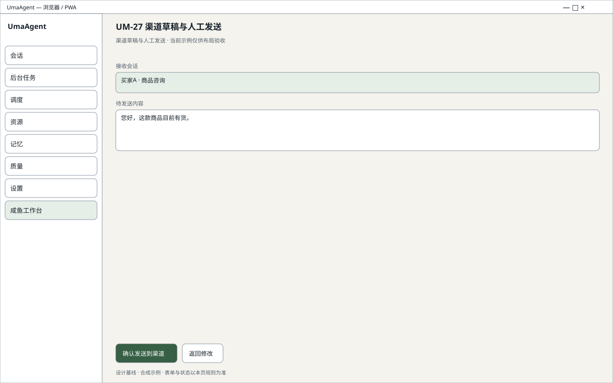

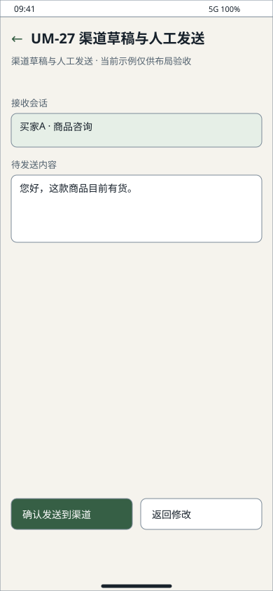

### 交互合同与状态图

**UM-27.I01 — 确认发送到渠道**

|条目|精确定义|
|---|---|
|触发与前置|用户点击“确认发送到渠道”；字段校验通过、在线、权限允许且此动作无在途请求。|
|执行类别|write（按G13解释）|
|事件/调用|`xianyuSendDraft(sessionId,messageId)`|
|处理中|“确认发送到渠道”禁用并显示“处理中…”；本页对象保留，禁止并发重复提交。|
|成功|回执ok后标已发送；提示外部目标与时间。|
|失败/重试|结果未知先刷新渠道历史，禁止自动再次发送。|
|返回/取消|返回触发页面，恢复原焦点/滚动；未保存输入按G03确认；在途操作不被伪装取消。|
|验收|Given 操作前示例数据；When 触发“确认发送到渠道”；Then 只有真实回执后呈现上述结果。另模拟失败、双击、离开页面，核对G02/G03。|

**UM-27.I02 — 返回修改**

|条目|精确定义|
|---|---|
|触发与前置|未开始发送。|
|执行类别|local（按G13解释）|
|事件/调用|`local.navigateChannelDraft`|
|处理中|本地导航。|
|成功|保留未发送草稿，回渠道会话。|
|失败/重试|不产生网络错误；目标对象在本地已移除则提示“内容已不可用”并保留当前页面。前置条件不满足时禁用并说明原因。|
|返回/取消|返回触发页面，恢复原焦点/滚动；未保存输入按G03确认；在途操作不被伪装取消。|
|验收|Given 本页前置条件满足；When 点击“返回修改”；Then 本地状态立即符合成功规则。断网重复执行仍可用；返回恢复焦点，不产生远端写请求。切换类连续点击按当前值逐次切换。|

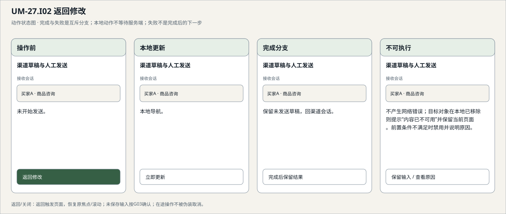

### 页面验收

本页每个字段、每个动作和全部失败分支都有对应UI；320宽和200%字号可滚动到所有控件。不得用空值模拟成功。绑定见本页来源文件；实现检查本页所有事件ID。

## UM-28 · 快捷命令与命令结果

**入口与返回**：Web Ctrl+K/工具栏命令；Android更多→快捷命令。

**角色/设备**：已登录用户；Web, Android。

**导航归属**：电脑端：会话；Android：对话。返回沿本页规定入口恢复；从系统通知进入时无应用内历史则返回相应导航首页。

**布局**：使用§3设备壳。字段按表从上到下；主体单独滚动，操作区固定在主体底部；主次操作为交互表前两项，其余为右上“更多操作”。

**数据绑定**：`apps/web/src/components/CommandPalette.tsx`。packages/protocol/src/commands.json 为目录；Web client.executeShortcut、Android UmaViewModel.executeShortcut 统一调用 Core。

|控件（从上到下）|类型|图中示例|校验/显示合同|
|---|---|---|---|
|命令搜索|input|任务|只过滤已注册命令，不执行任意shell|
|命令|record|列出任务|名称、说明、权限|
|输出|record|共3项后台任务|转义文本；长内容可选取|

**页面规则**：方向键选中、Enter执行、Esc关闭；输入文字不是直接运行命令。 Web和Android支持命令、中文名称与说明搜索，显示管理员权限。Android保留参数命令输入；选中目录项填入输入框，只有点击执行才写入。关闭弹窗不取消已发送写入，账号切换仍隔离回执。 Android未提交命令修改关闭时确认，搜索条件本身不算业务草稿；已提交写入归账号ViewModel，关闭只停止等待。

**空态/加载/错误**：首次读取显示“正在加载快捷命令与命令结果”；成功无记录显示“暂无快捷命令与命令结果记录”并保留入口操作。失败就地显示错误区；旧数据标“上次同步”；离线远端写操作禁用；本地查看、返回、复制、外观保存和已明确允许的配置保存仍可用。

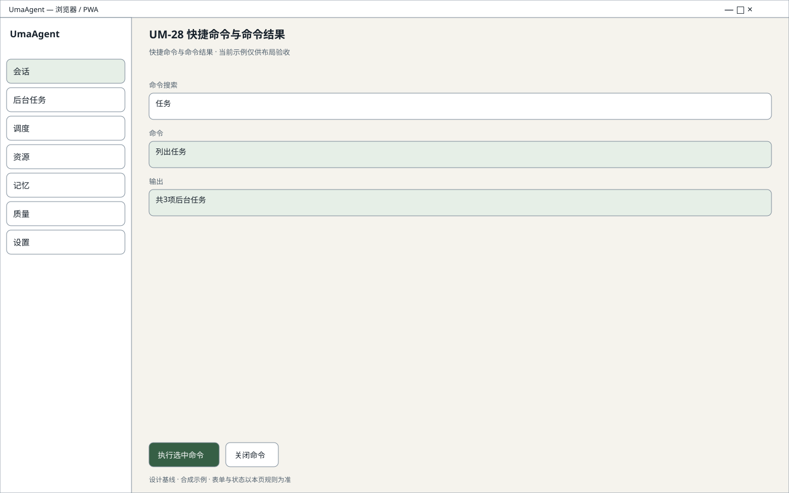

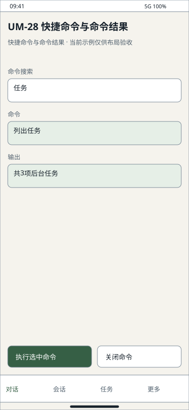

### 交互合同与状态图

**UM-28.I01 — 执行选中命令**

|条目|精确定义|
|---|---|
|触发与前置|用户点击“执行选中命令”；字段校验通过、在线、权限允许且此动作无在途请求。|
|执行类别|write（按G13解释）|
|事件/调用|`executeShortcut(sessionId,command)`|
|处理中|“执行选中命令”禁用并显示“处理中…”；本页对象保留，禁止并发重复提交。|
|成功|仅注册命令映射执行，显示返回output；执行许可遵循账号免审批策略，权限与工作区边界始终检查。|
|失败/重试|错误区显示具体原因；保留本页输入，按G02先核实结果再手动重试。|
|返回/取消|返回触发页面，恢复原焦点/滚动；未保存输入按G03确认；在途操作不被伪装取消。|
|验收|Given 操作前示例数据；When 触发“执行选中命令”；Then 只有真实回执后呈现上述结果。另模拟失败、双击、离开页面，核对G02/G03。|

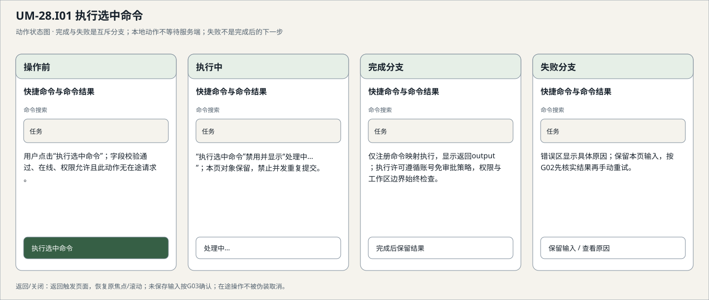

**UM-28.I02 — 关闭命令**

|条目|精确定义|
|---|---|
|触发与前置|Esc/关闭按钮；无需网络。|
|执行类别|local（按G13解释）|
|事件/调用|`local.closePalette`|
|处理中|本地关闭。|
|成功|返回触发控件，保留草稿。|
|失败/重试|不产生网络错误；目标对象在本地已移除则提示“内容已不可用”并保留当前页面。前置条件不满足时禁用并说明原因。|
|返回/取消|返回触发页面，恢复原焦点/滚动；未保存输入按G03确认；在途操作不被伪装取消。|
|验收|Given 本页前置条件满足；When 点击“关闭命令”；Then 本地状态立即符合成功规则。断网重复执行仍可用；返回恢复焦点，不产生远端写请求。切换类连续点击按当前值逐次切换。|

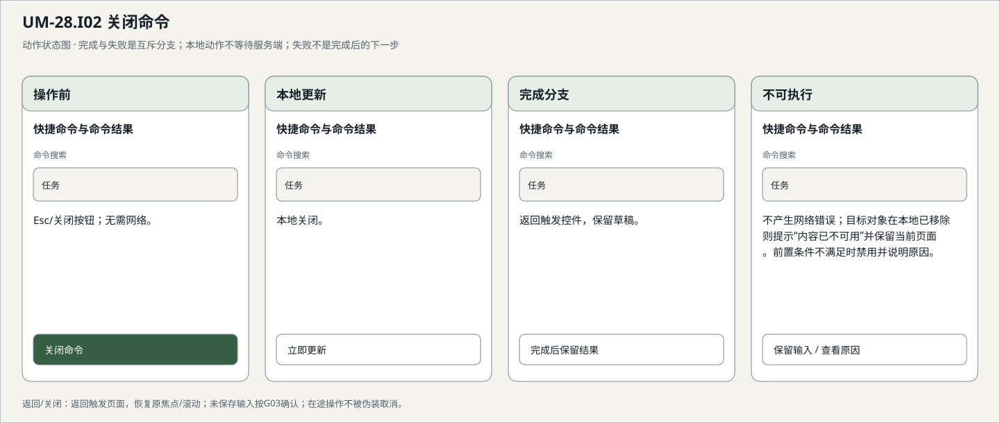

### 页面验收

本页每个字段、每个动作和全部失败分支都有对应UI；320宽和200%字号可滚动到所有控件。不得用空值模拟成功。绑定见本页来源文件；实现检查本页所有事件ID。

## UM-29 · 平板、更多与离线状态

**入口与返回**：手机更多导航/平板宽屏/事件断连。

**角色/设备**：已登录用户；Tablet, Android。

**导航归属**：电脑端：设置；Android：更多。返回沿本页规定入口恢复；从系统通知进入时无应用内历史则返回相应导航首页。

**布局**：使用§3设备壳。字段按表从上到下；主体单独滚动，操作区固定在主体底部；主次操作为交互表前两项，其余为右上“更多操作”。

**数据绑定**：`android/app/src/main/java/site/robotclaw/umaagent/UmaShell.kt`。MobileSection与SyncState；UI适配目标。

|控件（从上到下）|类型|图中示例|校验/显示合同|
|---|---|---|---|
|更多入口|record|调度 / 资源 / 记忆 / 质量 / 设置|管理员额外渠道；每项回各自同名页面|
|当前连接|record|离线 · 上次同步09:41|读缓存明确标记|
|未发送草稿|textarea|请总结这次的研究结果|离线保留，但不自动排队发送|

**页面规则**：≥840双栏保留选择与滚动，600–839仅Rail+单内容；IME使用G10。移动高级页面已提供Compose入口，逐页和组合验收状态以发布验收为准。

**空态/加载/错误**：首次读取显示“正在加载平板、更多与离线状态”；成功无记录显示“暂无平板、更多与离线状态记录”并保留入口操作。失败就地显示错误区；旧数据标“上次同步”；离线远端写操作禁用；本地查看、返回、复制、外观保存和已明确允许的配置保存仍可用。

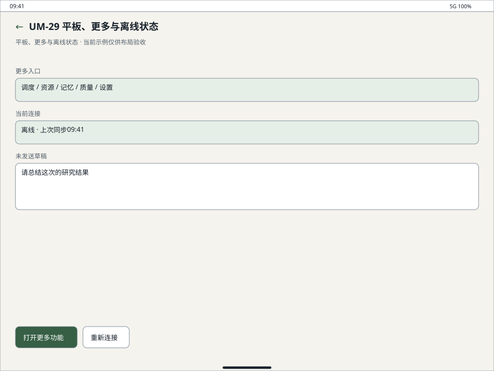

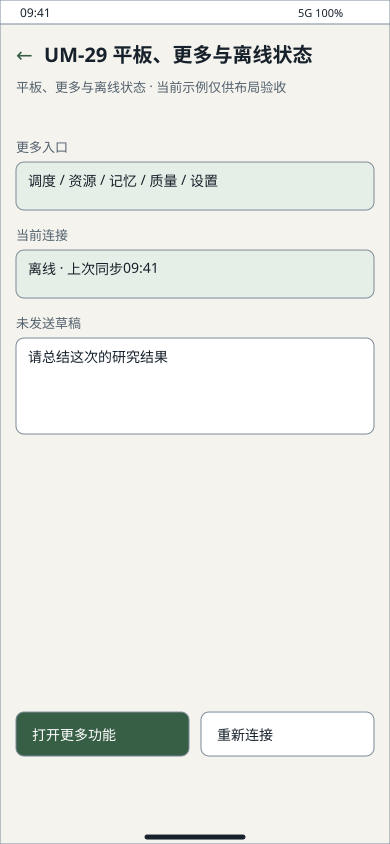

### 交互合同与状态图

**UM-29.I01 — 打开更多功能**

|条目|精确定义|
|---|---|
|触发与前置|已登录；读取页允许离线。|
|执行类别|local（按G13解释）|
|事件/调用|`local.navigate(section)`|
|处理中|本地导航。|
|成功|路由到对应界面ID；切换布局不重建会话。|
|失败/重试|不产生网络错误；目标对象在本地已移除则提示“内容已不可用”并保留当前页面。前置条件不满足时禁用并说明原因。|
|返回/取消|返回触发页面，恢复原焦点/滚动；未保存输入按G03确认；在途操作不被伪装取消。|
|验收|Given 本页前置条件满足；When 点击“打开更多功能”；Then 本地状态立即符合成功规则。断网重复执行仍可用；返回恢复焦点，不产生远端写请求。切换类连续点击按当前值逐次切换。|

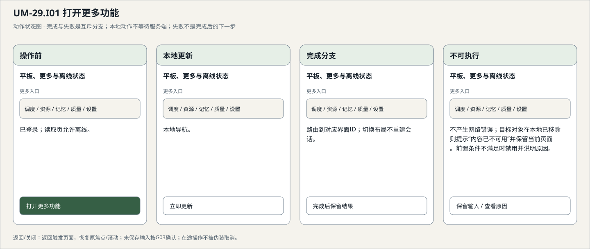

**UM-29.I02 — 重新连接**

|条目|精确定义|
|---|---|
|触发与前置|用户点击“重新连接”；字段校验通过、在线、权限允许且此动作无在途请求。|
|执行类别|write（按G13解释）|
|事件/调用|`client.connectEvents / Android sync`|
|处理中|“重新连接”禁用并显示“处理中…”；本页对象保留，禁止并发重复提交。|
|成功|完成bootstrap/回放后恢复写控件；不自动发送离线草稿。|
|失败/重试|错误区显示具体原因；保留本页输入，按G02先核实结果再手动重试。|
|返回/取消|返回触发页面，恢复原焦点/滚动；未保存输入按G03确认；在途操作不被伪装取消。|
|验收|Given 操作前示例数据；When 触发“重新连接”；Then 只有真实回执后呈现上述结果。另模拟失败、双击、离开页面，核对G02/G03。|

### 页面验收

本页每个字段、每个动作和全部失败分支都有对应UI；320宽和200%字号可滚动到所有控件。不得用空值模拟成功。绑定见本页来源文件；实现检查本页所有事件ID。

## UM-30 · 运行诊断报告

**入口与返回**：质量中心→运行诊断；返回质量中心。

**角色/设备**：已登录用户；Web, Android。

**导航归属**：电脑端：质量；Android：更多。返回沿本页规定入口恢复；从系统通知进入时无应用内历史则返回相应导航首页。

**布局**：使用§3设备壳。字段按表从上到下；主体单独滚动，操作区固定在主体底部；主次操作为交互表前两项，其余为右上“更多操作”。

**数据绑定**：`apps/web/src/areas/DiagnosticsArea.tsx`。diagnosticsReport(from,to)。

|控件（从上到下）|类型|图中示例|校验/显示合同|
|---|---|---|---|
|时间窗|select|最近24小时|UI固定最近24小时/7天/30天，转换明确epoch区间|
|运行|record|10/12完成 · 恢复率8.3%|summary.runs/recoveryFrequency；分母0显示未提供|
|模型耗时|record|provider/model · 平均480ms|slowModels平均值不能标为P95|
|工具失败|record|文件读取 · 2次|toolFailures名称/次数/latestError|
|Trace|record|已记录52 · 不完整1 · 活跃2|spans/incomplete/active/errorRate/writeFailures/otlpExportFailures/services|

**页面规则**：审批瓶颈额外列tool/requested/denied；UI文案说明拒绝率，不将拒绝等同工具失败。

**空态/加载/错误**：首次读取显示“正在加载运行诊断报告”；成功无记录显示“暂无运行诊断报告记录”并保留入口操作。失败就地显示错误区；旧数据标“上次同步”；离线远端写操作禁用；本地查看、返回、复制、外观保存和已明确允许的配置保存仍可用。

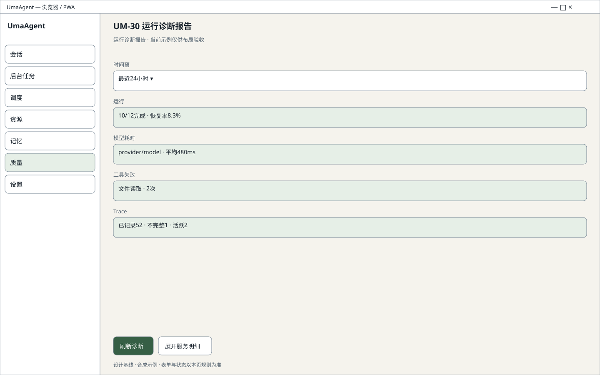

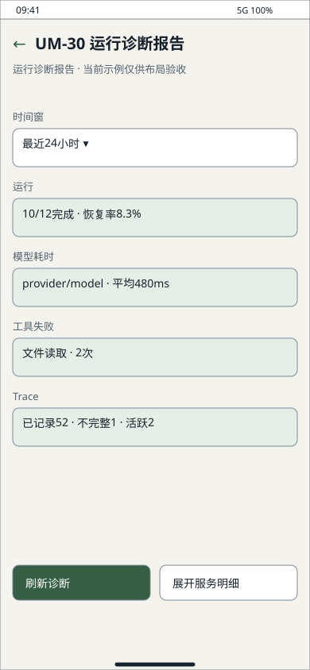

### 交互合同与状态图

**UM-30.I01 — 刷新诊断**

|条目|精确定义|
|---|---|
|触发与前置|用户点击“刷新诊断”；字段校验通过、在线、权限允许且此动作无在途请求。|
|执行类别|read（按G13解释）|
|事件/调用|`diagnosticsReport(from,to)`|
|处理中|“刷新诊断”禁用并显示“处理中…”；本页对象保留，禁止并发重复提交。|
|成功|更新当前时间窗所有模块和获取时间；模块未提供明确标记。|
|失败/重试|读取失败保留已加载内容并标“上次同步”，首次无缓存显示错误面板；按G07显示对应错误原因，手动重试相同查询，不要求核实写入结果。|
|返回/取消|返回触发页面，恢复原焦点/滚动；未保存输入按G03确认；在途操作不被伪装取消。|
|验收|Given 操作前示例数据；When 触发“刷新诊断”；Then 只有真实回执后呈现上述结果。另模拟失败、双击、离开页面，核对G02/G03。|

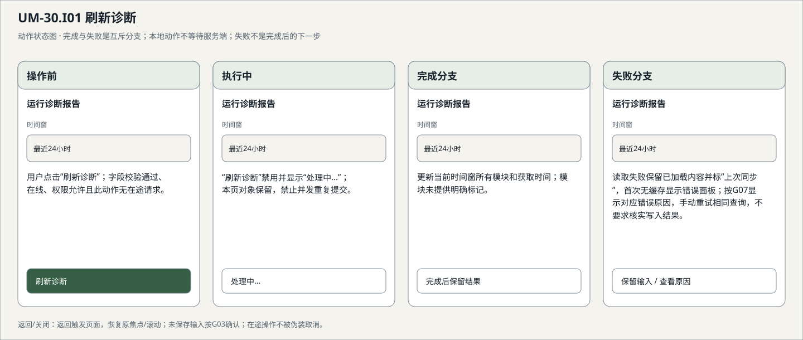

**UM-30.I02 — 展开服务明细**

|条目|精确定义|
|---|---|
|触发与前置|报告有services数组；无需联网。|
|执行类别|local（按G13解释）|
|事件/调用|`local.expandTraceServices`|
|处理中|本地展开。|
|成功|显示每服务spans/errors与写入失败，折叠不丢时间窗。|
|失败/重试|不产生网络错误；目标对象在本地已移除则提示“内容已不可用”并保留当前页面。前置条件不满足时禁用并说明原因。|
|返回/取消|返回触发页面，恢复原焦点/滚动；未保存输入按G03确认；在途操作不被伪装取消。|
|验收|Given 本页前置条件满足；When 点击“展开服务明细”；Then 本地状态立即符合成功规则。断网重复执行仍可用；返回恢复焦点，不产生远端写请求。切换类连续点击按当前值逐次切换。|

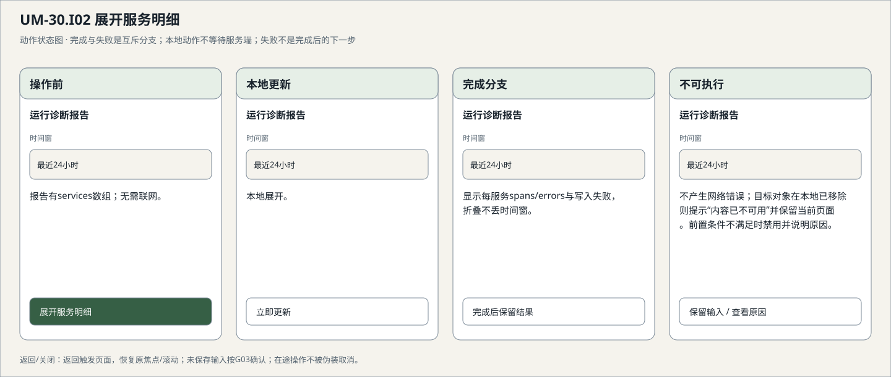

### 页面验收

本页每个字段、每个动作和全部失败分支都有对应UI；320宽和200%字号可滚动到所有控件。不得用空值模拟成功。绑定见本页来源文件；实现检查本页所有事件ID。

## UM-31 · 评测历史与用例详情

**入口与返回**：质量中心→评测历史；点击报告展开。

**角色/设备**：已登录用户；Web, Android。

**导航归属**：电脑端：质量；Android：更多。返回沿本页规定入口恢复；从系统通知进入时无应用内历史则返回相应导航首页。

**布局**：使用§3设备壳。字段按表从上到下；主体单独滚动，操作区固定在主体底部；主次操作为交互表前两项，其余为右上“更多操作”。

**数据绑定**：`apps/web/src/areas/EvaluationArea.tsx`。listEvaluationReports(limit100)/listEvaluationTrends(最近30天)/getEvaluationReport。

|控件（从上到下）|类型|图中示例|校验/显示合同|
|---|---|---|---|
|趋势分组|record|核心流程 · 80%通过|group/passedCases/totalCases/durationMs.p95|
|报告|record|faux · suite-1 · 8/10|id/status/mode/suiteVersion/createdAt/durationMs|
|用例|record|来源检索 · 通过 · 420ms|每例name/passed/category/durationMs/error|

**页面规则**：报告排序createdAt降序；显示当前最多100条与时间范围，不宣称全量历史。faux与real标签始终可见。

**空态/加载/错误**：首次读取显示“正在加载评测历史与用例详情”；成功无记录显示“暂无评测历史与用例详情记录”并保留入口操作。失败就地显示错误区；旧数据标“上次同步”；离线远端写操作禁用；本地查看、返回、复制、外观保存和已明确允许的配置保存仍可用。

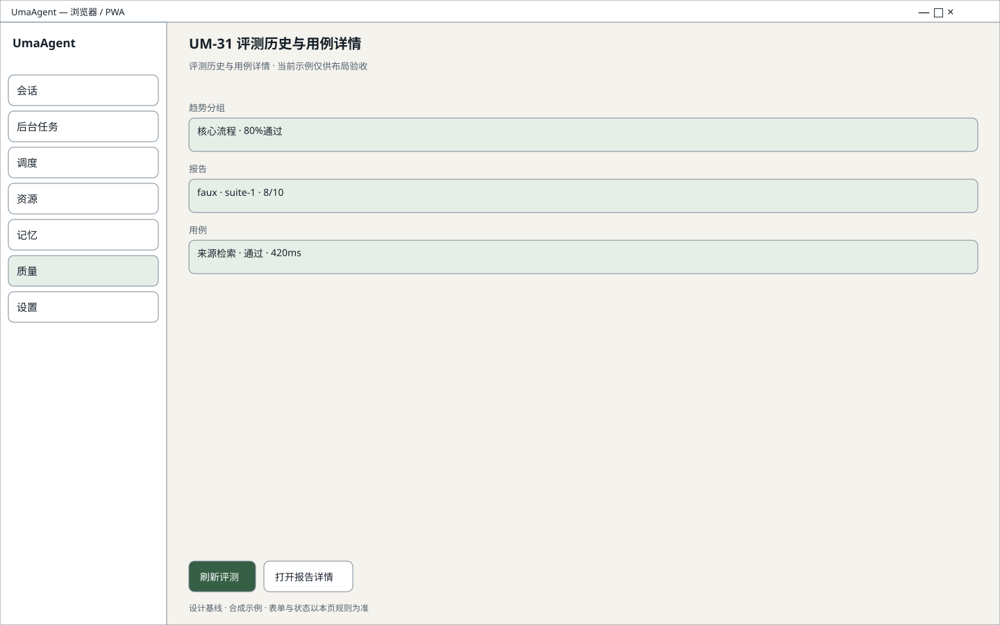

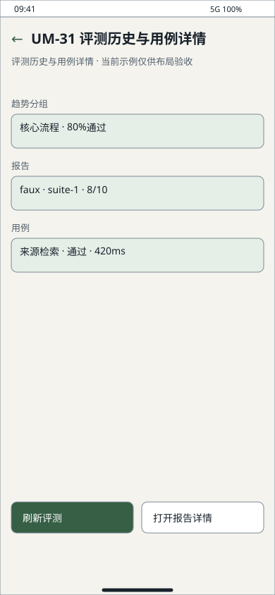

### 交互合同与状态图

**UM-31.I01 — 刷新评测**

|条目|精确定义|
|---|---|
|触发与前置|用户点击“刷新评测”；字段校验通过、在线、权限允许且此动作无在途请求。|
|执行类别|read（按G13解释）|
|事件/调用|`listEvaluationReports(100);listEvaluationTrends`|
|处理中|“刷新评测”禁用并显示“处理中…”；本页对象保留，禁止并发重复提交。|
|成功|仅展示实际已有报告，不启动真实评测/收费模型调用。|
|失败/重试|读取失败保留已加载内容并标“上次同步”，首次无缓存显示错误面板；按G07显示对应错误原因，手动重试相同查询，不要求核实写入结果。|
|返回/取消|返回触发页面，恢复原焦点/滚动；未保存输入按G03确认；在途操作不被伪装取消。|
|验收|Given 操作前示例数据；When 触发“刷新评测”；Then 只有真实回执后呈现上述结果。另模拟失败、双击、离开页面，核对G02/G03。|

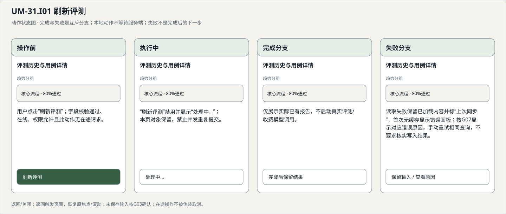

**UM-31.I02 — 打开报告详情**

|条目|精确定义|
|---|---|
|触发与前置|用户点击“打开报告详情”；字段校验通过、在线、权限允许且此动作无在途请求。|
|执行类别|read（按G13解释）|
|事件/调用|`getEvaluationReport(id)`|
|处理中|“打开报告详情”禁用并显示“处理中…”；本页对象保留，禁止并发重复提交。|
|成功|展开该报告完整cases；加载失败保留摘要。|
|失败/重试|读取失败保留已加载内容并标“上次同步”，首次无缓存显示错误面板；按G07显示对应错误原因，手动重试相同查询，不要求核实写入结果。|
|返回/取消|返回触发页面，恢复原焦点/滚动；未保存输入按G03确认；在途操作不被伪装取消。|
|验收|Given 操作前示例数据；When 触发“打开报告详情”；Then 只有真实回执后呈现上述结果。另模拟失败、双击、离开页面，核对G02/G03。|

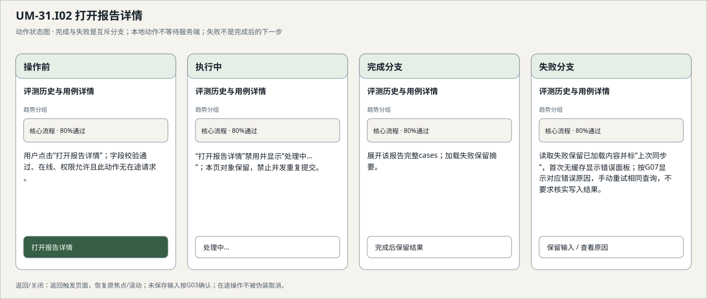

### 页面验收

本页每个字段、每个动作和全部失败分支都有对应UI；320宽和200%字号可滚动到所有控件。不得用空值模拟成功。绑定见本页来源文件；实现检查本页所有事件ID。

## UM-32 · 只读优化提案

**入口与返回**：质量中心→人工优化。

**角色/设备**：已登录用户；Web, Android。

**导航归属**：电脑端：质量；Android：更多。返回沿本页规定入口恢复；从系统通知进入时无应用内历史则返回相应导航首页。

**布局**：使用§3设备壳。字段按表从上到下；主体单独滚动，操作区固定在主体底部；主次操作为交互表前两项，其余为右上“更多操作”。

**数据绑定**：`apps/web/src/areas/OptimizationArea.tsx`。listOptimizationProposals/generateOptimizationProposals/decideOptimizationProposal。

|控件（从上到下）|类型|图中示例|校验/显示合同|
|---|---|---|---|
|提案|record|减少重复读取|title/recommendation|
|证据|record|同类读取共出现12次|逐条evidence，不自行造证据|
|风险与状态|record|low · pending|risk low/medium/high，status pending/accepted/rejected|

**页面规则**：无apply/rollback按钮；已决策项只读；不把此功能与对话回答改进混为一体。

**空态/加载/错误**：首次读取显示“正在加载只读优化提案”；成功无记录显示“暂无只读优化提案记录”并保留入口操作。失败就地显示错误区；旧数据标“上次同步”；离线远端写操作禁用；本地查看、返回、复制、外观保存和已明确允许的配置保存仍可用。

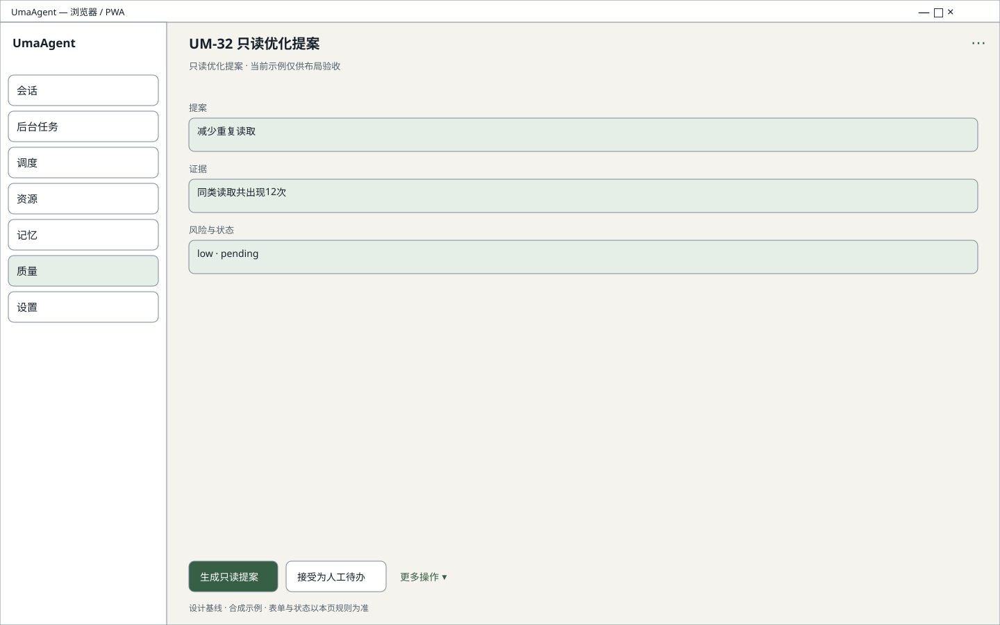

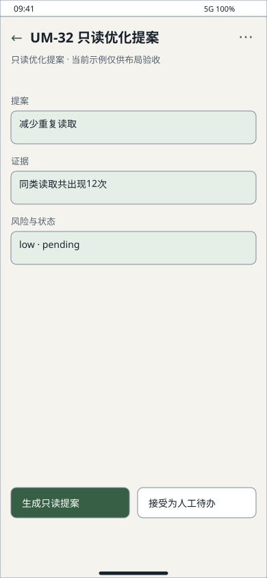

### 交互合同与状态图

**UM-32.I01 — 生成只读提案**

|条目|精确定义|
|---|---|
|触发与前置|用户点击“生成只读提案”；字段校验通过、在线、权限允许且此动作无在途请求。|
|执行类别|write（按G13解释）|
|事件/调用|`generateOptimizationProposals`|
|处理中|“生成只读提案”禁用并显示“处理中…”；本页对象保留，禁止并发重复提交。|
|成功|返回后刷新提案列表，生成失败保留旧提案。|
|失败/重试|错误区显示具体原因；保留本页输入，按G02先核实结果再手动重试。|
|返回/取消|返回触发页面，恢复原焦点/滚动；未保存输入按G03确认；在途操作不被伪装取消。|
|验收|Given 操作前示例数据；When 触发“生成只读提案”；Then 只有真实回执后呈现上述结果。另模拟失败、双击、离开页面，核对G02/G03。|

**UM-32.I02 — 接受为人工待办**

|条目|精确定义|
|---|---|
|触发与前置|用户点击“接受为人工待办”；字段校验通过、在线、权限允许且此动作无在途请求。|
|执行类别|write（按G13解释）|
|事件/调用|`decideOptimizationProposal(id,accepted)`|
|处理中|“接受为人工待办”禁用并显示“处理中…”；本页对象保留，禁止并发重复提交。|
|成功|pending→accepted后标记待人工处理，绝不应用补丁。|
|失败/重试|错误区显示具体原因；保留本页输入，按G02先核实结果再手动重试。|
|返回/取消|返回触发页面，恢复原焦点/滚动；未保存输入按G03确认；在途操作不被伪装取消。|
|验收|Given 操作前示例数据；When 触发“接受为人工待办”；Then 只有真实回执后呈现上述结果。另模拟失败、双击、离开页面，核对G02/G03。|

**UM-32.I03 — 拒绝提案**

|条目|精确定义|
|---|---|
|触发与前置|用户点击“拒绝提案”；字段校验通过、在线、权限允许且此动作无在途请求。|
|执行类别|write（按G13解释）|
|事件/调用|`decideOptimizationProposal(id,rejected)`|
|处理中|“拒绝提案”禁用并显示“处理中…”；本页对象保留，禁止并发重复提交。|
|成功|pending→rejected，仅记录决策。|
|失败/重试|错误区显示具体原因；保留本页输入，按G02先核实结果再手动重试。|
|返回/取消|返回触发页面，恢复原焦点/滚动；未保存输入按G03确认；在途操作不被伪装取消。|
|验收|Given 操作前示例数据；When 触发“拒绝提案”；Then 只有真实回执后呈现上述结果。另模拟失败、双击、离开页面，核对G02/G03。|

### 页面验收

本页每个字段、每个动作和全部失败分支都有对应UI；320宽和200%字号可滚动到所有控件。不得用空值模拟成功。绑定见本页来源文件；实现检查本页所有事件ID。

## 6. 平台与系统级行为

Windows Web/PWA：浏览器/系统窗口控件位于右侧；支持Ctrl+K命令、Ctrl+F浏览器查找（不抢占），不使用macOS Command键提示；PWA安装入口只在浏览器提供安装事件时显示。

Android：底部固定对话/会话/任务/更多；更多包含调度、资源、记忆、质量、设置，管理员额外咸鱼入口；≥600Rail、≥840会话列表+正文双栏。系统文件选择器取得URI后上传，不承诺进程被杀后上传继续；返回前台重新检查附件状态，失败项保留手动重试。

消息通知只显示已授权内容摘要；无当前系统通知实现的能力不得显示已通知。本机外观支持跟随系统、浅色和深色，采用品牌绿。所有角色切换使用独立标题，普通工作台入口与“切换普通账号”明确分开。

## 7. 发布验收门槛

1. 页面注册表全部可通过规定入口到达，返回后定位不丢失；没有孤立按钮、无意义“继续”按钮、正文写JSON或未说明的占位框。
2. 每个事件ID核对前置/处理中/成功/失败/返回，写请求双击只产生一次有效动作。断网/超时不能显示成功或重放未知写请求。
3. 像素验收以SVG中的结构和几何表为基准：布局尺寸偏差≤2px/dp，字体使用指定系统栈；系统标题栏、字体栅格化、平台文件选择器由OS决定，不要求跨OS像素一致。
4. 覆盖Web 1440×900/1024×768/390×844/320×640；Android 390×844、600×960、840×900、1024×768，字体100%/200%，深浅色、键盘打开、长文本；Windows Web/PWA另测125%/150%浏览器缩放；当前无原生桌面客户端，不设置托盘验收项。
5. 对比度：普通文字≥4.5:1，大标题和控件边界≥3:1；Tab/读屏/减少动态效果通过；账号隔离、403深链、离线只读、换账号迟到写入逐条验证。
6. 设计校验仅证明设计资料、源码绑定与静态图稿自洽。设备、网络、性能及真实模型以 docs/release-acceptance.md 的独立实测结果为准；全局 G03/G14 的所有表单丢弃确认尚未完成逐项验证，不得标为已实现或已验收。

## 8. 来源快照与复刻方法

所有相对源码路径相对于当前项目根目录。渲染命令：`python docs/frontend-design/render.py`。静态复核命令：`python docs/frontend-design/validate.py`（Python 3、playwright、Pillow，以及本机Microsoft Edge）。渲染只写当前项目的设计文档和 final 图稿；不会写产品源码或请求外部接口。设计源为 spec.json，生成文档与图稿需同步提交；校验报告与预览输出到忽略的 artifacts/acceptance/design，不作为版本化过程文件。图稿为结构规格，不替代设备截图与行为验收。

设计方法参考：[imagegen-frontend-mobile](https://github.com/diuzhev26-glitch/imagegen-frontend-mobile)。采用其平台原生、可读性、连续屏幕一致性要求；本交付为精确 SVG 线框/结构图，未调用外部绘图服务。
